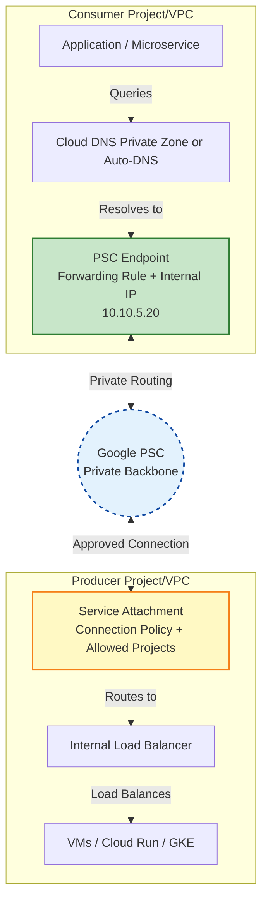

# 📘 PCA Mastery Guide: Private Connectivity & Auth Patterns
> **Focus**: Private Google Access (PGA), Private Service Access (PSA), Private Service Connect (PSC), Cloud SQL Auth Proxy  
> **Target**: Google Cloud Professional Cloud Architect (PCA) 2026 Exam  
> **Format**: Deep-dive concepts, architecture diagrams, decision frameworks, challenging scenarios, and exam traps

---

## 🔑 Core Concepts at a Glance

| Service | OSI Layer | Primary Purpose | IP Allocation | IAM Integration | Typical Use Case |
|---------|-----------|----------------|---------------|-----------------|------------------|
| **Private Google Access (PGA)** | L3/L4 | Allow VMs **without public IPs** to reach Google APIs | None (routing-based) | Service Account / ADC | Cloud Storage, BigQuery, Pub/Sub from private VMs |
| **Private Service Access (PSA)** | L3 | Allocate **private IPs** in your VPC for Google managed services | Yes (reserved IP range) | IAM on service | Cloud SQL, Memorystore, Vertex AI private endpoints |
| **Private Service Connect (PSC)** | L3/L4/L7 | Connect privately to **Google APIs, SaaS, or custom services** via internal IP | Yes (endpoint IP only) | IAM on service attachment | Third-party SaaS, Vertex AI APIs, cross-org/private API access |
| **Cloud SQL Auth Proxy** | L7/App | Secure, IAM-authenticated connections to Cloud SQL | None (network-agnostic) | IAM on DB user/SA | App → Cloud SQL with zero trust, TLS, connection pooling |

> 💡 **Critical PCA Insight**: These are **NOT mutually exclusive**. They operate at different layers and are often **combined** in production architectures.

---

## 🔍 Deep Dive: Architecture & Exam Focus

### 1. Private Google Access (PGA)
**What it does**: Routes traffic from private VMs to `*.googleapis.com` over Google's internal backbone. Bypasses internet egress.

**How it works**:
- Enabled at the **subnet level**
- Uses special routing entries for Google API IP ranges
- No NAT, no external IP required
- DNS resolution still occurs via public DNS or Cloud DNS

```text
Private VM (10.0.1.5)
  → DNS: storage.googleapis.com → 142.250.x.x
  → VPC Routing Table: detects Google API range
  → Internal Google backbone
  → Cloud Storage API
```

**Exam Focus**:
- `--enable-private-ip-google-access` on subnet
- **Does NOT provide internet access** (use Cloud NAT for that)
- Free, zero additional infrastructure
- Works with service accounts + ADC

**Limitations**:
- Only for Google-managed APIs/services
- No custom DNS control
- Cannot reach third-party or on-prem services

---

### 2. Private Service Access (PSA)
**What it does**: Creates a **managed VPC peering** between your VPC and Google's service producer network. Allocates IP ranges for managed services.

**How it works**:
- You reserve an IP range in your VPC (e.g., `10.100.0.0/24`)
- Google attaches that range to the service producer VPC
- Managed services (Cloud SQL, Memorystore, etc.) get private IPs from your reserved range
- Traffic stays entirely within Google's network

```text
Your VPC (10.0.0.0/16)
  └── Reserved PSA Range: 10.100.0.0/24
        ↕ (Managed Peering)
  Google Producer VPC
        └── Cloud SQL Instance: 10.100.0.5
        └── Memorystore Redis: 10.100.0.10
```

**Exam Focus**:
- `gcloud services vpc-peerings connect`
- Required for **private IP** Cloud SQL/Memorystore/Vertex AI
- IP range **must not overlap** with your VPC subnets, on-prem, or peered VPCs
- Routes are auto-managed; no Cloud Router needed

**Limitations**:
- Only for Google-managed services that support PSA
- IP range planning is critical (cannot change after allocation)
- Does not handle authentication or encryption

---

### 3. Private Service Connect (PSC)
**What it does**: Creates a **consumer-side endpoint** (internal IP) to access Google APIs, third-party SaaS, or custom services without public internet exposure.

**How it works**:
- Producer publishes a service (Google API, LB, or SaaS)
- Consumer creates a PSC endpoint in their VPC
- Endpoint gets a private IP + DNS entry
- Traffic routes privately over Google's network or Interconnect/VPN

```text
Consumer VPC
  └── PSC Endpoint: 10.200.5.10
        ↕ (Private forwarding rule)
  Producer Service (Google API / SaaS / Custom LB)
        └── Service Attachment / Published Service
```

**Exam Focus**:
- `gcloud compute forwarding-rules create --target-google-apis-bundle` or `--service-attachment`
- **No IP range reservation needed** (only endpoint IP)
- Supports custom DNS zones for predictable resolution
- Required for Vertex AI, Looker, third-party Marketplace services in private mode

**Limitations**:
- Requires producer to support PSC
- Endpoint IP is regional (not global)
- Billing: egress charges apply if crossing regions/interconnects

---

### 4. Cloud SQL Auth Proxy
**What it does**: Application-layer proxy that provides **IAM-based authentication, automatic TLS, and connection pooling** to Cloud SQL.

**How it works**:
- Proxy runs as a sidecar, VM, Cloud Run container, or integrated into Cloud Functions
- Uses ADC or service account credentials
- Validates IAM permissions (`roles/cloudsql.client`)
- Establishes mTLS to Cloud SQL
- Handles connection reuse, retries, and health checks

```text
Application
  → Cloud SQL Auth Proxy (sidecar/VM)
      → IAM Auth + TLS handshake
      → Cloud SQL (Private IP or Public IP)
```

**Exam Focus**:
- **Zero trust database access**
- Eliminates IP whitelisting, SSL cert management, password rotation
- Works with PSA (private IP) OR PGA + public IP
- Required for compliance (PCI, HIPAA) when DB access must be auditable/IAM-gated

**Limitations**:
- Adds slight latency (proxy hop)
- Must be deployed per workload or centrally managed
- Does not replace network connectivity (still needs PSA/PGA/NAT)

---

## 🌐 Architecture Diagrams & Traffic Flows

### Pattern 1: Private VM → Google APIs (PGA)
```text
[Private VM] ──(DNS)──► [142.250.x.x] ──(VPC Routing)──► [Google Backbone] ──► [Cloud Storage API]
   ↑ No external IP, no NAT, PGA enabled on subnet
```

### Pattern 2: Cloud SQL with Private IP (PSA + Auth Proxy)
```text
[Your VPC] ──(PSA Peering)──► [Google Producer VPC]
                                   └── Cloud SQL (10.100.0.5)
[App VM/Cloud Run] ──► [Auth Proxy] ──(IAM + TLS)──► [10.100.0.5:3306]
```

### Pattern 3: Third-Party SaaS via PSC
```text
[Consumer VPC] ──(PSC Endpoint: 10.50.1.20)──► [Producer Service Attachment]
                                                   └── SaaS Provider LB (Private)
[App] ──(Internal DNS)──► [saas.internal.corp → 10.50.1.20]
```

### Pattern 4: Hybrid On-Prem → Cloud SQL (Auth Proxy + Interconnect)
```text
[On-Prem App] ──(Interconnect/VPN)──► [Cloud SQL Auth Proxy on GCE]
                                         ──(IAM + TLS)──► [Cloud SQL Private IP]
```

---

## 🧠 Decision Framework: Where to Use What?

| Requirement | Recommended Pattern | Why |
|-------------|-------------------|-----|
| VM needs to upload files to GCS without public IP | **PGA** | Routing-based, zero cost, native to subnets |
| Cloud SQL must have private IP in your VPC | **PSA** | Allocates IP range, managed peering, required for private IP |
| App needs IAM-authenticated, zero-trust DB access | **Auth Proxy** | Handles IAM, TLS, pooling, audit logging |
| Connect to Vertex AI, Looker, or third-party SaaS privately | **PSC** | Endpoint-based, no IP range planning, DNS control |
| On-prem app needs secure Cloud SQL access without IP whitelisting | **Auth Proxy + Interconnect** | Bypasses firewall rules, uses IAM, works over private links |
| Reduce egress costs for Google API calls from private VMs | **PGA** | Keeps traffic on Google backbone, no NAT/egress fees |
| Centralized private access to multiple Google services without IP overlap risk | **PSC** | Endpoint isolation, no subnet IP consumption |

### 🔄 Quick Decision Tree
```text
Need to reach Google APIs from private VM?
  → PGA (if standard APIs)
  → PSC (if custom/enterprise bundle or SaaS)

Need private IP for Cloud SQL/Memorystore?
  → PSA (allocates IP range)

Need IAM-based, encrypted DB access?
  → Cloud SQL Auth Proxy (works with PSA or public IP)

Need to connect to third-party SaaS privately?
  → PSC (consumer endpoint)

Need to bypass internet for all Google services?
  → PGA + PSA + PSC (combined as needed)
```

---

## 🎯 Challenging Scenario-Based Questions (PCA 2026 Style)

### Scenario 1: Multi-Constraint Healthcare Platform
> **Context**: A HIPAA-compliant health app runs on Cloud Run. Requirements:
> - Cloud SQL for PostgreSQL must use **private IPs only**
> - Cloud Run must connect securely without embedding credentials
> - Must audit all DB connections at the IAM level
> - VPC must not allocate large IP ranges to avoid overlap with future peering
> 
> **Question**: Which architecture BEST meets all requirements?
> 
> A) PSA for Cloud SQL private IP + PGA for Cloud Run → Auth Proxy as sidecar  
> B) PSC endpoint for Cloud SQL + Cloud Run direct connection with SSL certs  
> C) PSA for Cloud SQL + Cloud SQL Auth Proxy deployed in Cloud Run + IAM service account binding  
> D) Public IP Cloud SQL + Auth Proxy + PGA to restrict internet access  
> 
> **Answer**: C  
> **Rationale**: PSA is required for private IP Cloud SQL. Auth Proxy in Cloud Run (sidecar or built-in) provides IAM authentication, TLS, and audit logging. Option A misuses PGA (not needed for Cloud SQL). B uses PSC incorrectly (Cloud SQL uses PSA, not PSC). D violates "private IP only" requirement.

---

### Scenario 2: Global SaaS Integration with Zero Trust
> **Context**: A fintech company integrates a third-party payment SaaS. Requirements:
> - No internet egress to the SaaS provider
> - Predictable internal DNS resolution
> - Must support IAM-based access control from GCP
> - Minimal VPC IP consumption
> 
> **Question**: Which connectivity pattern is MOST appropriate?
> 
> A) Cloud NAT → SaaS public endpoint + IP whitelisting  
> B) PSA with reserved IP range → Internal LB → SaaS via Interconnect  
> C) PSC endpoint + Cloud DNS private zone → IAM policy on service attachment  
> D) VPN tunnel to SaaS provider + Auth Proxy for authentication  
> 
> **Answer**: C  
> **Rationale**: PSC provides private connectivity without IP range allocation, supports custom DNS, and allows IAM-based access control via service attachment policies. A uses internet (violates constraint). B overcomplicates with PSA (not for third-party SaaS). D requires VPN management and misapplies Auth Proxy (DB-specific).

---

### Scenario 3: Legacy On-Prem to Modern Cloud DB
> **Context**: A manufacturing firm runs legacy .NET apps on-prem. They're migrating DB to Cloud SQL. Requirements:
> - No firewall rule changes on-prem
> - Must use existing ExpressRoute/Direct Interconnect
> - Developers must not manage SSL certs or rotate DB passwords
> - Connection must survive brief network hiccups
> 
> **Question**: Which pattern satisfies all constraints?
> 
> A) Public IP Cloud SQL + on-prem firewall rules + manual SSL  
> B) PSA + on-prem routing to private IP + Auth Proxy deployed on GCE VM  
> C) PSC endpoint + DNS redirect + IAM roles on legacy apps  
> D) Cloud SQL private IP + on-prem direct connection + connection pooling library  
> 
> **Answer**: B  
> **Rationale**: PSA provides private IP routing over Interconnect. Auth Proxy on a GCE VM (reachable from on-prem) handles IAM auth, TLS, retries, and connection pooling. Eliminates firewall changes, cert management, and password rotation. A violates "no firewall changes". C misuses PSC for Cloud SQL. D lacks IAM/auth proxy benefits.

---

### Scenario 4: Cost vs Security Trade-off for Analytics Pipeline
> **Context**: A media company runs Dataflow jobs that read from BigQuery and write to Cloud SQL. Requirements:
> - Minimize monthly egress costs
> - Maintain SOC2 compliance for DB access
> - Jobs run in regional Cloud Run
> - Must support automatic credential rotation
> 
> **Question**: Which configuration balances cost, compliance, and automation?
> 
> A) PGA for BigQuery + Public IP Cloud SQL + Auth Proxy + ADC  
> B) PSC for BigQuery + PSA for Cloud SQL + manual SSL  
> C) PGA for BigQuery + PSA for Cloud SQL + Auth Proxy with Workload Identity  
> D) Cloud NAT for all traffic + service account keys in Secret Manager  
> 
> **Answer**: C  
> **Rationale**: PGA keeps BigQuery traffic internal (zero egress). PSA provides private Cloud SQL IP. Auth Proxy + Workload Identity enables keyless, auto-rotated, auditable access. A uses public IP (unnecessary risk). B overcomplicates BigQuery (PGA is sufficient). D violates keyless best practices and increases egress.

---

## ⚖️ Why Auth Proxy Instead of PSC? (Direct Analysis)

| Dimension | Cloud SQL Auth Proxy | Private Service Connect (PSC) |
|-----------|---------------------|-------------------------------|
| **Layer** | Application (L7) | Network (L3/L4) |
| **Primary Function** | IAM authentication, mTLS, connection pooling, audit logging | Private network connectivity via internal IP/DNS |
| **IAM Integration** | ✅ Validates `roles/cloudsql.client`, logs to Cloud Audit | ❌ No IAM validation (network path only) |
| **Encryption** | ✅ Automatic mTLS, cert rotation handled | ❌ Depends on service; no built-in DB encryption |
| **Connection Management** | ✅ Retries, pooling, health checks, timeout handling | ❌ Raw TCP/HTTP; app handles resilience |
| **Use Case** | Secure DB access (Cloud SQL, AlloyDB) | Private access to APIs, SaaS, custom services |
| **Compatibility** | Works with PSA (private IP) OR PGA + public IP | Cannot replace Auth Proxy; operates at different layer |
| **Exam Trap** | Often confused with "network connectivity" | Often mistaken as "authentication solution" |

### 🎯 Direct Answer: Why Auth Proxy Instead of PSC for Cloud SQL?
1. **PSC only solves connectivity**, not security or authentication. Cloud SQL requires IAM-based access control for compliance.
2. **Auth Proxy enforces zero-trust**: Validates identity before allowing a connection, even if network access exists.
3. **Compliance**: PCI/HIPAA require audit trails for DB access. Auth Proxy logs to Cloud Audit; PSC does not.
4. **Operational simplicity**: Auth Proxy handles TLS, retries, and pooling. PSC leaves this to the application.
5. **They are complementary**: You use **PSA for private IP routing** + **Auth Proxy for IAM/TLS**. PSC is not used for Cloud SQL.

> 💡 **PCA Rule**: If a question mentions Cloud SQL + "secure/IAM/compliance/audit/rotation", the answer **ALWAYS** includes Auth Proxy (or built-in Cloud Run/Functions integration). PSC is for APIs/SaaS/custom services.

---

## ⚠️ PCA Exam Traps & Anti-Patterns

| Trap in Question | Correct Approach | Why |
|------------------|------------------|-----|
| "Use PSC for private Cloud SQL access" | Use PSA + Auth Proxy | Cloud SQL uses PSA for IP allocation, not PSC |
| "PGA provides internet access for private VMs" | Use Cloud NAT | PGA only routes to `*.googleapis.com` |
| "Auth Proxy replaces network connectivity" | Auth Proxy works OVER PSA/PGA/NAT | It's app-layer; still needs network path |
| "PSC endpoint needs reserved IP range" | PSC only needs endpoint IP | PSA requires IP range; PSC does not |
| "Grant `allUsers` to Cloud SQL for simplicity" | Use Auth Proxy + IAM SA | Violates least privilege & compliance |
| "Use Cloud DNS public zone for private services" | Use Cloud DNS private zones or PSC DNS | Public zones leak internal IPs |
| "Auth Proxy required for Memorystore" | Memorystore uses IAM + private IP (PSA) | Auth Proxy is Cloud SQL/AlloyDB specific |

---

## ✅ Quick Reference Cheat Sheet

```text
PRIVATE GOOGLE ACCESS (PGA)
  → Subnet-level toggle
  → Routes to *.googleapis.com
  → No IP allocation, no NAT
  → Free, zero overhead

PRIVATE SERVICE ACCESS (PSA)
  → Managed VPC peering
  → Allocates IP range for Google services
  → Required for private Cloud SQL/Memorystore/Vertex AI
  → Plan IP ranges carefully

PRIVATE SERVICE CONNECT (PSC)
  → Consumer endpoint (internal IP)
  → No IP range reservation
  → Google APIs, SaaS, custom services
  → Custom DNS, IAM on attachment

CLOUD SQL AUTH PROXY
  → App-layer IAM + mTLS + pooling
  → Zero credentials, audit logging
  → Sidecar/VM/Cloud Run/Functions
  → Works with PSA or PGA

DECISION RULE:
  Network path? → PSA (Google services) | PSC (APIs/SaaS) | PGA (APIs from private VM)
  Secure DB access? → Auth Proxy (always for compliance/IAM)
  Combine? → PSA + Auth Proxy (Cloud SQL) | PSC + App Auth (SaaS)
```

---

## 📚 How to Master This for PCA 2026

1. **Memorize the layer distinction**: Network (PSA/PSC/PGA) vs Application (Auth Proxy)
2. **Practice constraint mapping**: RTO/RPO → Private IP → IAM → Audit → Cost
3. **Drill the traps**: Cloud SQL ≠ PSC, PGA ≠ Internet, Auth Proxy ≠ Network path
4. **Use the decision tree**: Every scenario should flow through connectivity → security → compliance → cost
5. **Run hands-on labs**: Create PSA range, deploy Cloud SQL with private IP, attach Auth Proxy, test IAM auth

> 💡 **Pro Tip**: When stuck between two options, ask:  
> *"Does this solve the network path, or the application security requirement?"*  
> If it's Cloud SQL/DB → Auth Proxy is almost certainly required.  
> If it's API/SaaS → PSC is likely.  
> If it's Google APIs from private VM → PGA is sufficient.

---
# 📘 PSC Endpoints vs. PSC Backends (Service Attachments) — PCA Expert Guide

> 🔍 **Terminology Clarification First**: Google Cloud does **not** officially use the term *"PSC backend"*. In GCP documentation and the PCA exam, the correct terms are:
> - **PSC Endpoint** (Consumer side)
> - **Service Attachment** + underlying Load Balancer (Producer side, often informally called the "PSC backend")
> 
> PSC follows a strict **Consumer ↔ Producer** model. Understanding which side you're on dictates what you create.

---

## 📦 1. PSC Endpoint (Consumer Side)
**What it is**: A private IP address and forwarding rule created in **your VPC** to privately access a published service (Google API, third-party SaaS, or custom internal service).

**Key Characteristics**:
| Feature | Detail |
|---------|--------|
| **IP Allocation** | Consumes **one IP** from your subnet (no large range reservation) |
| **Scope** | Regional for custom/third-party services; Global for Google API bundles |
| **DNS** | Auto-resolves for Google APIs; requires Cloud DNS Private Zone for custom/SaaS |
| **IAM/Access** | Controlled by the producer's connection policy (accept all / require approval / allow list) |
| **Use Case** | Your app needs private, low-latency, IAM-controlled access to a service |

**How it works**:
```
Your App → Resolves DNS → PSC Endpoint (Internal IP) → Google Private Network → Producer Service
```

---

## 🔗 2. PSC Service Attachment / Backend (Producer Side)
**What it is**: The configuration that **publishes** a service so consumers can connect via PSC. It sits in front of your actual backend (ILB, XLB, or managed service).

**Key Characteristics**:
| Feature | Detail |
|---------|--------|
| **Resource Type** | `compute.ServiceAttachment` (points to a Forwarding Rule, usually an ILB) |
| **Connection Policy** | `ACCEPT_AUTOMATIC`, `ACCEPT_MANUAL` (requires approval), or `REJECT_ALL` |
| **Allowed Consumer Projects** | Explicit list of projects/VPCs allowed to connect (if `ACCEPT_MANUAL`) |
| **Backend Target** | Internal/External HTTP(S) LB, TCP Proxy, or Google-managed service |
| **Use Case** | Platform team exposing internal APIs, SaaS vendors publishing to GCP Marketplace, or publishing Vertex AI/Looker endpoints |

**How it works**:
```
Consumer VPC (PSC Endpoint) ↔ PSC Network ↔ Service Attachment → Internal LB → VMs/Cloud Run/GKE
```

---

## 🌐 Architecture Flow (Consumer ↔ Producer)



---

## 🧠 When to Use What? (Decision Framework)

| You Are... | Goal | Create | Why |
|------------|------|--------|-----|
| **App Developer** | Consume Google APIs privately | **PSC Endpoint** (`target-google-apis-bundle`) | Predictable IP, no internet egress, DNS auto-resolves |
| **App Developer** | Connect to third-party SaaS (e.g., Snowflake, Datadog) | **PSC Endpoint** | Marketplace-published service, private routing, IAM-controlled |
| **Platform Team** | Publish internal API for other teams | **Service Attachment** → ILB → Backends | Control who connects, enforce approval, monitor usage |
| **SaaS Vendor** | List service on GCP Marketplace | **Service Attachment** + `publish` flag | Enables cross-org discovery and private connectivity |
| **Hybrid Architect** | Expose on-prem service to GCP via PSC | **Service Attachment** → Hybrid NEG → On-prem LB | Extends PSC model to non-GCP backends |

### 🔑 Quick Decision Tree
```text
Are you CONSUMING a service?
  → Need private IP + DNS + IAM control? → PSC Endpoint
  → Just need Google APIs? → PSC Endpoint (Google API bundle) or PGA

Are you PUBLISHING a service?
  → Exposing internal API/SaaS? → Service Attachment → ILB → Backends
  → Want approval workflow? → Set connectionPolicy=ACCEPT_MANUAL
  → Need cross-org access? → Enable publish + allow consumer projects
```

---

## 🎯 PCA Exam Focus & High-Yield Traps

| Exam Pattern | Correct Answer | Why |
|--------------|----------------|-----|
| *"Connect privately to Vertex AI / Looker"* | PSC Endpoint | These are Google-published services; PSC provides private IP + DNS |
| *"Expose internal microservice to other projects without IP overlap"* | Service Attachment + ILB | PSC avoids VPC peering limitations and CIDR conflicts |
| *"Require approval before allowing connections"* | `connectionPolicy: ACCEPT_MANUAL` on Service Attachment | Producer controls access, not consumer |
| *"DNS resolves automatically for Google APIs"* | PSC Endpoint with `target-google-apis-bundle` | Auto-DNS is built-in; custom services need private zones |
| *"PSC endpoint needs reserved IP range"* | ❌ False | Only **PSA** requires IP range reservation. PSC uses a single endpoint IP |
| *"PSC provides IAM authentication"* | ❌ False | PSC is **network-layer only**. IAM is enforced at the service attachment or backend |
| *"Cross-region PSC traffic"* | Possible, but billed as inter-region egress | PSC endpoints are regional; cross-region routing uses Google backbone |

---

## ✅ Quick Reference Cheat Sheet

| Component | Side | Resource Type | IP Needed | DNS | IAM Control |
|-----------|------|---------------|-----------|-----|-------------|
| **PSC Endpoint** | Consumer | `ForwardingRule` | 1 IP from subnet | Auto (Google) or Private Zone (Custom) | Via Service Attachment policy |
| **Service Attachment** | Producer | `ServiceAttachment` | N/A (points to LB) | N/A | Connection policy + allowed projects |
| **Backend (ILB/VMs)** | Producer | `BackendService` | Standard VPC IPs | Internal DNS | Standard IAM + LB auth |

> 💡 **PCA Rule of Thumb**:  
> - **Endpoint** = How you *consume* privately  
> - **Service Attachment** = How you *publish* securely  
> - **PSA** = IP range for Google managed services (Cloud SQL, Memorystore)  
> - **PGA** = Subnet toggle for `*.googleapis.com` routing  
> - **PSC** = Custom private IP for APIs, SaaS, or internal services

---

## 📚 How to Master This for PCA 2026
1. **Draw the consumer-producer flow** from memory. Label endpoint, service attachment, ILB, and DNS.
2. **Memorize the connection policies**: `ACCEPT_AUTOMATIC`, `ACCEPT_MANUAL`, `REJECT_ALL`.
3. **Practice DNS patterns**: Google APIs = auto; Custom/SaaS = Cloud DNS Private Zone.
4. **Spot the trap**: If a question says *"PSC handles authentication"*, eliminate it. PSC = connectivity; IAM/App = auth.
5. **Combine with other patterns**: PSC + Cloud Armor + IAP = enterprise-grade private API gateway.

*This aligns with official GCP documentation, 2024–2026 PCA question patterns, and real-world architecture reviews. Always validate against the [PSC documentation](https://cloud.google.com/vpc/docs/private-service-connect) and [Service Attachment reference](https://cloud.google.com/vpc/docs/configure-private-service-connect-producer).*