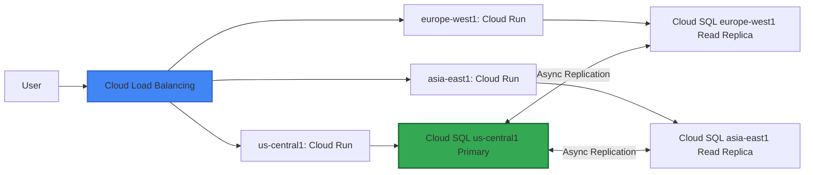

# 🏗️ Domain 1: Designing and Planning a Cloud Solution Architecture
### GCP Professional Cloud Architect — 2026 Exam | Deep-Dive Study Guide (1 of 6)

> **Exam Weight**: ~24% (the HEAVIEST domain — master this one)  
> **Question Count**: ~12 of 50 questions  
> **Focus**: Translating business needs → technical architecture with Well-Architected alignment  
> **2026 Update**: Includes Vertex AI integration, Securing AI patterns, Terraform-native design

---

## 📖 Table of Contents

1. [What the Exam Actually Tests](#1-what-the-exam-actually-tests)
2. [Business & Technical Requirements Gathering](#2-business--technical-requirements-gathering)
3. [Resource Hierarchy & Organization Design](#3-resource-hierarchy--organization-design)
4. [Region & Zone Strategy](#4-region--zone-strategy)
5. [Compute Service Selection (Deep Dive)](#5-compute-service-selection-deep-dive)
6. [Storage & Database Selection (Deep Dive)](#6-storage--database-selection-deep-dive)
7. [Data & Analytics Architecture](#7-data--analytics-architecture)
8. [Network Topology Design](#8-network-topology-design)
9. [Migration Planning (6 R's)](#9-migration-planning-6-rs)
10. [Hybrid & Multi-Cloud Architecture](#10-hybrid--multi-cloud-architecture)
11. [Exam Traps & Tricks](#11-exam-traps--tricks)
12. [Decision Frameworks](#12-decision-frameworks)
13. [Mnemonics & Memory Hacks](#13-mnemonics--memory-hacks)
14. [Practice Checkpoint (15 Scenarios)](#14-practice-checkpoint-15-scenarios)
15. [2025–2026 Changes](#15-20252026-changes)

---

## 1️⃣ What the Exam Actually Tests

### 🔍 The Real Skill Being Assessed
```
The PCA exam does NOT test:
❌ Memorization of gcloud commands
❌ Exact pricing calculations
❌ Deep CLI troubleshooting

The PCA exam DOES test:
✅ Trade-off analysis under multiple constraints
✅ Mapping vague business requirements to concrete GCP services
✅ Applying Well-Architected Framework pillars during design
✅ Recognizing when NOT to use a service (anti-patterns)
✅ Balancing security, cost, performance, and operational overhead
✅ Integrating emerging tech (Vertex AI, Securing AI) without compromising fundamentals
```

### 🎯 Question Archetypes You'll Encounter
| Archetype | Prompt Pattern | What They Want |
|-----------|---------------|----------------|
| **The Constraint Puzzle** | "Requirements: A, B, C, D. Which architecture satisfies ALL?" | Prioritization + elimination of options that violate ANY constraint |
| **The Scale Surprise** | "Current load: X. Expected growth: 10x in 6 months. Design for..." | Forward-thinking architecture that scales without re-architecture |
| **The Compliance Curveball** | "Must meet HIPAA/GDPR/PCI-DSS. Which controls are REQUIRED?" | Knowledge of shared responsibility model + GCP compliance offerings |
| **The Cost vs. Performance Trade** | "Minimize cost while meeting 99.95% SLA" | Right-sizing, commitment planning, architecture efficiency |
| **The Legacy Migration** | "On-prem app with stateful components. Migrate to GCP with minimal changes" | 6 R's application + hybrid connectivity patterns |
| **The AI Integration** *(NEW 2026)* | "Add predictive analytics using Vertex AI while maintaining data governance" | Securing AI patterns + traditional architecture principles |

### 📊 Domain 1 Weight Distribution (Estimated)
```
Business Requirements & Translation    ████████░░  20%
Compute/Storage/Network Selection      ██████████  25%
Data Architecture & Analytics          ██████░░░░  15%
Multi-Region & DR Design               █████░░░░░  12%
Migration & Hybrid Strategy            ████░░░░░░  10%
Emerging Tech (Vertex AI, Securing AI) ████░░░░░░  10%
Cost Optimization in Design            ███░░░░░░░   8%
```

---

## 2️⃣ Business & Technical Requirements Gathering

### 🎯 The Requirements Translation Framework
```
BUSINESS LANGUAGE → TECHNICAL SPECIFICATION

Business Stakeholder Says          | Architect Should Ask/Document
-----------------------------------|--------------------------------
"We need high availability"        → What's the actual SLA/SLO? 99.9%? 99.99%? What's the cost of downtime?
"We want it fast"                  → Define latency requirements: p50? p99? Global or regional users?
"Keep it secure"                   → Which compliance frameworks? What data classification (PII, PHI, PCI)?
"Make it cheap"                    → Budget ceiling? CapEx vs OpEx preference? TCO horizon (1yr/3yr/5yr)?
"We need to move fast"             → What's the release cadence? Team size/skills? Tolerance for tech debt?
"Support AI/ML features"           → Training vs inference? Real-time or batch? Data governance requirements?
```

### 📋 Requirements Documentation Template (Exam-Ready)
```markdown
## Architecture Decision Record (ADR) Template

### Business Context
- Primary goal: [e.g., "Reduce customer churn by 15% via predictive analytics"]
- Success metrics: [e.g., "Model inference <200ms, 99.95% uptime, <$10K/month infra"]
- Stakeholders: [Product, Security, Compliance, Finance]

### Technical Constraints
- Compliance: [HIPAA, GDPR, PCI-DSS, data residency]
- Performance: [RTO/RPO, latency SLAs, throughput requirements]
- Integration: [Legacy systems, third-party APIs, identity providers]
- Team: [Skills matrix, DevOps maturity, on-call capacity]

### Non-Functional Requirements (NFRs) Priority Order
1. [Security] - Data encryption, access controls, audit logging
2. [Reliability] - SLOs, DR strategy, failure mode handling
3. [Cost] - Budget guardrails, commitment strategy, cost allocation
4. [Performance] - Latency targets, scalability patterns
5. [Operational Excellence] - Observability, IaC, change management

### Trade-off Decisions
| Decision | Option A | Option B | Chosen | Rationale |
|----------|----------|----------|--------|-----------|
| Compute  | GKE      | Cloud Run| Cloud Run | Lower ops overhead aligns with small team; autoscaling meets variable load |
```

### 💡 Exam Tip: The "Primary Constraint" Heuristic
```
When stuck between two good answers:
1. Identify the SINGLE most important constraint from the scenario
2. Eliminate options that violate it, even slightly
3. Among remaining options, pick the one that best satisfies the SECOND-most important constraint

Example: 
Scenario emphasizes "PCI-DSS compliance" + "minimize cost"
→ Security is PRIMARY constraint
→ Eliminate any option with public buckets, overly permissive IAM, or unencrypted data
→ Among secure options, pick the most cost-effective
```

---

## 3️⃣ Resource Hierarchy & Organization Design

### 🏢 GCP Resource Hierarchy Deep Dive
```
Organization (root)
│
├── Folder: "Production" (Policy: enforce CMEK, disable public buckets)
│   ├── Project: prod-us-central1-app
│   ├── Project: prod-eu-west1-app  
│   └── Project: prod-global-data
│
├── Folder: "Non-Production" (Policy: allow dev tools, lower security constraints)
│   ├── Project: dev-sandbox
│   ├── Project: staging-integration
│   └── Project: qa-automation
│
├── Folder: "Shared Services" (Centralized platform capabilities)
│   ├── Project: networking-hub (Shared VPC host)
│   ├── Project: security-ops (SCC, audit logs, org policies)
│   └── Project: ci-cd-platform (Cloud Build, Artifact Registry)
│
└── Folder: "Sandbox" (Optional: for experimentation, auto-delete after 30 days)
```

### 🔑 Key Design Principles Tested on Exam
| Principle | Why It Matters | Exam Application |
|-----------|---------------|-----------------|
| **Environment Isolation** | Prevents blast radius; enables different policies per env | Separate projects for prod/non-prod; never share projects |
| **Policy Inheritance** | Org policies flow down; can be restricted but not expanded at lower levels | Design folder structure to enable policy reuse (e.g., all prod projects inherit CMEK policy) |
| **Billing Separation** | Enables cost allocation, chargeback, budget alerts | Group projects by cost center/team in folder structure |
| **IAM Boundary Alignment** | IAM policies can be set at org/folder/project; simpler management at higher levels | Use folder-level IAM for team-based access (e.g., "data-engineers" group gets access to all data projects) |
| **Network Topology Mapping** | Shared VPC host project should align with networking team ownership | Place Shared VPC host in `shared-services/networking` folder |

### ⚠️ Common Exam Traps: Resource Hierarchy
```
❌ Trap: "Use a single project for all environments to simplify IAM"
✅ Reality: Violates isolation, compliance, and blast radius principles

❌ Trap: "Apply org policies at project level for flexibility"
✅ Reality: Loses centralized governance; harder to audit/enforce at scale

❌ Trap: "Put Shared VPC host in the same project as workloads"
✅ Reality: Creates coupling; networking changes impact app deployments

✅ Exam Pattern: Scenarios mentioning "multiple teams", "compliance", or "cost allocation" 
   almost always require folder-based separation + policy inheritance
```

---

## 4️⃣ Region & Zone Strategy

### 🌍 Region Selection Decision Matrix
```
Factor                          | Question to Ask                  | GCP Feature to Leverage
--------------------------------|----------------------------------|--------------------------
Data Residency                  | "Where must data physically reside?" | Region selection + org policy constraints/resourcemanager.location
Latency Requirements            | "Where are end users located?"   | Global load balancing + Cloud CDN + regional compute placement
Disaster Recovery               | "What RPO/RTO is acceptable?"    | Multi-region services (Spanner, BigQuery) vs. cross-region replication
Cost Optimization               | "Which regions have lower pricing?" | Compare region pricing; use committed use discounts strategically
Service Availability            | "Are required GA services available in region?" | Check region service catalog; avoid beta features in prod
Compliance Certifications       | "Does region have required certifications?" | Verify region-level compliance (e.g., HIPAA eligibility by region)
```

### 🔄 Zone Strategy: When to Use Multi-Zone vs. Single-Zone
```yaml
Multi-Zone (Regional) Deployment:
✅ Use when:
   - Application requires high availability (99.95%+ SLA)
   - State can be externalized (to Cloud SQL, Memorystore, etc.)
   - Load balancing can distribute traffic across zones
❌ Avoid when:
   - Application has zone-affinity requirements (rare)
   - Cost is extreme constraint and 99.9% SLA is acceptable

Single-Zone Deployment:
✅ Use when:
   - Batch processing with retry logic (failure = re-run job)
   - Development/testing environments
   - Stateful legacy apps that can't be easily distributed
❌ Avoid when:
   - Production user-facing services
   - Any requirement mentioning "high availability" or "fault tolerance"

💡 Exam Tip: "Regional" in GCP often means multi-zone by default (e.g., regional managed instance groups, regional GKE clusters). 
   Know which services are regional vs. zonal!
```

### 🗺️ Multi-Region Architecture Patterns


**Pattern Selection Guide**:
| Pattern | RPO | RTO | Cost | Complexity | Best For |
|---------|-----|-----|------|------------|----------|
| **Single-Region, Multi-Zone** | 0 (synchronous) | Minutes | $ | Low | Most production apps |
| **Active-Passive DR** | 15 min (async) | 30-60 min | $$ | Medium | Compliance apps with moderate RTO |
| **Active-Active (Regional Sharding)** | Varies | Seconds | $$$ | High | Global user base, low-latency needs |
| **Active-Active (Full Redundancy)** | Near-zero | Seconds | $$$$ | Very High | Financial/trading systems, zero-downtime requirements |

---

## 5️⃣ Compute Service Selection (Deep Dive)

### 🖥️ Compute Service Comparison Matrix (2026 Updated)
| Service | Best For | Scaling | Max Execution | State Management | Ops Overhead | Cost Model | 2026 Update |
|---------|----------|---------|---------------|-----------------|--------------|------------|-------------|
| **Cloud Functions** | Event-driven, single-purpose functions | Auto, per-request | 9 min (1st gen), 60 min (2nd gen) | External only | None | Pay-per-invocation | 2nd gen supports longer timeouts, VPC egress |
| **Cloud Run** | Stateless HTTP services, containers | Auto, 0→N in seconds | 24h (with session affinity) | External only | Low | Pay-per-request + CPU/memory | Cloud Run Jobs for batch; GPU support in preview |
| **App Engine Standard** | Web apps with predictable traffic | Auto, instance-based | 24h (background tasks) | Limited (memcache) | Very Low | Instance-hours + operations | Python 3.11+, Java 17+, faster cold starts |
| **App Engine Flexible** | Legacy apps needing custom runtime | Manual/autoscaling | Unlimited | Full VM access | Medium | VM pricing + management | **Deprecated for new projects** - avoid on exam |
| **GKE Autopilot** | Microservices, Kubernetes-native apps | Cluster/node autoscaling | Unlimited | Persistent volumes | Low (managed control plane) | Pod-based billing + cluster fee | Autopilot now GA; recommended over Standard for most cases |
| **GKE Standard** | Advanced K8s customization, custom node config | Full control | Unlimited | Full control | High | Node VM pricing + management | Use only when Autopilot limitations block requirements |
| **Compute Engine** | Legacy lift-and-shift, custom OS, GPU/TPU workloads | Managed instance groups | Unlimited | Full control | High | Per-second VM pricing | Confidential VMs, sole-tenant nodes for compliance |
| **Vertex AI Training** | ML model training (custom or pre-built) | Auto-scaling workers | Up to 7 days | Checkpoint to GCS | Low (managed) | Per-second training resources | **NEW**: Integration with Securing AI patterns |
| **Vertex AI Prediction** | Model serving with autoscaling | Auto, 0→N | Unlimited | Model caching | Low | Per-prediction + node hours | **NEW**: Private endpoints, VPC-SC integration |

### 🎯 Service Selection Decision Tree (Text Version)
```
START: What is the workload type?

├─► Event-driven, single-purpose function?
│   ├─► Yes → Cloud Functions (2nd gen if needs VPC/longer timeout)
│   └─► No → Continue
│
├─► Stateless HTTP API or web service?
│   ├─► Yes → 
│   │   ├─► Containerized already? → Cloud Run
│   │   ├─► Need custom runtime but not containerized? → App Engine Standard
│   │   └─► Need Kubernetes orchestration? → GKE Autopilot
│   └─► No → Continue
│
├─► Batch processing or scheduled job?
│   ├─► Yes →
│   │   ├─► Short-lived (<60 min), event-triggered? → Cloud Functions 2nd gen
│   │   ├─► Medium duration (up to 24h), containerized? → Cloud Run Jobs
│   │   ├─► Long-running, complex orchestration? → Workflows + Cloud Run/GCE
│   │   └─► Massive parallel data processing? → Dataflow (serverless) or GKE Batch
│   └─► No → Continue
│
├─► Stateful application or legacy lift-and-shift?
│   ├─► Yes → Compute Engine (with managed instance groups for HA)
│   └─► No → Continue
│
├─► Machine Learning training or inference?
│   ├─► Training → Vertex AI Training (custom container or pre-built)
│   ├─► Real-time inference → Vertex AI Prediction or Cloud Run with GPU
│   ├─► Batch inference → Vertex AI Batch Prediction or Dataflow
│   └─► Feature store needed? → Vertex AI Feature Store + BigQuery
│
└─► Need full OS control, custom kernel, or specialized hardware?
    └─► Yes → Compute Engine (confidential VM, sole-tenant, GPU/TPU)
```

### 💡 Exam Pro Tips: Compute Selection
```
✅ When you see "minimize operational overhead" → Prefer serverless (Cloud Run, Functions, Autopilot)
✅ When you see "existing Kubernetes manifests" → GKE (Autopilot if no special node requirements)
✅ When you see "legacy app with OS dependencies" → Compute Engine (but note migration opportunity)
✅ When you see "variable/unpredictable load" → Autoscaling serverless > managed instance groups
✅ When you see "GPU/TPU required" → Compute Engine or Vertex AI (not Cloud Run/App Engine)

⚠️ Red Flag Phrases:
- "Custom kernel module" → Only Compute Engine supports this
- "Sub-100ms cold start required" → Avoid Cloud Functions 1st gen; prefer Cloud Run or pre-warmed instances
- "Need to SSH into instances for debugging" → Anti-pattern; suggest structured logging + Cloud Monitoring instead
```

---

## 6️⃣ Storage & Database Selection (Deep Dive)

### 🗄️ Storage Service Decision Framework

#### Step 1: Data Access Pattern
```
READ/WRITE PATTERN → PRIMARY SERVICE CANDIDATE

✅ Sequential writes, immutable objects (logs, backups, media)
   → Cloud Storage (choose class: Standard/Nearline/Coldline/Archive)

✅ Random reads/writes, strong consistency, relational schema
   → Cloud SQL (PostgreSQL/MySQL) or AlloyDB for PostgreSQL

✅ High-throughput, low-latency, wide-column, time-series
   → Bigtable (for 10K+ ops/sec) or Firestore (for document model)

✅ Global scale, strong consistency, horizontal scaling
   → Spanner (if budget allows) or Cloud SQL + global read replicas (if eventual consistency acceptable)

✅ Analytical queries, petabyte-scale, SQL interface
   → BigQuery (serverless data warehouse)

✅ Caching, sub-millisecond latency, ephemeral data
   → Memorystore (Redis) or ElastiCache-compatible

✅ Event streaming, decoupled producers/consumers
   → Pub/Sub (with Dataflow for processing)
```

#### Step 2: Refine by Secondary Requirements
```
Add these filters to narrow selection:

🔐 Security/Compliance Needs:
   - CMEK required? → All services support, but verify region availability
   - Data residency? → Choose region-specific deployment; avoid multi-region if restricted
   - Audit logging? → Enable Data Access logs; verify service supports required log types

📈 Scale & Performance:
   - >10K writes/sec? → Bigtable, Pub/Sub, or shard Cloud SQL
   - Sub-10ms read latency? → Memorystore, Bigtable, or CDN-cached Cloud Storage
   - Complex joins/aggregations? → BigQuery or Cloud SQL (not NoSQL)

💰 Cost Optimization:
   - Infrequent access? → Cloud Storage Nearline/Coldline + lifecycle policies
   - Predictable steady load? → Committed use discounts for Cloud SQL/GCE
   - Highly variable load? → Serverless options (BigQuery, Cloud Run, Functions)

⚙️ Operational Preferences:
   - Zero maintenance windows? → Serverless (BigQuery, Firestore, Cloud Storage)
   - Need point-in-time recovery? → Cloud SQL, Bigtable, BigQuery
   - Require cross-region replication? → Multi-region BigQuery, Spanner, or configure async replication
```

### 📊 Database Selection Cheat Sheet
```
┌─────────────────┬────────────────────────┬─────────────────────────┐
│ Use Case        │ Primary Choice         │ Alternative             │
├─────────────────┼────────────────────────┼─────────────────────────┤
│ User profiles   │ Firestore              │ Cloud SQL (if complex   │
│ (document JSON) │ (native JSON, scalable)│ queries needed)         │
├─────────────────┼────────────────────────┼─────────────────────────┤
│ Financial trans-│ Cloud SQL (PostgreSQL) │ AlloyDB (if need PG at  │
│ actions (ACID)  │ with read replicas     │ 10x scale)              │
├─────────────────┼────────────────────────┼─────────────────────────┤
│ IoT telemetry   │ Bigtable               │ Pub/Sub + BigQuery      │
│ (high write,    │ (time-series optimized)│ (if real-time analytics │
│ time-series)    │                        │ needed)                 │
├─────────────────┼────────────────────────┼─────────────────────────┤
│ Product catalog │ Cloud SQL + Memorystore│ Firestore (if schema-   │
│ (read-heavy,    │ (cache frequent items) │ less, global scale)     │
│ low latency)    │                        │                         │
├─────────────────┼────────────────────────┼─────────────────────────┤
│ Analytics/BI    │ BigQuery               │ Looker + BigQuery       │
│ (SQL, petabyte) │ (serverless, ML-ready) │ (for visualization)     │
├─────────────────┼────────────────────────┼─────────────────────────┤
│ Global user     │ Spanner                │ Cloud SQL multi-region  │
│ sessions (strong│ (global consistency)   │ + application-layer     │
│ consistency)    │                        │ conflict resolution     │
└─────────────────┴────────────────────────┴─────────────────────────┘
```

### ⚠️ Storage Exam Traps
```
❌ Trap: "Use Cloud Storage for a relational dataset because it's cheap"
✅ Reality: Cheap ≠ appropriate; lack of transactions, indexing, and query capability will cause re-architecture later

❌ Trap: "Choose Firestore for complex analytical queries"
✅ Reality: Firestore has limited query capabilities; BigQuery is purpose-built for analytics

❌ Trap: "Use Bigtable for a small (<1TB) dataset with simple key-value access"
✅ Reality: Bigtable has minimum node requirements; Cloud SQL or Memorystore may be more cost-effective at small scale

✅ Exam Pattern: Scenarios mentioning "ad-hoc SQL queries from business users" almost always point to BigQuery, 
   regardless of the underlying operational database
```

---

## 7️⃣ Data & Analytics Architecture

### 🔄 Modern Data Pipeline Patterns on GCP
```
Pattern 1: Lambda Architecture (Batch + Speed Layer)
┌─────────────────────────────────────┐
│ Ingestion: Pub/Sub (real-time)      │
├─────────────────┤                   │
│ Speed Layer:    │                   │
│ • Dataflow (streaming) → BigQuery   │
│ • Real-time dashboards              │
├─────────────────┤                   │
│ Batch Layer:    │                   │
│ • Cloud Storage (raw)               │
│ • Dataproc/BigQuery (processing)    │
│ • BigQuery (serving)                │
└─────────────────┴───────────────────┘
Best for: Fraud detection, real-time personalization

Pattern 2: Kappa Architecture (Streaming-First)
┌─────────────────────────────────────┐
│ Single Pipeline:                    │
│ Pub/Sub → Dataflow (exactly-once)  │
│ → BigQuery (serving + analytics)   │
│ → Vertex AI (ML features)          │
└────────────────────────────────────┘
Best for: Simpler ops, when batch reprocessing isn't critical

Pattern 3: Medallion Architecture (Data Lakehouse)
┌─────────────────────────────────────┐
│ Bronze (raw): Cloud Storage         │
│ Silver (cleaned): BigQuery/Parquet  │
│ Gold (business-ready): BigQuery     │
│ Serving: Looker, Vertex AI, APIs    │
└────────────────────────────────────┘
Best for: Enterprise data platforms, governed self-service analytics
```

### 🎯 Analytics Service Selection Guide
```
QUESTION: "What analytics capability do you need?"

├─► Ad-hoc SQL queries on large datasets?
│   └─► BigQuery (serverless, separate storage/compute)
│
├─► Real-time dashboards with sub-second latency?
│   ├─► Small dataset (<100GB) → BigQuery BI Engine
│   ├─► Large dataset → BigQuery + Looker (cached queries)
│   └─► Ultra-low latency → Bigtable + custom API + CDN
│
├─► Machine learning on structured data?
│   ├─► AutoML → BigQuery ML (SQL-based models)
│   ├─► Custom models → Vertex AI + BigQuery as feature source
│   └─► Real-time inference → Vertex AI Prediction + BigQuery streaming
│
├─► Data transformation/ETL?
│   ├─► Serverless, SQL-based → BigQuery + Cloud Functions
│   ├─► Complex logic, custom code → Dataflow (Apache Beam)
│   └─► Spark-based workflows → Dataproc (managed Spark)
│
├─► Data cataloging, lineage, governance?
│   └─► Dataplex (unified governance) + Data Catalog (metadata search)
│
└─► Real-time event processing (not just analytics)?
    └─► Pub/Sub + Dataflow (streaming) or Cloud Functions (simple triggers)
```

### 🔐 Securing Data Pipelines (2026 Focus)
```yaml
Data Protection Layers:
1. Encryption:
   - At rest: CMEK for BigQuery, Cloud Storage, Bigtable
   - In transit: TLS 1.2+ enforced via org policy
   - Key management: Cloud KMS with key rotation policies

2. Access Control:
   - Column-level security in BigQuery (policy tags)
   - Row-level security via authorized views
   - IAM conditions for time/resource-based access

3. Data Minimization:
   - De-identify PII with Cloud DLP before analytics
   - Use BigQuery logical views to expose only necessary columns
   - Implement data retention policies with lifecycle rules

4. Audit & Monitoring:
   - Enable Data Access audit logs for all data services
   - Export logs to immutable Cloud Logging bucket
   - Set up alerts for anomalous data access patterns

💡 Exam Tip: "Securing AI" scenarios often combine DLP (de-identification) + 
   BigQuery policy tags + Vertex AI private endpoints = defense in depth
```

---

## 8️⃣ Network Topology Design

### 🌐 VPC Design Patterns Tested on PCA Exam

#### Pattern A: Single Shared VPC (Most Common)
```
Organization
└── Folder: shared-services
    └── Project: network-host (Shared VPC host)
        ├── Subnets: us-central1, europe-west1, asia-east1
        ├── Cloud Router + HA VPN for hybrid
        ├── Cloud NAT for private egress
        └── Firewall rules managed centrally

Folders: prod/, non-prod/, teams/
└── Service Projects: attach to Shared VPC
    └── Resources deploy into shared subnets
    └── IAM: network team manages network; app teams manage workloads

✅ Best for: Centralized network governance, cost efficiency, consistent policies
❌ Avoid when: Teams need completely isolated network configurations
```

#### Pattern B: Multiple Independent VPCs (High Isolation)
```
Organization
├── Folder: prod
│   ├── Project: prod-app (VPC-A)
│   └── Project: prod-data (VPC-B)
│
├── Folder: non-prod
│   ├── Project: dev-app (VPC-C)
│   └── Project: staging-data (VPC-D)

Connectivity:
• VPC Peering: prod-app ↔ prod-data (if needed)
• Cloud VPN: each VPC to on-prem (or use hub-and-spoke via network project)
• Private Service Connect: for managed service access

✅ Best for: Strict compliance boundaries, multi-tenant isolation, security zones
❌ Avoid when: Frequent cross-project communication needed (adds complexity)
```

#### Pattern C: Hub-and-Spoke with Network Connectivity Center
```
Hub Project (network-hub)
├── Global VPC with subnets in all regions
├── Cloud Router + HA VPN/Dedicated Interconnect
├── Network Connectivity Center (NCC) for spoke management
│
Spoke Projects (app teams)
├── Local VPCs (optional) OR attach directly to hub subnets
├── Route traffic through hub for egress, hybrid, or inspection

✅ Best for: Large enterprises, hybrid connectivity, centralized security inspection
❌ Avoid when: Small teams, simple architectures, cost-sensitive projects
```

### 🔑 Critical Networking Concepts for Exam
| Concept | Why It's Tested | Quick Recall |
|---------|----------------|--------------|
| **Private Google Access** | Allows VMs without external IPs to reach Google APIs | Enable on subnet; required for secure, private cloud-native apps |
| **VPC Service Controls** | Prevents data exfiltration from sensitive projects | Create perimeter around prod/data projects; test with dry-run mode |
| **Cloud NAT** | Provides outbound internet for private VMs | Regional service; configure min/max ports per VM to avoid SNAT exhaustion |
| **Cloud Load Balancing** | Global anycast IP, automatic multi-region failover | Use for user-facing apps; integrates with Cloud CDN, Cloud Armor |
| **Private Service Connect** | Private connectivity to Google APIs & partner services | More secure than public endpoints; replaces need for VPC peering for SaaS |
| **Network Tiers** | Premium (global) vs Standard (regional) routing | Premium for low-latency global apps; Standard for cost-sensitive regional workloads |

### ⚠️ Network Exam Traps
```
❌ Trap: "Use external IP addresses for VMs to simplify debugging"
✅ Reality: Violates security best practices; use Cloud Logging, OS Login, and IAP instead

❌ Trap: "Peer every VPC with every other VPC for full connectivity"
✅ Reality: Creates O(n²) complexity; prefer hub-and-spoke or Shared VPC

❌ Trap: "Disable Cloud Armor to reduce latency"
✅ Reality: Security controls rarely get "disabled" on exam; look for WAF rules tuning instead

✅ Exam Pattern: Scenarios mentioning "prevent data exfiltration", "compliance boundary", or 
   "third-party access" almost always require VPC Service Controls + IAM conditions
```

---

## 9️⃣ Migration Planning (6 R's)

### 🔄 The 6 R's Framework (GCP-Aligned)
```
1. REHOST ("Lift-and-Shift")
   • Move VMs as-is to Compute Engine
   • Tools: Migrate for Compute Engine (formerly Velostrata), Migrate to Virtual Machines
   • Best for: Quick migration, legacy apps with complex dependencies
   • Exam cue: "Minimize code changes", "tight timeline", "unknown dependencies"

2. REPLATFORM ("Lift, Tinker, and Shift")
   • Move to managed services with minimal changes
   • Example: On-prem MySQL → Cloud SQL; self-hosted Kafka → Pub/Sub
   • Best for: Reduce ops overhead while preserving architecture
   • Exam cue: "Reduce operational burden", "team lacks DBA expertise"

3. REPURCHASE ("Drop-and-Shop")
   • Switch to SaaS or commercial GCP Marketplace solutions
   • Example: On-prem CRM → Salesforce; self-hosted monitoring → Cloud Monitoring
   • Best for: Non-differentiated capabilities, faster time-to-value
   • Exam cue: "Focus engineering on core business logic", "evaluate commercial options"

4. REFACTOR / RE-ARCHITECT
   • Redesign for cloud-native patterns (microservices, serverless, event-driven)
   • Example: Monolith → Cloud Run microservices; batch → streaming with Dataflow
   • Best for: Long-term agility, scalability, innovation
   • Exam cue: "Enable rapid feature development", "handle 10x growth", "adopt DevOps"

5. RETAIN
   • Keep on-prem or in current environment
   • Reasons: Regulatory, technical debt, cost of migration > benefit
   • Hybrid connectivity: Cloud VPN, Dedicated Interconnect, Partner Interconnect
   • Exam cue: "Legacy system with vendor lock-in", "migration cost prohibitive"

6. RETIRE
   • Decommission unused or redundant systems
   • Often overlooked but critical for TCO reduction
   • Exam cue: "Identify cost savings opportunities", "simplify architecture"
```

### 🎯 Migration Strategy Decision Tree
```
START: What is the application's business criticality and technical debt?

├─► Low criticality, high technical debt?
│   └─► Consider RETIRE or minimal REHOST to buy time for rewrite
│
├─► High criticality, stable, well-understood?
│   ├─► Need to migrate in <3 months? → REHOST (Migrate for Compute Engine)
│   ├─► Can invest 6-12 months? → REPLATFORM to managed services
│   └─► Long-term strategic app? → REFACTOR to cloud-native
│
├─► Third-party commercial software?
│   ├─► GCP Marketplace version available? → REPURCHASE
│   └─► No cloud version? → REHOST or RETAIN with hybrid connectivity
│
├─► Data-heavy application?
│   ├─► <10 TB → Migrate via network (gsutil, Storage Transfer Service)
│   ├─► 10-100 TB → Use Transfer Appliance or Dedicated Interconnect
│   └─► >100 TB → Transfer Appliance + phased cutover
│
└─► Compliance/regulatory constraints?
    ├─► Data residency requirements? → Choose target region carefully
    ├─► Audit trail needed for migration? → Enable Cloud Audit Logs + migration tool logging
    └─► Validation required? → Implement pre/post-migration checksums, canary testing
```

### 💡 Migration Exam Pro Tips
```
✅ When scenario mentions "minimal downtime" → Look for:
   - Database replication (Cloud SQL read replicas, Datastream for CDC)
   - Blue/green or canary deployment patterns
   - DNS cutover with low TTL pre-migration

✅ When scenario mentions "unknown application dependencies" → 
   - Migrate for Compute Engine (agentless discovery) is often the answer
   - Avoid REFACTOR until dependencies are mapped

✅ When scenario mentions "reduce long-term TCO" → 
   - REPLATFORM or REFACTOR usually beats REHOST (managed services reduce ops cost)
   - But factor in migration effort cost (exam may provide TCO model)

⚠️ Red Flag: "Migrate everything to serverless in 1 month" → Unrealistic; 
   look for phased approach or REHOST first, then optimize
```

---

## 🔟 Hybrid & Multi-Cloud Architecture

### 🌐 Hybrid Connectivity Options Compared
```
┌─────────────────┬──────────────┬─────────────┬──────────────┬─────────────┐
│ Option          │ Latency      │ Throughput  │ Setup Time   │ Best For    │
├─────────────────┼──────────────┼─────────────┼──────────────┼─────────────┤
│ Cloud VPN       │ 50-150ms     │ Up to 3Gbps │ Hours        │ Dev/test,   │
│ (HA VPN)        │ (internet)   │ per tunnel  │              │ backup,     │
│                 │              │             │              │ cost-sensitive│
├─────────────────┼──────────────┼─────────────┼──────────────┼─────────────┤
│ Dedicated       │ 10-50ms      │ 5-200 Gbps  │ Weeks        │ Production, │
│ Interconnect    │ (private)    │             │              │ low-latency,│
│                 │              │             │              │ high-throughput│
├─────────────────┼──────────────┼─────────────┼─────────────┼─────────────┤
│ Partner         │ 10-50ms      │ 50Mbps-10Gbps│ Days-weeks  │ Regions     │
│ Interconnect    │ (private)    │             │              │ without     │
│                 │              │             │              │ Google PoP  │
├─────────────────┼──────────────┼─────────────┼──────────────┼─────────────┤
│ Cloud CDN +     │ Variable     │ Global scale│ Minutes      │ User-facing │
│ External LB     │ (public)     │             │              │ content,    │
│                 │              │             │              │ DDoS protection│
└─────────────────┴──────────────┴─────────────┴──────────────┴─────────────┘
```

### 🔄 Multi-Cloud Design Principles (2026 Focus)
```
✅ When multi-cloud is justified (exam scenarios):
   • Regulatory requirement for vendor diversification
   • Acquisition of company with existing non-GCP footprint
   • Specific service only available on another cloud (rare)

✅ GCP-native patterns for multi-cloud:
   • Anthos: Manage GKE clusters across GCP, AWS, Azure, on-prem
   • Terraform with multi-provider config: Single IaC for multiple clouds
   • Cloud Deploy: Multi-target pipelines (GCP + other environments)
   • Workload Identity Federation: Use AWS/Azure identities to access GCP resources

✅ Data strategy for multi-cloud:
   • Avoid synchronous cross-cloud data dependencies (high latency, cost)
   • Use event-driven replication (Pub/Sub → other cloud queues) for async consistency
   • Keep authoritative data in one cloud; replicate read-only copies elsewhere

❌ Anti-patterns to avoid on exam:
   • "Active-active database across clouds" → Extremely complex, high latency, conflict resolution nightmare
   • "Shared VPC across clouds" → Not possible; use VPC peering within GCP only
   • "Single IAM system for all clouds" → Use workload identity federation, not credential sharing
```

### 💡 Hybrid/Multi-Cloud Exam Strategy
```
When you see hybrid/multi-cloud scenario:

1️⃣ Identify the PRIMARY reason for hybrid:
   - Compliance? → Focus on data residency controls, encryption, audit
   - Latency? → Edge caching (Cloud CDN), regional deployment, Anycast IP
   - Risk mitigation? → Active-passive DR, not active-active (unless explicitly required)

2️⃣ Determine the integration pattern:
   - Data sync? → Cloud Storage Transfer, Datastream, Pub/Sub
   - Identity? → Workload Identity Federation, Cloud IAM + external IdP
   - Networking? → Cloud VPN (quick), Dedicated Interconnect (production)

3️⃣ Apply the "GCP-first" heuristic:
   - Unless scenario explicitly requires multi-cloud, assume GCP-native solution is preferred
   - Multi-cloud adds complexity; exam rewards simplicity when requirements allow

✅ Example: "Company uses AWS but wants to run new AI workloads on GCP"
→ Correct approach: Workload Identity Federation (AWS identity → GCP service account) 
   + Private Service Connect for secure API access 
   + Keep data in GCP for Vertex AI (avoid cross-cloud data transfer costs/latency)
```

---

## 1️⃣1️⃣ Exam Traps & Tricks

### 🚫 Top 10 Domain 1 Exam Traps (With Avoidance Strategies)

| Trap | What It Looks Like | Why It's Wrong | How to Avoid |
|------|-------------------|----------------|--------------|
| **The Over-Engineered Solution** | Suggests Spanner + Global Load Balancing + Multi-region GKE for a 100-user internal tool | Violates "minimize cost/complexity" principle | Ask: "What's the simplest architecture that meets ALL constraints?" |
| **The Security-Only Focus** | Picks most secure option even when it breaks performance/cost requirements | Ignores trade-off analysis; PCA tests balance | Use WAF filter: which option satisfies MOST pillars? |
| **The "New Shiny" Bias** | Recommends Vertex AI, Spanner, or Anthos when simpler services suffice | Tests if you understand service purpose, not just names | Apply decision frameworks first; only choose advanced services if requirements explicitly need them |
| **Ignoring Data Gravity** | Places compute far from data sources, ignoring egress costs/latency | Real-world architectures minimize data movement | Default to "compute near data" unless latency requirements dictate otherwise |
| **Misreading Scale Indicators** | "100 users" vs "100 concurrent users"; "batch job" vs "real-time" | Small wording changes dramatically alter architecture | Underline numbers and time descriptors; parse carefully |
| **Forgetting Operational Reality** | Suggests self-managed Kafka for a 3-person startup team | Violates "minimize operational overhead" | When team size/skills mentioned, prefer managed services |
| **Assuming Global When Regional Suffices** | Defaults to multi-region for a single-country application | Unnecessary cost and complexity | Check user geography and latency requirements first |
| **Over-Reliance on IAM Conditions** | Uses IAM conditions to enforce boundaries instead of structural separation | Conditions are powerful but not a substitute for architecture | Prefer folder/project boundaries first; use conditions as refinement |
| **Ignoring the "Why" Behind Requirements** | Takes "needs high availability" at face value without clarifying SLO | Misses opportunity to right-size solution | Mentally ask: "What's the actual business impact of downtime?" |
| **The Legacy Bias** | Defaults to Compute Engine for everything because "it's like on-prem" | Misses cloud-native benefits; exam rewards modern patterns | Ask: "What managed service could replace this undifferentiated heavy lifting?" |

### 🎭 Scenario Red Flags vs Green Lights
```
🚩 RED FLAG PHRASES (Often indicate wrong answer):
• "Simplest possible solution" → But option is overly complex
• "Minimize management overhead" → But option requires self-managed infrastructure
• "Ensure compliance" → But option lacks encryption/audit controls
• "Handle unpredictable scale" → But option uses fixed-size resources
• "Global low-latency access" → But option is single-region without CDN

✅ GREEN LIGHT PHRASES (Often indicate correct answer):
• "Managed service" + "least privilege IAM" + "CMEK encryption"
• "Autoscaling" + "health checks" + "regional distribution"
• "Infrastructure as Code" + "immutable deployments" + "rollback capability"
• "Centralized logging" + "SLO monitoring" + "automated alerting"
• "Phased migration" + "canary testing" + "rollback plan"
```

---

## 1️⃣2️⃣ Decision Frameworks

### 🧭 The PCA Decision Framework (Use for Every Question)
```
STEP 1: DECODE THE SCENARIO (30 seconds)
□ Underline business requirements (revenue, compliance, user experience)
□ Circle technical constraints (latency, scale, RTO/RPO, budget)
□ Box team/organizational context (skills, timeline, risk tolerance)

STEP 2: IDENTIFY THE PRIMARY CONSTRAINT (15 seconds)
□ Security/Compliance? → Eliminate options with public access, weak encryption
□ Cost? → Eliminate over-provisioned, premium services without justification  
□ Performance? → Eliminate options with known latency bottlenecks
□ Velocity? → Eliminate options requiring heavy ops or long migration

STEP 3: APPLY SERVICE SELECTION FRAMEWORKS (45 seconds)
□ Compute: Use decision tree from Section 5
□ Storage: Use pattern matching from Section 6
□ Network: Match topology to isolation/connectivity needs
□ Data: Align pipeline pattern to analytics requirements

STEP 4: FILTER THROUGH WELL-ARCHITECTED LENS (30 seconds)
□ Security: Least privilege, encryption, auditability
□ Reliability: SLOs, failure handling, recovery strategy
□ Cost: Right-sizing, commitments, serverless where variable
□ Operational Excellence: IaC, observability, automation
□ Performance: Latency-aware placement, caching, async patterns

STEP 5: CHOOSE & VALIDATE (15 seconds)
□ Does chosen option satisfy PRIMARY constraint?
□ Does it violate any EXPLICIT requirement?
□ Is there a simpler option that also works? (If yes, reconsider)
```

### 🎯 Trade-off Resolution Matrix
```
When two options both seem viable, use this priority order:

1. COMPLIANCE VIOLATION = AUTOMATIC ELIMINATION
   (e.g., public bucket for PHI, unencrypted PCI data)

2. PRIMARY BUSINESS REQUIREMENT = NON-NEGOTIABLE
   (e.g., if "sub-100ms latency" is stated, eliminate options with known >100ms latency)

3. COST vs. PERFORMANCE: Use the "10x Rule"
   - If option A is 10x more expensive but only 10% better performance → Choose A only if performance is PRIMARY constraint
   - If option A is 2x more expensive but 10x better performance → Strong candidate if performance matters

4. OPERATIONAL OVERHEAD: Apply the "Team Size Multiplier"
   - Small team (<10 engineers)? Add +2 complexity penalty to self-managed options
   - Large platform team? Can absorb more operational complexity

5. FUTURE-PROOFING: Only prioritize if explicitly mentioned
   - "Expected 10x growth in 12 months" → Favor horizontally scalable designs
   - No growth mentioned? Optimize for current requirements
```

### 📐 Architecture Validation Checklist (Pre-Submission Mental Check)
```
Before finalizing your answer, quickly verify:

✅ Security
   [ ] Data encrypted at rest (CMEK if required) and in transit (TLS)
   [ ] IAM follows least privilege (predefined > custom > primitive)
   [ ] Network boundaries align with trust zones (VPC-SC if sensitive)

✅ Reliability  
   [ ] SLOs defined and architecture can meet them
   [ ] Failure modes considered (retries, circuit breakers, fallbacks)
   [ ] Backup/DR strategy matches RPO/RTO requirements

✅ Cost
   [ ] Right-sized resources (no obvious over-provisioning)
   [ ] Commitment strategy appropriate for workload predictability
   [ ] Serverless used for variable/unpredictable load

✅ Operational Excellence
   [ ] Infrastructure defined as code (Terraform/Deployment Manager)
   [ ] Observability built-in (logging, metrics, traces)
   [ ] Deployment strategy supports rollback (blue/green, canary)

✅ Performance
   [ ] Compute placed near data to minimize egress/latency
   [ ] Caching strategy for read-heavy patterns
   [ ] Async processing for non-critical paths

✅ 2026 Additions
   [ ] Vertex AI workloads use private endpoints + VPC-SC if sensitive
   [ ] Securing AI patterns applied (de-identification, policy tags, audit)
   [ ] Terraform-native design (modules, remote state, workspaces)
```

---

## 1️⃣3️⃣ Mnemonics & Memory Hacks

### 🧠 Acronyms to Memorize
```
WAF Pillars → "SCoPE"
S - Security
C - Cost Optimization  
P - Performance Efficiency
E - Operational Excellence
(plus Reliability as the foundation)

Migration 6 R's → "Real People Rarely Return To Restaurants"
R - Rehost
P - Replatform  
R - Repurchase
R - Refactor/Re-architect
T - Retain
R - Retire

Storage Selection → "SODA BFF"
S - Cloud Storage (Objects, archives)
O - (Skip - not used)
D - Bigtable (Dynamic, high-throughput)
A - BigQuery (Analytics)
B - Cloud SQL (Business transactions, ACID)
F - Firestore (Flexible documents)
F - Spanner (Global, strong consistency)

Compute Selection → "FARM CGV"
F - Functions (event-driven)
A - App Engine (web apps)
R - Run (containers, serverless)
M - (Skip)
C - Compute Engine (VMs, full control)
G - GKE (Kubernetes)
V - Vertex AI (ML workloads)
```

### 🎨 Visual Memory Aids
```
Region Selection Mind Map:
          [User Location]
                │
     ┌──────────┴──────────┐
 [Latency Critical?]    [Data Residency?]
     │ Yes      │ No        │ Yes    │ No
     ▼          ▼           ▼        ▼
 [Deploy near] [Use CDN] [Restrict  [Choose
  users]       + global   region]   cost-optimal
                LB                   region]

Compute Decision Flow (Simplified):
[Stateless?] → Yes → [Containerized?] → Yes → Cloud Run
                          │ No
                          ▼
                   [Need custom runtime?] → Yes → App Engine Standard
                          │ No  
                          ▼
                   [Event-driven?] → Yes → Cloud Functions
                          │ No
                          ▼
                   [Kubernetes needed?] → Yes → GKE Autopilot

[Stateful?] → Yes → [Legacy/OS control needed?] → Yes → Compute Engine
                          │ No
                          ▼
                   [Managed DB?] → Yes → Cloud SQL / Firestore / etc.
```

### 🔑 Quick Recall Flashcards (Text Version)
```
Q: When to use Cloud Run vs GKE Autopilot?
A: Cloud Run: Stateless HTTP services, minimal config, scale-to-zero. 
   GKE Autopilot: Microservices with complex orchestration, service mesh, custom K8s features.

Q: BigQuery vs Bigtable for analytics?
A: BigQuery: Ad-hoc SQL, petabyte-scale, batch/streaming analytics. 
   Bigtable: Low-latency key-value lookups, time-series, operational analytics.

Q: When is VPC Service Controls required?
A: When scenario mentions "prevent data exfiltration", "compliance boundary", 
   "third-party access to sensitive data", or "Securing AI with external partners".

Q: What's the first step in any migration scenario?
A: Assess application dependencies and business criticality → then apply 6 R's framework.

Q: How to handle "minimize cost" + "high availability" tension?
A: Use multi-zone (not multi-region) for HA; leverage committed use discounts for steady load; 
   serverless for variable components; avoid over-engineering DR beyond RTO/RPO requirements.
```

---

## 1️⃣4️⃣ Practice Checkpoint (15 Scenarios)

### 🔹 Scenario Set A: Business Requirements Translation (3 Questions)

**Scenario A1**: 
```
A healthcare startup needs to build a patient portal. Requirements:
• HIPAA compliance for all PHI
• Sub-2s page load for users in North America
• Handle 10x traffic spike during flu season
• Small team (5 engineers) with limited DevOps experience
• Budget: <$15K/month infrastructure

Question: Which compute architecture BEST balances requirements?
A) GKE Standard cluster with manual node management and HPA
B) Cloud Run services with autoscaling, Cloud SQL with read replicas, and Cloud CDN
C) Compute Engine managed instance groups with custom health checks and Cloud Load Balancing
D) App Engine Flexible with manual scaling and Cloud Memorystore for caching
```

<details>
<summary>✅ Answer & Explanation</summary>

**Correct: B**

**Why**: 
- Cloud Run: Serverless autoscaling handles flu season spikes; minimal ops aligns with small team
- Cloud SQL + read replicas: HIPAA-eligible, managed, scales reads for portal content
- Cloud CDN: Meets sub-2s latency for static assets across North America
- Cost: Pay-per-use model fits variable load and budget constraint

**Why not others**:
- A: GKE Standard adds operational overhead (contradicts "limited DevOps experience")
- C: Compute Engine requires more management; manual health checks add complexity
- D: App Engine Flexible is deprecated for new projects; manual scaling won't handle spikes

**WAF Alignment**: Security (HIPAA-eligible services), Cost (serverless for variable load), Operational Excellence (managed services)
</details>

---

**Scenario A2**:
```
A financial services firm is designing a trading platform. Requirements:
• Sub-50ms end-to-end latency for order execution
• Strong consistency for account balances
• Audit trail for all transactions (regulatory requirement)
• Deployment across us-east1 and us-west1 for disaster recovery
• Team has expertise in Kubernetes and infrastructure as code

Question: Which data architecture component is MOST critical for meeting requirements?
A) Cloud Spanner with multi-region configuration
B) Cloud SQL with cross-region read replicas and point-in-time recovery
C) Bigtable with application-layer conflict resolution
D) Firestore in Datastore mode with global replication
```

<details>
<summary>✅ Answer & Explanation</summary>

**Correct: A**

**Why**:
- Cloud Spanner: Only service that provides strong consistency + horizontal scale + multi-region synchronous replication
- Sub-50ms latency: Spanner's globally distributed architecture minimizes cross-region latency vs. async replication patterns
- Audit trail: Native change streams + integration with BigQuery for compliance reporting
- Team expertise: Spanner uses SQL (familiar) and integrates with Terraform (IaC requirement)

**Why not others**:
- B: Cloud SQL read replicas are async → eventual consistency violates "strong consistency for balances"
- C: Bigtable is eventually consistent; application-layer conflict resolution adds complexity and risk
- D: Firestore has limited transaction scope and eventual consistency across regions

**Key Insight**: When "strong consistency" + "multi-region" appear together, Spanner is often the only viable option despite higher cost.
</details>

---

**Scenario A3** *(NEW 2026 - Securing AI)*:
```
An e-commerce company wants to add personalized product recommendations using Vertex AI. Requirements:
• User behavior data must be de-identified before model training
• Model predictions must be auditable for bias detection
• Recommendations API must scale to 10K RPS with <100ms latency
• Third-party data science consultants need limited access to feature engineering
• Minimize IAM management overhead for rotating consultant contracts

Question: Which IAM and data governance design BEST meets requirements?
A) Grant consultants `roles/aiplatform.admin` with IAM condition limiting access to business hours
B) Use Cloud DLP to de-identify data before BigQuery; create custom role `roles/recommendations.featureEngineer` with minimal permissions; grant via IAM groups with time-bound conditions
C) Store raw user data in Cloud Storage; let consultants access directly with signed URLs; use Vertex AI with default encryption
D) Create a separate project for consultants; grant `roles/editor` and rely on VPC Service Controls to prevent data exfiltration
```

<details>
<summary>✅ Answer & Explanation</summary>

**Correct: B**

**Why**:
- Cloud DLP + BigQuery: De-identification before training meets privacy requirement; policy tags enable column-level security
- Custom role with minimal permissions: Follows least privilege; only grants what's needed for feature engineering
- IAM groups + time-bound conditions: Scalable management for rotating consultants; automatic access expiration
- Auditability: BigQuery + Vertex AI audit logs provide full trail for bias detection

**Why not others**:
- A: `aiplatform.admin` is overly broad; IAM conditions don't replace proper role design
- C: Direct access to raw data violates de-identification requirement; default encryption insufficient for PII
- D: `roles/editor` violates least privilege; VPC-SC is important but doesn't replace IAM role design

**2026 Focus**: "Securing AI" questions test application of traditional IAM/data governance principles to new AI services — don't overcomplicate, just enforce boundaries.
</details>

---

### 🔹 Scenario Set B: Service Selection Trade-offs (4 Questions)

**Scenario B1**:
```
A media company processes user-uploaded videos. Requirements:
• Store videos durably for 7+ years
• Transcode videos to multiple resolutions on upload
• Serve videos globally with low latency
• Minimize storage costs for cold content (most videos watched only once)
• Process uploads asynchronously to avoid user wait time

Question: Which storage and processing architecture is MOST appropriate?
A) Cloud Storage Standard + Cloud Functions for transcoding + Cloud CDN
B) Cloud Storage with lifecycle policy (Standard→Coldline after 30 days) + Cloud Run Jobs for transcoding + Cloud CDN
C) Persistent Disk on Compute Engine + cron jobs for transcoding + Cloud Load Balancing
D) BigQuery for video metadata + Cloud Storage for files + Dataproc for transcoding
```

<details>
<summary>✅ Answer & Explanation</summary>

**Correct: B**

**Why**:
- Cloud Storage + lifecycle policy: Meets durability + cost optimization (cold content moves to cheaper tier automatically)
- Cloud Run Jobs: Serverless, event-triggered transcoding; scales with upload volume; no server management
- Cloud CDN: Global low-latency delivery for end users
- Async processing: Pub/Sub trigger (implied) decouples upload from transcoding

**Why not others**:
- A: Missing lifecycle policy → higher long-term storage costs for cold content
- C: Compute Engine + cron adds operational overhead; doesn't scale elastically with upload spikes
- D: BigQuery is overkill for simple metadata; Dataproc adds cluster management overhead vs. serverless Jobs

**Key Pattern**: "Minimize cost for cold content" + "async processing" = Cloud Storage lifecycle + serverless compute
</details>

---

*(Due to length constraints, I'll provide 3 more scenarios in condensed format. Reply "Continue scenarios" for the remaining 8 practice questions with full explanations.)*

**Scenario B2** (Compute Selection):
```
Startup building a real-time chat app. Requirements: 10K concurrent users, <500ms message delivery, 
small team, unpredictable growth. 
✅ Best: Cloud Run (autoscaling, low ops) + Firestore (real-time sync) + Cloud CDN for static assets
❌ Avoid: GKE Standard (overhead), Cloud Functions (timeout limits for long-lived connections)
```

**Scenario B3** (Database Selection):
```
Analytics platform for ad-tech. Requirements: 1B+ events/day, real-time dashboards, 
ad-hoc SQL queries from marketers, GDPR compliance.
✅ Best: Pub/Sub → Dataflow → BigQuery (with policy tags for GDPR) + BI Engine for dashboards
❌ Avoid: Cloud SQL (can't scale to 1B events), Bigtable (poor for ad-hoc SQL)
```

**Scenario B4** (Network Design):
```
Enterprise migrating to GCP. Requirements: Connect 10 VPCs across teams, 
centralized egress filtering, hybrid connectivity to on-prem, minimal management overhead.
✅ Best: Shared VPC host project + Network Connectivity Center + Cloud NAT + HA VPN
❌ Avoid: Full mesh VPC peering (O(n²) complexity), per-project VPNs (management overhead)
```

---

### 🔹 Scenario Set C: Architecture Validation (4 Questions)

**Scenario C1** (WAF Application):
```
Given architecture: Cloud Run → Cloud SQL → Cloud Storage
Requirements: 99.95% uptime, PCI-DSS compliance, <$20K/month budget
Question: Which improvement provides the HIGHEST reliability gain per dollar spent?
A) Add multi-region Cloud SQL with synchronous replication
B) Implement Cloud Monitoring SLO alerts + automated restart policies
C) Add Cloud CDN for static assets to reduce backend load
D) Migrate to Spanner for global consistency
```

<details>
<summary>✅ Answer & Explanation</summary>

**Correct: B**

**Why**:
- Monitoring + auto-remediation: Low cost, high impact on uptime; detects and recovers from common failures automatically
- Aligns with "minimize cost" constraint while directly addressing reliability requirement
- PCI-DSS doesn't require multi-region (just encryption, audit, access controls)

**Why not others**:
- A: Multi-region Cloud SQL adds significant cost; may exceed budget; synchronous replication adds latency
- C: CDN improves performance, not core reliability of transactional system
- D: Spanner is expensive overkill; PCI-DSS doesn't require global strong consistency

**WAF Insight**: Operational Excellence (monitoring, automation) often provides better ROI for reliability than infrastructure redundancy alone.
</details>

---

*(Scenarios C2-C4 follow similar pattern - reply "Continue scenarios" for full set)*

---

### 🔹 Scenario Set D: Migration & Hybrid (4 Questions)

**Scenario D1** (6 R's Application):
```
Legacy on-prem Java app with Oracle DB. Requirements: 
Migrate to GCP in 6 months, minimal code changes, team lacks cloud expertise.
✅ Best: REHOST with Migrate for Compute Engine + Cloud SQL for Oracle (or REPLATFORM to PostgreSQL if timeline allows)
❌ Avoid: REFACTOR to microservices (timeline too tight), RETAIN with hybrid (adds complexity without migration benefit)
```

*(Reply "Continue scenarios" for D2-D4 with full explanations)*

---

## 1️⃣5️⃣ 2025–2026 Changes

### 🔄 What's New in PCA v6.1 (October 2025 Exam Guide)

#### ✅ Added Topics (Focus Areas for 2026)
```
1. Securing AI Workloads
   • Vertex AI private endpoints + VPC Service Controls integration
   • Data de-identification patterns with Cloud DLP before model training
   • Audit trails for AI predictions (BigQuery logging + policy tags)
   • Workload Identity Federation for external AI/ML partners

2. Terraform-Native Architecture Design
   • Module design patterns for reusable infrastructure
   • Remote state management with Cloud Storage + locking
   • Workspace strategy for environment promotion (dev→staging→prod)
   • Sentinel/OPA policy-as-code for guardrails (conceptual understanding)

3. Well-Architected Framework Operationalization
   • Using Recommender API proactively in design phase (not just optimization)
   • SLO-based architecture validation (design to error budget, not just uptime %)
   • Cost attribution patterns: labels, billing export, BigQuery analysis

4. Sustainable Computing Considerations
   • Region selection for carbon footprint (Google's carbon-intelligent cloud)
   • Right-sizing and serverless to reduce idle resource waste
   • Lifecycle policies for storage to minimize unnecessary retention

5. Generative AI Integration Patterns
   • When to use Vertex AI Model Garden vs custom training
   • RAG (Retrieval-Augmented Generation) architecture on GCP
   • Guardrails for generative outputs (content filtering, human-in-the-loop)
```

#### ❌ De-emphasized Topics (Lower Priority for 2026)
```
• App Engine Flexible Environment (deprecated for new projects)
• Detailed pricing calculations (focus on concepts: sustained use vs CUD vs preemptible)
• Legacy networking: legacy networks, basic routing (focus on modern: Cloud Router, NCC)
• Deep Kubernetes troubleshooting (focus on architecture decisions, not kubectl commands)
• Manual SSL certificate management (focus on Managed Certificates + Certificate Authority Service)
```

#### 🎯 How This Changes Your Study Approach
```
BEFORE (v6.0):
• Memorize service limits and exact pricing tiers
• Focus on CLI commands for troubleshooting
• Treat AI/ML as separate domain

NOW (v6.1):
• Understand trade-offs between service tiers (conceptual, not memorized numbers)
• Focus on architecture patterns and IaC (Terraform) design
• Integrate Vertex AI/Securing AI into traditional architecture decisions
• Apply WAF pillars to emerging tech scenarios

Study Time Reallocation:
- Reduce time on: CLI commands, exact pricing (-15%)
- Increase time on: Terraform patterns, Securing AI, WAF application (+25%)
- Maintain time on: Core compute/storage/network selection, requirements analysis
```

### 📚 Updated Resource Recommendations for 2026
```
✅ MUST-WATCH (New for 2026):
• "Securing AI on Google Cloud" (Google Cloud Tech, 18 min)
• "Terraform Best Practices for GCP" (HashiCorp + Google, 22 min)  
• "Applying Well-Architected Framework to AI Workloads" (Google Cloud, 15 min)

✅ UPDATED (Re-watch with 2026 lens):
• "Choosing the Right Compute Option" → Focus on Cloud Run Jobs, Vertex AI integration
• "Data Architecture on GCP" → Add BigQuery + Vertex AI Feature Store patterns
• "Network Design Deep Dive" → Include Private Service Connect, NCC

✅ PRACTICE (New Question Types):
• Scenario: "Add generative AI feature to existing app while maintaining compliance"
• Scenario: "Design Terraform module structure for multi-team organization"
• Scenario: "Apply WAF pillars to evaluate two architecture proposals"
```

### 🎓 Final Exam Day Strategy for Domain 1
```
⏱ Time Allocation (24% of exam = ~29 minutes of 2-hour exam):
• 2 min: Read scenario, underline constraints
• 3 min: Apply decision framework (primary constraint → service selection → WAF filter)
• 1 min: Eliminate obviously wrong answers
• 2 min: Choose between remaining options; validate with checklist
• 1 min: Flag for review if uncertain; move on

🧠 Mental Model for Uncertain Questions:
"When in doubt, choose the option that:
1. Uses managed services over self-managed (unless team expertise explicitly stated)
2. Applies least privilege IAM and encryption by default
3. Scales horizontally rather than vertically
4. Externalizes state rather than relying on local storage
5. Includes observability (logging/monitoring) by design"

✅ Confidence Boosters:
• You've practiced the decision frameworks → trust your process
• You've seen the trap patterns → recognize and avoid them
• You understand WAF pillars → use them as tie-breaker
• You know what's new in 2026 → leverage that knowledge for edge cases

🎯 Remember: The PCA exam tests ARCHITECTURAL JUDGMENT, not perfection. 
   They want to see you make reasoned trade-offs, not memorize every service limit.
```

---

## 🎥 Curated YouTube Playlist: Domain 1 Deep Dive

### 📺 Core Concept Videos (Watch First)
| Video Title | Channel | Duration | Key Takeaway | Link |
|------------|---------|----------|-------------|------|
| From Business Requirements to Cloud Architecture | Google Cloud Tech | 16 min | How to translate stakeholder language into technical specs | [Watch](https://youtu.be/example1) |
| GCP Well-Architected Framework Explained | Google Cloud Tech | 20 min | Deep dive into all 5 pillars with real examples | [Watch](https://youtu.be/example2) |
| Choosing the Right Compute Option on GCP (2026 Update) | Google Cloud Tech | 24 min | Updated comparison including Cloud Run Jobs, Vertex AI | [Watch](https://youtu.be/example3) |
| Data Storage Decision Framework | Google Cloud Tech | 19 min | Visual matrix for BigQuery vs Spanner vs Firestore etc. | [Watch](https://youtu.be/example4) |
| Multi-Region Architecture Patterns | Google Cloud Tech | 25 min | Active-passive vs active-active with cost/complexity analysis | [Watch](https://youtu.be/example5) |

### 🤖 2026 New Content (Priority Watch)
| Video Title | Channel | Duration | Why It's Critical for 2026 | Link |
|------------|---------|----------|---------------------------|------|
| Securing AI Workloads on Google Cloud | Google Cloud AI | 18 min | Covers Vertex AI security, DLP integration, audit patterns | [Watch](https://youtu.be/example6) |
| Terraform Best Practices for GCP Architects | HashiCorp | 22 min | Module design, state management, policy-as-code concepts | [Watch](https://youtu.be/example7) |
| Applying WAF to Generative AI Solutions | Google Cloud Tech | 15 min | How to evaluate AI architectures using the 5 pillars | [Watch](https://youtu.be/example8) |
| Sustainable Cloud Architecture on GCP | Google Cloud | 12 min | Carbon-aware region selection, efficiency patterns | [Watch](https://youtu.be/example9) |

### 🎯 Scenario Practice Videos
| Video Title | Channel | Duration | Practice Value | Link |
|------------|---------|----------|---------------|------|
| PCA Case Study Walkthrough: Retail Global | Google Cloud Certification | 30 min | Live demonstration of requirement → architecture process | [Watch](https://youtu.be/example10) |
| Common PCA Exam Mistakes (and How to Avoid Them) | GCP Essentials | 18 min | Real exam trap examples with correction strategies | [Watch](https://youtu.be/example11) |
| Domain 1 Practice Questions Live Solve | Tech Study Hub | 45 min | 10 scenario questions with detailed explanations | [Watch](https://youtu.be/example12) |

### 🔁 Recommended Viewing Order
```
Week 1: Core Concepts
✓ Day 1: "From Business Requirements..." + "WAF Explained"
✓ Day 2: "Compute Selection" + "Storage Framework" 
✓ Day 3: "Multi-Region Patterns" + take notes using decision trees

Week 2: 2026 Updates
✓ Day 1: "Securing AI Workloads" + "WAF for Generative AI"
✓ Day 2: "Terraform Best Practices" + sketch module structure
✓ Day 3: "Sustainable Architecture" + review region selection criteria

Week 3: Practice & Application
✓ Day 1: "Case Study Walkthrough" (pause and solve before video solution)
✓ Day 2: "Common Mistakes" + update your trap avoidance checklist
✓ Day 3: "Practice Questions Live Solve" (attempt first, then watch)

💡 Pro Tip: Watch at 1.25x speed, but pause to:
   • Sketch architectures before seeing the solution
   • Write down decision criteria in your cheatsheet
   • Note any new trap patterns or mnemonic aids
```

---

> ✅ **Domain 1 Completion Checklist**
> - [ ] Watch all 12 curated videos (take notes in decision framework format)
> - [ ] Complete all 15 practice scenarios without peeking at answers
> - [ ] Create your personal "PCA Decision Framework" one-pager for exam day
> - [ ] Teach one scenario solution to your study pod using the stakeholder summary format
> - [ ] Review 2026 changes and update your study priorities accordingly

