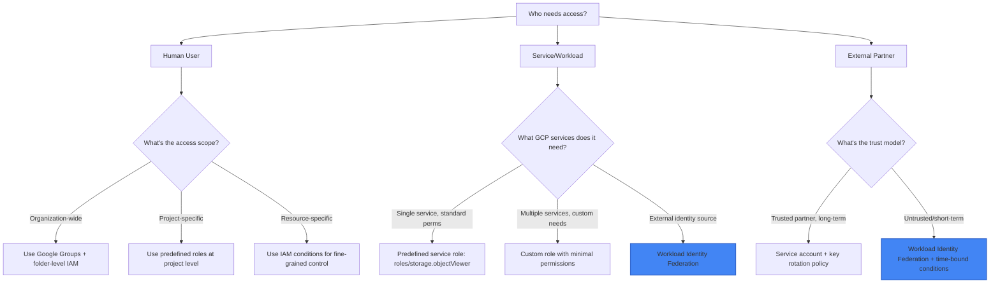

# 🔐 Domain 3: Security & Compliance (+ Securing AI) (20%)
### Google Professional Cloud Architect 2026 | Deep-Dive Study Guide (3 of 6)

> **Exam Weight**: ~20% (~10 questions) | **Focus**: Protecting data, identities, and workloads while meeting compliance requirements | **Key Skills**: Zero-trust architecture, data protection, Securing AI patterns, compliance automation

---

## 📖 Table of Contents

1. [What the Exam Actually Tests](#1-what-the-exam-actually-tests)
2. [Identity & Access Management (IAM) Deep Dive](#2-identity--access-management-iam-deep-dive)
3. [Data Protection & Encryption Strategies](#3-data-protection--encryption-strategies)
4. [Network Security Architecture](#4-network-security-architecture)
5. [Compliance Frameworks & Audit Patterns](#5-compliance-frameworks--audit-patterns)
6. [Securing AI Workloads *(NEW 2026 Focus)*](#6-securing-ai-workloads-new-2026-focus)
7. [Secret Management & Key Lifecycle](#7-secret-management--key-lifecycle)
8. [Threat Detection & Security Operations](#8-threat-detection--security-operations)
9. [Exam Traps & Tricks](#9-exam-traps--tricks)
10. [Decision Frameworks](#10-decision-frameworks)
11. [Mnemonics & Memory Hacks](#11-mnemonics--memory-hacks)
12. [Practice Checkpoint (15 Scenarios)](#12-practice-checkpoint-15-scenarios)
13. [2025–2026 Changes](#13-20252026-changes)

---

## 1️⃣ What the Exam Actually Tests

### 🔍 The Real Skill Being Assessed
```
Domain 3 does NOT test:
❌ Memorizing exact IAM permission names
❌ Step-by-step console UI paths for security settings
❌ Cryptographic algorithm implementation details

Domain 3 DOES test:
✅ Designing zero-trust architectures with least-privilege IAM
✅ Selecting appropriate encryption strategies (CMEK, EKM, client-side) for compliance requirements
✅ Implementing network security boundaries (VPC-SC, firewall, private access)
✅ Mapping business compliance requirements (HIPAA, PCI-DSS, GDPR) to GCP controls
✅ Applying Securing AI patterns to Vertex AI and generative workloads (2026 focus)
✅ Automating security guardrails with org policies and policy-as-code
✅ Designing audit trails and incident response capabilities into architecture
✅ Balancing security controls with usability, cost, and operational overhead
```

### 🎯 Question Archetypes You'll Encounter
| Archetype | Prompt Pattern | What They Want |
|-----------|---------------|----------------|
| **The Least-Privilege Puzzle** | "Team needs access to X but not Y. Which IAM design?" | Understanding of role granularity, conditions, and boundary enforcement |
| **The Compliance Mapping** | "Must meet HIPAA/GDPR/PCI-DSS. Which controls are REQUIRED?" | Knowledge of shared responsibility model + GCP compliance offerings |
| **The Data Protection Decision** | "Sensitive data must be encrypted with customer-controlled keys. Which pattern?" | CMEK vs EKM vs client-side encryption trade-offs |
| **The Network Boundary Question** | "Prevent data exfiltration to unauthorized destinations. Which control?" | VPC Service Controls, private access patterns, egress filtering |
| **The Securing AI Scenario** *(NEW 2026)* | "Deploy generative AI while preventing prompt injection and data leakage. Which architecture?" | Securing AI patterns: input validation, output filtering, audit logging |
| **The Audit & Detection Design** | "Detect and respond to suspicious activity within 5 minutes. Which controls?" | Cloud Audit Logs + SCC + alerting + automated response patterns |

### 📊 Domain 3 Weight Distribution (Estimated)
```
IAM & Identity Management          ██████████  25%
Data Encryption & Protection       ████████░░  20%
Network Security Boundaries        ███████░░░  18%
Compliance & Audit Frameworks      ██████░░░░  15%
Securing AI Patterns (NEW)         █████░░░░░  12%
Threat Detection & Response        ████░░░░░░  10%
```

---

## 2️⃣ Identity & Access Management (IAM) Deep Dive

### 🔑 IAM Role Selection Decision Tree


### 🎯 IAM Pattern Cheat Sheet (Exam-Critical)

#### Pattern A: Least-Privilege Role Design
```yaml
✅ DO:
• Start with predefined roles (roles/storage.objectViewer) before creating custom roles
• Use IAM conditions for time/resource-based restrictions:
  - request.time < timestamp('2026-12-31T23:59:59Z')
  - resource.name.startsWith("projects/my-prod/buckets/sensitive")
• Grant roles at the narrowest scope possible (resource > project > folder > org)
• Use Google Groups for user management, not individual user bindings

❌ DON'T:
• Grant primitive roles (roles/editor, roles/owner) in production designs
• Create custom roles when predefined roles satisfy requirements
• Use service account keys when workload identity federation is possible
• Grant permissions at org level when project-level suffices
```

#### Pattern B: Service Account Security
```hcl
# Terraform pattern for secure service account (exam-relevant)
resource "google_service_account" "app_runner" {
  account_id   = "app-runner"
  display_name = "Application Runtime SA"
  
  # Disable key creation by default (enforced via org policy)
  # Keys should be avoided; use workload identity or short-lived tokens
}

# Grant minimal permissions using predefined roles
resource "google_project_iam_member" "storage_access" {
  project = var.project_id
  role    = "roles/storage.objectViewer"  # Not roles/storage.admin!
  member  = "serviceAccount:${google_service_account.app_runner.email}"
}

# Add IAM condition for resource scoping (exam favorite)
resource "google_project_iam_member" "conditional_access" {
  project = var.project_id
  role    = "roles/bigquery.dataViewer"
  member  = "serviceAccount:${google_service_account.app_runner.email}"
  
  condition {
    title       = "only_anonymized_datasets"
    expression  = "resource.name.startsWith('projects/${var.project_id}/datasets/anon_')"
    description = "Restrict access to de-identified datasets only"
  }
}
```

#### Pattern C: Workload Identity Federation (External Access)
```
Use Case: External CI/CD system (GitHub Actions) needs to deploy to GCP

✅ Recommended Pattern:
1. Configure workload identity pool in GCP
2. Create identity provider mapping for GitHub
3. Grant GCP service account permissions to the federated identity
4. GitHub Actions obtains short-lived GCP credentials via token exchange

✅ Exam Benefits:
• No long-lived service account keys to manage/rotate
• Credentials automatically expire (short-lived tokens)
• Fine-grained access control via IAM conditions
• Audit trail shows external identity source

❌ Anti-Pattern:
• Downloading service account key JSON and storing in GitHub Secrets
• Granting broad roles to the external identity "for simplicity"
```

### ⚠️ IAM Exam Traps
```
❌ Trap: "Grant roles/editor to simplify team onboarding"
✅ Reality: Violates least privilege; exam expects predefined roles + groups + conditions

❌ Trap: "Use service account keys for external integrations"
✅ Reality: Key management overhead and leakage risk; exam expects workload identity federation

❌ Trap: "Apply IAM policies only at project level for flexibility"
✅ Reality: Loses ability to enforce boundaries at folder/org level; exam expects hierarchical design

✅ Exam Pattern: Scenarios mentioning "external partner", "third-party access", or "rotating contractors" 
   almost always require workload identity federation + time-bound IAM conditions + minimal roles
```

---

## 3️⃣ Data Protection & Encryption Strategies

### 🔐 Encryption Strategy Decision Framework

#### Step 1: Determine Key Management Requirements
```
BUSINESS REQUIREMENT → ENCRYPTION APPROACH

"Google manages encryption"              
→ Default Google-managed keys (GMEK)
→ Best for: Non-sensitive data, internal tools, dev environments

"Customer controls key lifecycle"        
→ Customer-Managed Encryption Keys (CMEK) via Cloud KMS
→ Best for: HIPAA, PCI-DSS, GDPR, financial data, compliance requirements

"Customer holds keys outside Google"     
→ External Key Manager (EKM) with partner HSM
→ Best for: Highest security requirements, regulatory mandates for key sovereignty

"Encrypt before data leaves client"      
→ Client-side encryption + CMEK/EKM for storage
→ Best for: Zero-trust architectures, highly sensitive PII/PHI
```

#### Step 2: Apply Service-Specific Encryption Patterns
```yaml
Cloud Storage:
• Default: GMEK (AES-256)
• CMEK: Specify kms_key_name in bucket/resource config
• Bucket-level vs object-level: Bucket-level CMEK applies to all objects unless overridden
• Exam tip: CMEK adds ~$1/month/key + $0.03/10K operations – factor into cost questions

Cloud SQL:
• Default: GMEK for data at rest, TLS 1.2+ for in transit
• CMEK: Enable during instance creation (cannot add later without recreation)
• Backup encryption: Inherits instance encryption setting
• Exam tip: Scenario mentioning "rotate encryption keys annually" → CMEK with key rotation policy

BigQuery:
• Default: GMEK for tables, datasets, projects
• CMEK: Configure at dataset or table level (table overrides dataset)
• Federated queries: Source data encryption must also be considered
• Exam tip: "Column-level encryption" → Use BigQuery policy tags + CMEK, not application-layer

Vertex AI (NEW 2026):
• Training data: CMEK on Cloud Storage/BigQuery source
• Model artifacts: CMEK on model registry storage
• Prediction requests/responses: Enable audit logging + CMEK for cached predictions
• Exam tip: Securing AI scenarios require CMEK end-to-end: data → training → model → inference
```

### 🗝️ Cloud KMS Key Management Patterns
```hcl
# Terraform: CMEK with automatic rotation (exam-relevant)
resource "google_kms_key_ring" "prod_keys" {
  name     = "prod-keyring"
  location = "global"  # Or regional for data residency requirements
}

resource "google_kms_crypto_key" "data_encryption_key" {
  name            = "data-encryption-key"
  key_ring        = google_kms_key_ring.prod_keys.id
  rotation_period = "7776000s"  # 90 days automatic rotation
  
  version_template {
    algorithm        = "GOOGLE_SYMMETRIC_ENCRYPTION"
    protection_level = "SOFTWARE"  # Or "HSM" for higher security
  }
  
  # Destroy versions after rotation to limit exposure window
  destroy_scheduled_duration = "86400s"  # 24 hours
}

# Grant minimal permissions for services to use the key
resource "google_kms_crypto_key_iam_member" "bigquery_usage" {
  crypto_key_id = google_kms_crypto_key.data_encryption_key.id
  role          = "roles/cloudkms.cryptoKeyEncrypterDecrypter"
  member        = "serviceAccount:bq-${var.project_id}@developer.gserviceaccount.com"
}
```

### ⚠️ Encryption Exam Traps
```
❌ Trap: "Enable CMEK for all resources regardless of data sensitivity"
✅ Reality: Adds cost and management overhead; exam expects risk-based approach (CMEK for sensitive data only)

❌ Trap: "Use the same KMS key for all projects/environments"
✅ Reality: Violates isolation principles; exam expects key separation by environment/compliance boundary

❌ Trap: "Rely on application-layer encryption instead of platform CMEK"
✅ Reality: Error-prone, hard to audit; exam expects platform-managed CMEK unless zero-trust explicitly required

✅ Exam Pattern: Scenarios mentioning "compliance", "audit", "key rotation", or "customer-controlled encryption" 
   almost always require CMEK with rotation policy + minimal IAM permissions on keys + audit logging
```

---

## 4️⃣ Network Security Architecture

### 🛡️ Zero-Trust Network Patterns for GCP

#### Pattern A: VPC Service Controls Perimeter
```
Use Case: Prevent data exfiltration from sensitive projects (prod, data, AI)

✅ Recommended Architecture:
┌─────────────────────────────────────┐
│ VPC Service Controls Perimeter      │
│ "sensitive-data-perimeter"          │
├─────────────────────────────────────┤
│ Included Projects:                  │
│ • prod-app-01                       │
│ • prod-data-warehouse               │
│ • vertex-ai-production              │
├─────────────────────────────────────┤
│ Allowed Services:                   │
│ • storage.googleapis.com            │
│ • bigquery.googleapis.com           │
│ • aiplatform.googleapis.com         │
├─────────────────────────────────────┤
│ Access Levels (context-aware):      │
│ • Corporate IP ranges               │
│ • Require IAP for browser access    │
│ • Block unknown devices             │
└─────────────────────────────────────┘

✅ Exam Benefits:
• Prevents data exfiltration even if IAM is misconfigured
• Supports compliance requirements for data boundary enforcement
• Integrates with BeyondCorp Enterprise for identity-aware access

❌ Anti-Pattern:
• Creating overly broad perimeters that block legitimate workflows
• Not testing perimeter policies in dry-run mode before enforcement
```

#### Pattern B: Private Access Architecture
```yaml
Private Google Access:
• Purpose: Allow VMs without external IPs to reach Google APIs securely
• Configuration: Enable on subnet; required for secure cloud-native apps
• Exam cue: "VMs should not have public IPs but need to call Cloud Storage" → Enable PGA

Private Service Connect:
• Purpose: Private connectivity to Google APIs and partner SaaS services
• Configuration: Create PSC endpoint in your VPC; consume via internal IP
• Exam cue: "Access Vertex AI/BigQuery without traversing public internet" → PSC

Cloud NAT:
• Purpose: Provide outbound internet for private VMs (e.g., OS updates)
• Configuration: Regional service; configure min/max ports to avoid SNAT exhaustion
• Exam cue: "Private VMs need to download packages but shouldn't accept inbound connections" → Cloud NAT

Internal HTTP(S) Load Balancer:
• Purpose: Load balance traffic within VPC without public exposure
• Configuration: Regional LB with internal IP; integrates with Cloud Armor for WAF
• Exam cue: "Microservices communication within VPC with DDoS protection" → Internal LB + Cloud Armor
```

#### Pattern C: Firewall Rule Best Practices
```hcl
# Terraform: Targeted firewall rules with tags (exam pattern)
resource "google_compute_firewall" "allow_health_checks" {
  name    = "allow-gcp-health-checks"
  network = google_compute_network.prod.name
  
  allow {
    protocol = "tcp"
    ports    = ["80", "443", "8080"]
  }
  
  # Target only instances with specific tag (not all instances)
  target_tags = ["web-frontend"]
  
  # Source: Official Google health check ranges (documented)
  source_ranges = [
    "35.191.0.0/16",
    "130.211.0.0/22", 
    "209.85.152.0/22",
    "209.85.204.0/22",
  ]
  
  # Log denied traffic for security monitoring
  log_config {
    metadata = "INCLUDE_ALL_METADATA"
  }
}

# Instance template applies the matching tag
resource "google_compute_instance_template" "web" {
  tags = ["web-frontend", "prod"]
  # ... other config
}
```

### ⚠️ Network Security Exam Traps
```
❌ Trap: "Use 0.0.0.0/0 source ranges to simplify firewall management"
✅ Reality: Overly permissive; exam expects specific ranges (health checks, LB IPs, corporate CIDR)

❌ Trap: "Assign external IPs to all VMs for easier troubleshooting"
✅ Reality: Increases attack surface; exam expects IAP, OS Login, Cloud Logging for access

❌ Trap: "Rely solely on IAM for data protection without network boundaries"
✅ Reality: Defense in depth requires both IAM + network controls; exam expects VPC-SC for sensitive data

✅ Exam Pattern: Scenarios mentioning "prevent data exfiltration", "compliance boundary", or "third-party access" 
   almost always require VPC Service Controls + private access patterns + targeted firewall rules
```

---

## 5️⃣ Compliance Frameworks & Audit Patterns

### 📋 Compliance Mapping Framework

#### Step 1: Identify Applicable Frameworks
```
INDUSTRY → COMMON FRAMEWORKS → GCP CONTROLS

Healthcare (HIPAA):
• Required: Encryption at rest/in transit, access controls, audit logs, BAAs
• GCP Mapping: CMEK + IAM least privilege + Cloud Audit Logs + BAA signed

Financial (PCI-DSS, SOX):
• Required: Network segmentation, key management, change management, audit trails
• GCP Mapping: VPC-SC + Cloud KMS + Cloud Deploy + immutable log exports

Privacy (GDPR, CCPA):
• Required: Data minimization, right to deletion, consent management, breach notification
• GCP Mapping: BigQuery policy tags + DLP API + Data Catalog + automated deletion workflows

Government (FedRAMP, ITAR):
• Required: Data residency, personnel screening, continuous monitoring, incident response
• GCP Mapping: Region selection + Access Approval + SCC + Chronicle integration
```

#### Step 2: Implement Audit-Ready Architecture
```yaml
Cloud Audit Logs Strategy:
✅ Enable three log types for compliance:
   • Admin Activity: Who changed what (enabled by default, cannot disable)
   • Data Access: Who read/wrote sensitive data (enable for BigQuery, Storage, etc.)
   • System Event: GCP system actions (enabled by default)

✅ Export logs for immutability and long-term retention:
   • Create dedicated logging project with CMEK-encrypted bucket
   • Set retention policy: 7 years for financial, 6 years for HIPAA
   • Enable bucket lock to prevent deletion/modification (WORM compliance)

✅ Automate compliance reporting:
   • Use Log Analytics in BigQuery for SQL-based audit queries
   • Build Looker dashboards for compliance officer review
   • Schedule automated reports via Cloud Composer/Airflow

✅ Exam tip: Scenario mentioning "regulatory audit" or "e-discovery" 
   → Expect answers with immutable log exports + long retention + queryable analytics
```

#### Step 3: Access Approval & Justification Workflows
```
Use Case: Require human approval before accessing highly sensitive data

✅ Recommended Pattern (BeyondCorp Enterprise + Access Approval):
1. Tag sensitive resources with access level requirements
2. Configure Access Approval policy requiring justification + approval
3. Integrate with ticketing system (Jira, ServiceNow) for workflow tracking
4. Log all access requests and approvals for audit trail

✅ Terraform Conceptual Pattern:
resource "google_access_approval_project_settings" "sensitive_data" {
  project = var.project_id
  
  enrollment_configs {
    cloud_product = "bigquery.googleapis.com"
  }
  
  # Require approval for data access requests
  notification_emails = ["security-team@myorg.com"]
}

✅ Exam Benefits:
• Meets "segregation of duties" requirements for compliance
• Provides explicit audit trail of who approved what access and why
• Integrates with existing ITSM workflows for operational efficiency

❌ Anti-Pattern:
• Requiring approval for all access (creates alert fatigue and workflow bottlenecks)
• Not logging approval decisions (defeats audit purpose)
```

### ⚠️ Compliance Exam Traps
```
❌ Trap: "Enable all audit logs at maximum verbosity to ensure compliance"
✅ Reality: Cost explosion and signal-to-noise problems; exam expects selective, targeted logging

❌ Trap: "Rely on default log retention periods for compliance requirements"
✅ Reality: Defaults (30 days) are insufficient for most frameworks; exam expects explicit retention configuration

❌ Trap: "Use the same logging project for all environments"
✅ Reality: Loses environment isolation and increases blast radius; exam expects separate logging for prod/compliance

✅ Exam Pattern: Scenarios mentioning "audit", "compliance", "regulatory review", or "e-discovery" 
   almost always require: Data Access logs enabled + immutable export + long retention + queryable analytics
```

---

## 6️⃣ Securing AI Workloads *(NEW 2026 Focus)*

### 🤖 Securing AI Architecture Patterns (Critical for 2026 Exam)

#### Pattern A: End-to-End Data Protection for Vertex AI
```
Data Flow: Source → Training → Model → Inference → Audit

✅ Recommended Architecture:
┌─────────────────────────────────────────┐
│ 1. Data Ingestion & De-identification   │
├─────────────────────────────────────────┤
│ • Cloud DLP API: Detect and redact PII/PHI before training
│ • BigQuery policy tags: Column-level access control for sensitive features
│ • CMEK encryption: On source data in Storage/BigQuery
└─────────────────────────────────────────┘
                      ↓
┌─────────────────────────────────────────┐
│ 2. Secure Training Environment          │
├─────────────────────────────────────────┤
│ • Vertex AI Training in private subnet (no public internet)
│ • Workload Identity: Training job uses minimal IAM role
│ • VPC Service Controls: Perimeter around training + data projects
│ • Audit logging: Capture training job metadata and parameters
└─────────────────────────────────────────┘
                      ↓
┌─────────────────────────────────────────┐
│ 3. Protected Model Registry             │
├─────────────────────────────────────────┤
│ • Model artifacts stored with CMEK encryption
│ • IAM conditions: Only approved pipelines can register models
│ • Model card metadata: Document training data sources and limitations
└─────────────────────────────────────────┘
                      ↓
┌─────────────────────────────────────────┐
│ 4. Secure Inference Endpoint            │
├─────────────────────────────────────────┤
│ • Private Service Connect endpoint (no public exposure)
│ • Request validation: Filter prompts for injection attacks
│ • Response filtering: Redact sensitive info in model outputs
│ • Prediction logging: Capture inputs/outputs for audit/bias detection
└─────────────────────────────────────────┘
```

#### Pattern B: Prompt Security & Output Governance
```yaml
Prompt Injection Protection:
✅ Input Validation Layer:
   • Use Cloud Functions/Cloud Run to preprocess prompts before Vertex AI
   • Filter known attack patterns (e.g., "ignore previous instructions", base64 exfiltration attempts)
   • Validate prompt length, character sets, and structure

✅ Context Isolation:
   • Never include raw PII in prompts; use de-identified references or RAG with policy-tagged data
   • For RAG architectures: Ensure retrieval layer respects BigQuery policy tags and IAM

✅ Exam tip: Scenario mentioning "prevent prompt injection" or "secure generative AI" 
   → Expect answers with input validation + context isolation + audit logging

Output Governance & Audit:
✅ Response Filtering:
   • Post-process model outputs through Cloud DLP to redact accidentally generated PII
   • Apply content safety filters (toxicity, harassment, self-harm) via Perspective API or custom classifiers

✅ Audit Trail for AI Decisions:
   • Log prediction requests/responses to BigQuery with CMEK encryption
   • Include metadata: model version, prompt hash, user identity, timestamp
   • Enable automated bias detection: Monitor output distributions across demographic groups

✅ Human-in-the-Loop for High-Risk Decisions:
   • Route predictions above confidence threshold to human review queue
   • Use Cloud Tasks + Pub/Sub for asynchronous review workflow
   • Log human overrides for model retraining and compliance reporting

✅ Exam tip: Scenario mentioning "regulatory review of AI decisions" or "bias detection" 
   → Expect answers with immutable prediction logging + metadata capture + human review workflow
```

#### Pattern C: Third-Party AI Partner Access
```
Use Case: External ML vendor needs limited access to train models on your de-identified data

✅ Recommended Pattern (Workload Identity Federation + VPC-SC):
1. Create dedicated "partner-access" folder with isolated projects
2. Configure workload identity pool for partner's identity provider
3. Grant minimal Vertex AI + BigQuery permissions via IAM conditions:
   - condition: resource.name.startsWith("projects/myorg/datasets/anon_*")
   - condition: request.time < timestamp('2026-12-31T23:59:59Z')
4. Enclose partner projects in VPC Service Controls perimeter with your data projects
5. Enable audit logging for all partner actions; export to immutable bucket

✅ Terraform Conceptual Snippet:
resource "google_iam_workload_identity_pool" "partner_pool" {
  workload_identity_pool_id = "ml-partner-pool"
  display_name              = "External ML Partner Access"
}

resource "google_iam_workload_identity_pool_provider" "partner_oidc" {
  workload_identity_pool_id          = google_iam_workload_identity_pool.partner_pool.workload_identity_pool_id
  workload_identity_pool_provider_id = "partner-oidc"
  
  oidc {
    issuer_uri = "https://auth.partner.com"
  }
  
  attribute_mapping = {
    "google.subject"        = "assertion.sub"
    "attribute.partner_id"  = "assertion.partner_id"
  }
}

✅ Exam Benefits:
• No service account keys to share/manage with external party
• Time-bound and resource-scoped access via IAM conditions
• Audit trail shows exactly which partner identity performed which action
• VPC-SC prevents data exfiltration even if partner credentials are compromised

❌ Anti-Pattern:
• Sharing service account key JSON files via email or ticketing system
• Granting broad roles like roles/aiplatform.admin "for flexibility"
• Not enclosing partner access in VPC Service Controls perimeter
```

### ⚠️ Securing AI Exam Traps (NEW 2026)
```
❌ Trap: "Use public Vertex AI endpoints for easier integration with external partners"
✅ Reality: Data exfiltration risk; exam expects private endpoints + VPC-SC for sensitive data/models

❌ Trap: "Grant roles/aiplatform.admin to data scientists for model development flexibility"
✅ Reality: Overly permissive; exam expects custom roles with minimal Vertex AI permissions + IAM conditions

❌ Trap: "Store training data in standard Cloud Storage without de-identification or policy tags"
✅ Reality: Violates data minimization and access control requirements; exam expects DLP + policy tags for sensitive data

❌ Trap: "Disable prediction logging to reduce storage costs"
✅ Reality: Prevents audit, bias detection, and model improvement; exam expects immutable prediction logging for compliance

✅ Exam Pattern: Scenarios mentioning "generative AI", "third-party ML partner", "bias detection", or "regulatory review of AI" 
   almost always require: private endpoints + CMEK + DLP/policy tags + workload identity federation + immutable audit logging
```

---

## 7️⃣ Secret Management & Key Lifecycle

### 🔐 Secret Management Strategy Framework

#### Step 1: Classify Secret Types
```
SECRET TYPE → RECOMMENDED STORAGE → ACCESS PATTERN

Application credentials (DB passwords, API keys)
→ Cloud Secret Manager
→ Access via client libraries with IAM; automatic versioning and rotation

TLS certificates
→ Certificate Authority Service (private CA) or Managed Certificates (public)
→ Auto-renewal integration with load balancers and ingress controllers

Encryption keys (CMEK)
→ Cloud KMS (software or HSM protection level)
→ Grant encrypter/decrypter roles to services; enable automatic rotation

SSH keys for OS access
→ OS Login with IAM-based access (no key management)
→ Or Cloud Identity-Aware Proxy for browser-based access

Service account keys (avoid if possible)
→ Workload Identity Federation (external) or default service accounts (internal)
→ If absolutely required: Store in Secret Manager with strict IAM + rotation policy
```

#### Step 2: Implement Secret Rotation Patterns
```yaml
Automated Rotation (Preferred):
✅ Cloud SQL credentials:
   • Use Cloud SQL Auth Proxy with IAM authentication (no password rotation needed)
   • Or configure automatic password rotation via Cloud Scheduler + Cloud Functions

✅ API keys for third-party services:
   • Store in Secret Manager with versions
   • Use Cloud Scheduler + Cloud Functions to call provider's rotation API
   • Update dependent services via Pub/Sub notification

✅ CMEK keys:
   • Enable automatic rotation in Cloud KMS (90-day default)
   • New encryption uses new key version; decryption supports all versions
   • Schedule destruction of old versions after grace period (e.g., 30 days)

Manual Rotation Workflow (When automation not possible):
✅ Secret Manager + Approval Workflow:
   1. Create new secret version with updated value
   2. Trigger notification to application owners via Pub/Sub
   3. Application updates configuration (with rollback capability)
   4. After validation, schedule destruction of old version
   5. Log all rotation events for audit compliance

✅ Exam tip: Scenario mentioning "rotate credentials quarterly" or "key lifecycle management" 
   → Expect answers with Secret Manager + automated rotation + audit logging + rollback capability
```

#### Step 3: Secure Secret Access Patterns
```hcl
# Terraform: Secure secret access for Cloud Run service (exam pattern)
resource "google_secret_manager_secret" "db_password" {
  secret_id = "prod-db-password"
  
  replication {
    automatic = true  # Multi-region replication for availability
  }
  
  # Enable audit logging for secret access
  version_aliases = {}
}

resource "google_secret_manager_secret_version" "password_v1" {
  secret      = google_secret_manager_secret.db_password.id
  secret_data = var.db_password  # Passed via terraform.tfvars (not committed to git)
  
  # Enable automatic destruction after rotation
  enabled = true
}

# Grant minimal access to Cloud Run service account
resource "google_secret_manager_secret_iam_member" "cloudrun_access" {
  secret_id = google_secret_manager_secret.db_password.id
  role      = "roles/secretmanager.secretAccessor"  # Not roles/secretmanager.admin!
  member    = "serviceAccount:${google_cloud_run_service.api.service_account_email}"
}

# Cloud Run configuration references secret (not hardcoded)
resource "google_cloud_run_service" "api" {
  template {
    spec {
      containers {
        env {
          name  = "DB_PASSWORD"
          value_from {
            secret_key_ref {
              name = google_secret_manager_secret.db_password.secret_id
              key  = "latest"  # Always use latest version
            }
          }
        }
      }
    }
  }
}
```

### ⚠️ Secret Management Exam Traps
```
❌ Trap: "Store secrets in environment variables in Terraform code"
✅ Reality: Secrets may appear in state files, logs, or version control; exam expects Secret Manager integration

❌ Trap: "Use the same service account key for multiple environments"
✅ Reality: Violates isolation principles; exam expects environment-specific secrets and identities

❌ Trap: "Disable secret versioning to simplify management"
✅ Reality: Removes rollback capability and audit trail; exam expects versioning for compliance

✅ Exam Pattern: Scenarios mentioning "credential rotation", "audit secret access", or "prevent secret leakage" 
   almost always require: Cloud Secret Manager + IAM least privilege + automatic rotation + audit logging
```

---

## 8️⃣ Threat Detection & Security Operations

### 🚨 Security Monitoring Architecture

#### Pattern A: Layered Detection Strategy
```
Detection Layer → Tool → Use Case → Exam Relevance

Preventive Controls:
• Organization Policies + Terraform validation → Block insecure provisioning
• Binary Authorization → Allow only signed container images
• VPC Service Controls → Prevent data exfiltration
→ Exam cue: "Prevent misconfiguration" or "shift-left security"

Detective Controls:
• Security Command Center (SCC) → Centralized security findings across GCP
• Cloud Audit Logs + Log Analytics → Query-based threat hunting
• Event Threat Detection (SCC Premium) → ML-based anomaly detection
→ Exam cue: "Detect suspicious activity" or "centralized security monitoring"

Responsive Controls:
• Cloud Functions + Pub/Sub → Automated response to security events
• Chronicle (if mentioned) → Advanced SOAR capabilities
• Incident response runbooks in Cloud Composer → Orchestrated remediation
→ Exam cue: "Respond to incidents within X minutes" or "automate security response"
```

#### Pattern B: SCC Integration Blueprint
```yaml
Security Command Center Tiers:
✅ Standard (Free):
   • Asset inventory: Discover all GCP resources
   • Basic findings: Misconfigurations, public buckets, missing encryption
   • Integration: Export findings to Cloud Logging, Pub/Sub, or SIEM

✅ Premium (Paid):
   • Event Threat Detection: ML-based anomaly detection (unusual API calls, data access patterns)
   • Security Health Analytics: Continuous compliance monitoring against benchmarks
   • Web Security Scanner: DAST scanning for web applications
   • Integration: BigQuery export for custom analytics, SOAR platform connectors

✅ Exam-Recommended Configuration:
resource "google_scc_organization_settings" "security_ops" {
  organization = var.org_id
  
  # Enable premium features for production environments
  premium_features {
    event_threat_detection {
      enable = true
    }
    security_health_analytics {
      enable = true
    }
  }
  
  # Export findings to centralized logging project
  big_query_export {
    name         = "security-findings-export"
    dataset_id   = "scc_findings"
    table_id     = "findings"
    filter       = "state = \"ACTIVE\" AND category = \"DATA_EXFILTRATION\""
  }
  
  # Alert on critical findings via Pub/Sub
  notification_config {
    pubsub_topic = google_pubsub_topic.security_alerts.id
    filter       = "severity = \"CRITICAL\" OR severity = \"HIGH\""
  }
}
```

#### Pattern C: Automated Incident Response
```
Use Case: Automatically quarantine resources when suspicious activity is detected

✅ Recommended Pattern (Pub/Sub + Cloud Functions + IAM):
1. SCC or Audit Logs publish security findings to Pub/Sub topic
2. Cloud Function triggered by Pub/Sub message evaluates severity and context
3. For high-severity findings:
   • Revoke suspicious IAM bindings via Cloud IAM API
   • Isolate compromised VM by updating firewall rules
   • Disable compromised service account keys
   • Notify security team via Chat/Email with investigation context
4. Log all automated actions for audit and post-incident review

✅ Terraform Conceptual Snippet:
resource "google_cloudfunctions_function" "auto_quarantine" {
  name        = "security-auto-response"
  runtime     = "python311"
  entry_point = "quarantine_handler"
  
  event_trigger {
    event_type = "providers/cloud.pubsub/eventTypes/topic.publish"
    resource   = google_pubsub_topic.security_findings.id
  }
  
  environment_variables = {
    SECURITY_TEAM_EMAIL = "soc@myorg.com"
    QUARANTINE_PROJECTS = "prod-*,data-*"  # Only auto-respond in critical projects
  }
}

✅ Exam Benefits:
• Reduces mean time to respond (MTTR) for common security incidents
• Ensures consistent application of security policies across environments
• Provides audit trail of automated actions for compliance reporting

❌ Anti-Pattern:
• Auto-responding to all findings without severity filtering (risk of false positive disruption)
• Not logging automated actions (defeats audit and improvement purposes)
• Granting broad permissions to the response function (principle of least privilege)
```

### ⚠️ Security Operations Exam Traps
```
❌ Trap: "Enable all SCC features for all projects regardless of sensitivity"
✅ Reality: Cost and noise considerations; exam expects risk-based enablement (premium for prod/sensitive)

❌ Trap: "Rely solely on automated response without human review for critical actions"
✅ Reality: Risk of false positives causing outages; exam expects human-in-the-loop for high-impact actions

❌ Trap: "Store security findings only in Cloud Logging without export for analysis"
✅ Reality: Limits threat hunting and compliance reporting capabilities; exam expects BigQuery export for analytics

✅ Exam Pattern: Scenarios mentioning "detect threats", "automate response", or "security operations at scale" 
   almost always require: SCC (premium for prod) + Pub/Sub integration + automated response with human oversight + audit logging
```

---

## 9️⃣ Exam Traps & Tricks

### 🚫 Top 10 Domain 3 Exam Traps (With Avoidance Strategies)

| Trap | What It Looks Like | Why It's Wrong | How to Avoid |
|------|-------------------|----------------|--------------|
| **The Over-Privileged Role** | Suggests `roles/editor` or `roles/owner` for "simplicity" or "flexibility" | Violates least privilege; increases blast radius of compromise | Eliminate options with primitive roles; prefer predefined/custom roles with minimal permissions |
| **The Key Management Gap** | Proposes GMEK for highly sensitive data or compliance requirements | Fails to meet customer-controlled encryption requirements | For HIPAA/PCI-DSS/GDPR scenarios, expect CMEK with rotation policy + minimal IAM on keys |
| **The Public-by-Default Resource** | Creates buckets, endpoints, or clusters with public access enabled | Security anti-pattern; violates secure-by-default principle | Prefer options with `public_access_prevention = "enforced"`, private endpoints, VPC-SC |
| **The Audit Logging Oversight** | Omits Data Access logs or uses default retention periods | Insufficient for compliance audits and threat detection | Choose options with targeted Data Access logs + immutable export + long retention |
| **The Secret Management Anti-Pattern** | Hardcodes secrets in Terraform/env vars or shares keys via email | Credential leakage risk; violates secret management best practices | Eliminate options with hardcoded secrets; prefer Secret Manager + workload identity |
| **The Securing AI Gap** *(NEW 2026)* | Provisions Vertex AI without private endpoints, DLP, or audit logging | Data exfiltration risk; fails compliance for AI workloads | For AI scenarios, ensure private endpoints + CMEK + DLP/policy tags + immutable prediction logging |
| **The Network Boundary Weakness** | Relies solely on IAM without VPC-SC or private access patterns | Defense in depth requires both identity and network controls | For "prevent data exfiltration" scenarios, expect VPC-SC + private access + targeted firewall rules |
| **The Compliance Checkbox Approach** | Enables controls without considering operational impact or cost | Security must balance with usability, cost, and reliability | Apply WAF filter: which option satisfies security without unacceptable trade-offs in other pillars? |
| **The Manual Security Process** | Suggests manual review/approval for routine security tasks | Doesn't scale; prone to human error and inconsistency | Prefer automated guardrails: org policies, Terraform validation, SCC auto-remediation |
| **The False Sense of Encryption** | Assumes "encryption enabled" is sufficient without key management details | CMEK vs GMEK vs client-side have very different security/compliance implications | Read encryption requirements carefully: "customer-controlled" = CMEK/EKM; "Google-managed" = GMEK |

### 🎭 Scenario Red Flags vs Green Lights
```
🚩 RED FLAG PHRASES (Often indicate wrong answer):
• "Simplify by granting broader permissions" → Violates least privilege
• "Use default encryption settings" → May not meet compliance requirements
• "Store credentials in environment variables" → Secret leakage risk
• "Enable public access for easier debugging" → Security anti-pattern
• "Rely on manual processes for security controls" → Doesn't scale, error-prone

✅ GREEN LIGHT PHRASES (Often indicate correct answer):
• "Least privilege IAM" + "predefined roles" + "IAM conditions for scoping"
• "CMEK encryption" + "automatic key rotation" + "minimal KMS IAM permissions"
• "VPC Service Controls" + "private endpoints" + "targeted firewall rules"
• "Data Access audit logs" + "immutable export" + "long retention for compliance"
• "Cloud Secret Manager" + "workload identity" + "automatic secret rotation"
• "Vertex AI private endpoint" + "DLP de-identification" + "immutable prediction logging" (2026)
• "Security Command Center" + "automated response" + "human oversight for critical actions"
```

---

## 🔟 Decision Frameworks

### 🧭 The Domain 3 Decision Framework (Use for Every Question)
```
STEP 1: DECODE THE SECURITY CONTEXT (25 seconds)
□ What data classification: public, internal, confidential, restricted (PII/PHI/PCI)?
□ What compliance frameworks apply: HIPAA, PCI-DSS, GDPR, internal policy?
□ What threat model: external attackers, insider risk, accidental exposure, AI-specific threats?
□ What operational constraints: team size, automation maturity, incident response SLAs?

STEP 2: APPLY THE "ZERO-TRUST" FILTER (20 seconds)
□ Does the option enforce least privilege for IAM (predefined/custom > primitive)?
□ Does it encrypt sensitive data with appropriate key management (CMEK for compliance)?
□ Does it implement network boundaries (VPC-SC, private access) for defense in depth?
□ Does it assume breach and include detection/response capabilities?
→ Eliminate options that fail any of these zero-trust principles

STEP 3: APPLY THE "COMPLIANCE MAPPING" FILTER (20 seconds)
□ For HIPAA: CMEK + audit logs + BAAs + access controls
□ For PCI-DSS: Network segmentation + key management + change management + audit trails
□ For GDPR: Data minimization + right to deletion + consent management + breach notification
□ For AI/ML: De-identification + policy tags + private endpoints + prediction audit logging
→ Eliminate options that don't map to explicitly stated compliance requirements

STEP 4: APPLY THE "AUTOMATION & SCALE" FILTER (15 seconds)
□ Is the solution defined as code (Terraform) for reproducibility?
□ Does it use automated guardrails (org policies, SCC, automated rotation)?
□ Does it integrate with CI/CD for security testing and deployment gates?
□ Does it scale to multiple projects/environments without manual intervention?
→ Prefer options that maximize automation and reduce human error

STEP 5: APPLY THE "2026 SECURING AI" FILTER (10 seconds) *(NEW)*
□ For Vertex AI/generative AI scenarios:
   • Private endpoints + VPC-SC for data/model protection
   • DLP/policy tags for training data de-identification
   • Workload identity federation for external partner access
   • Immutable prediction logging for audit/bias detection
→ For AI scenarios, ensure these patterns are included in the chosen option

STEP 6: FINAL VALIDATION (10 seconds)
□ Does the chosen option satisfy the PRIMARY security constraint from scenario?
□ Does it violate any EXPLICIT compliance or operational requirement?
□ Is there a simpler option that also meets all criteria? (If yes, reconsider)
```

### 🎯 Security Trade-off Resolution Matrix
```
When two options both seem viable, use this priority order:

1. COMPLIANCE VIOLATION = AUTOMATIC ELIMINATION
   (e.g., GMEK for HIPAA data, public bucket for PII, missing audit logs for PCI-DSS)

2. ZERO-TRUST PRINCIPLE VIOLATION = STRONG CANDIDATE FOR ELIMINATION
   (e.g., primitive IAM roles, no network boundaries, hardcoded secrets)
   → Only accept if scenario explicitly requires trade-off (e.g., "legacy system constraints")

3. AUTOMATION vs. MANUAL CONTROL:
   • Production/compliance environments: Prefer automated guardrails (org policies, SCC, IaC)
   • Dev/experimental environments: May accept more manual processes if cost-sensitive
   • Exam default: Assume production/compliance unless explicitly stated otherwise

4. AI/ML SCENARIOS (2026):
   • If scenario mentions Vertex AI, generative AI, or ML workloads:
     → Prioritize options with private endpoints + de-identification + audit logging
     → Eliminate options with public endpoints, raw PII in prompts, or disabled prediction logging

5. COST vs. SECURITY:
   • Security is rarely the area to optimize cost in PCA exam scenarios
   • Only accept cost-saving security trade-offs if explicitly required by scenario
   • Default assumption: Compliance and data protection requirements are non-negotiable
```

### 📐 Security Architecture Validation Checklist (Pre-Submission Mental Check)
```
Before finalizing your answer, quickly verify:

✅ Identity & Access
   [ ] IAM follows least privilege (predefined/custom roles > primitive)
   [ ] Service accounts used for workloads (not user accounts)
   [ ] Workload identity federation for external identities (not service account keys)
   [ ] IAM conditions applied for resource/time-based scoping where appropriate

✅ Data Protection
   [ ] Sensitive data encrypted with CMEK (not just GMEK) for compliance scenarios
   [ ] Cloud KMS keys have automatic rotation enabled and minimal IAM permissions
   [ ] Secrets stored in Cloud Secret Manager (not hardcoded or in env vars)
   [ ] BigQuery policy tags or DLP applied for column-level PII/PHI protection

✅ Network Security
   [ ] VPC Service Controls perimeter for sensitive data/projects
   [ ] Private Google Access/Service Connect for secure API consumption
   [ ] Firewall rules use targeted sources/tags (not 0.0.0.0/0)
   [ ] No unnecessary public IPs or endpoints for production resources

✅ Compliance & Audit
   [ ] Data Access audit logs enabled for sensitive services (BigQuery, Storage, etc.)
   [ ] Logs exported to immutable, CMEK-encrypted bucket with compliance-appropriate retention
   [ ] Access Approval workflows configured for highly sensitive data access
   [ ] SCC enabled (premium for prod) with findings exported for analysis/response

✅ Securing AI (2026 Focus)
   [ ] Vertex AI endpoints configured as private service connect (not public)
   [ ] Training data de-identified via DLP or policy tags before model training
   [ ] Prediction requests/responses logged immutably for audit and bias detection
   [ ] Workload identity federation used for external AI/ML partner access

✅ Operational Security
   [ ] Automated secret/key rotation configured (not manual processes)
   [ ] Security findings integrated with alerting and response workflows
   [ ] Human oversight included for high-impact automated security actions
   [ ] Security controls defined as code (Terraform) for reproducibility and audit
```

---

## 1️⃣1️⃣ Mnemonics & Memory Hacks

### 🧠 Acronyms to Memorize
```
Zero-Trust Principles → "L.E.A.S.T."
L - Least privilege IAM (predefined/custom roles)
E - Encrypt sensitive data (CMEK for compliance)
A - Audit all access (Data Access logs + immutable export)
S - Segment networks (VPC-SC, private access, targeted firewalls)
T - Test and automate (SCC, automated rotation, IaC guardrails)

Compliance Mapping → "H.P.G.F."
H - HIPAA: CMEK + audit logs + BAAs + access controls
P - PCI-DSS: Network segmentation + key management + change management + audit trails
G - GDPR: Data minimization + deletion rights + consent + breach notification
F - FedRAMP/ITAR: Data residency + personnel screening + continuous monitoring

Securing AI Patterns (2026) → "P.R.I.V.A.T.E."
P - Private endpoints for Vertex AI (no public exposure)
R - Redact/De-identify training data (DLP + policy tags)
I - Immutable prediction logging for audit/bias detection
V - VPC Service Controls perimeter around AI + data resources
A - Access via workload identity federation (not service account keys)
T - Threat detection for AI-specific attacks (prompt injection, data exfiltration)
E - End-to-end encryption (CMEK from data → training → model → inference)
```

### 🎨 Visual Memory Aids
```
IAM Decision Flow:
          [Who needs access?]
                │
     ┌──────────┴──────────┐
 [Human User]        [Service/Workload]
     │                      │
     ▼                      ▼
[Use Groups +      [Predefined role if possible]
 predefined roles]        │
     │                    ▼
     ▼            [Custom role if needed]
[Add IAM conditions]      │
     │                    ▼
     ▼            [External identity?]
[Grant at narrowest       │
 scope possible]          ▼
                   [Workload Identity Federation]

Data Protection Decision Flow:
[Data classification?]
     │
     ├─► Public/Internal → GMEK + standard IAM
     │
     ├─► Confidential (internal PII) → CMEK + policy tags + audit logs
     │
     └─► Restricted (PHI/PCI) → CMEK/EKM + VPC-SC + DLP + immutable audit export
```

### 🔑 Quick Recall Flashcards (Text Version)
```
Q: When is CMEK required vs. optional?
A: Required when scenario mentions compliance (HIPAA/PCI-DSS/GDPR), customer-controlled encryption, 
   or key rotation requirements. Optional for internal/non-sensitive data where GMEK suffices.

Q: What's the exam-preferred pattern for external partner access to GCP resources?
A: Workload Identity Federation + IAM conditions (time/resource scoping) + VPC Service Controls perimeter.

Q: How to prevent data exfiltration from sensitive GCP projects?
A: VPC Service Controls perimeter + private endpoints + targeted firewall rules + audit logging.

Q: What logging configuration is required for compliance audits?
A: Data Access logs enabled for sensitive services + export to immutable CMEK-encrypted bucket + retention matching framework requirements.

Q: For Vertex AI scenarios in 2026, what security controls are exam-critical?
A: Private Service Connect endpoints + DLP/policy tags for training data + immutable prediction logging + workload identity for external access.
```

---

## 1️⃣2️⃣ Practice Checkpoint (15 Scenarios)

### 🔹 Scenario Set A: IAM & Least Privilege (4 Questions)

**Scenario A1**:
```
A healthcare startup is building a patient portal. Requirements:
• HIPAA compliance for all PHI
• Data scientists need access to de-identified datasets for model training
• External ML vendor needs limited inference API access
• Minimize IAM management overhead for rotating staff and contractors

Question: Which IAM design BEST meets requirements while following least privilege?
A) Grant data scientists `roles/bigquery.admin` and vendor `roles/aiplatform.admin` with IAM conditions limiting access to business hours
B) Create custom role `roles/healthcare.dataScientist` with `bigquery.dataViewer` on anonymized datasets only; use workload identity federation for vendor access with time-bound IAM conditions
C) Use a shared service account with `roles/editor` for all external parties to simplify key management
D) Grant vendor a user account in your Google Workspace with `roles/bigquery.dataEditor` for flexibility
```

<details>
<summary>✅ Answer & Explanation</summary>

**Correct: B**

**Why**:
- Custom role with minimal permissions (`dataViewer` only on anonymized datasets) follows least privilege
- Workload identity federation eliminates service account key management for external vendor
- Time-bound IAM conditions automatically expire vendor access, reducing management overhead for rotating contractors
- Aligns with HIPAA requirements for access controls and auditability

**Why not others**:
- A: `bigquery.admin` and `aiplatform.admin` are overly broad; IAM conditions don't replace proper role design
- C: Shared service accounts with editor role violate least privilege and auditability requirements
- D: Granting data editor access to external parties violates HIPAA minimum necessary principle

**WAF Alignment**: Security (least privilege, data protection), Operational Excellence (reduced IAM management overhead)
</details>

---

**Scenario A2**:
```
A financial services firm is designing IAM for a new trading platform. Requirements:
• PCI-DSS compliance for payment processing
• Separate IAM management for development and production environments
• Audit all privileged access with immutable logs
• Support just-in-time access elevation for incident response

Question: Which IAM strategy BEST supports these requirements?
A) Use primitive roles (roles/editor) for developers and roles/owner for production with Cloud Audit Logs enabled
B) Implement folder-based separation (dev/prod) with predefined roles, enable Data Access logs, and integrate Access Approval for privileged actions
C) Grant all engineers `roles/compute.admin` at the organization level for flexibility, with org policies to restrict production changes
D) Use service account keys for all application access with quarterly rotation, stored in a shared Cloud Storage bucket
```

<details>
<summary>✅ Answer & Explanation</summary>

**Correct: B**

**Why**:
- Folder-based separation enables different IAM policies for dev vs prod while maintaining centralized governance
- Predefined roles follow least privilege better than primitive roles
- Data Access logs + immutable export meet PCI-DSS audit requirements
- Access Approval provides just-in-time privileged access with human oversight and audit trail

**Why not others**:
- A: Primitive roles violate least privilege; audit logs alone don't compensate for overly broad permissions
- C: Org-level admin access violates environment isolation and least privilege principles
- D: Service account keys increase management overhead and leakage risk; shared bucket for keys is security anti-pattern

**Key Insight**: For compliance + environment separation + audit requirements, expect answers with: folder hierarchy + predefined roles + Data Access logs + Access Approval workflows.
</details>

---

**Scenario A3** *(NEW 2026 - Securing AI IAM)*:
```
An e-commerce company is adding personalized recommendations using Vertex AI. Requirements:
• User behavior data must be de-identified before model training
• Third-party data science consultants need limited access to feature engineering
• Model predictions must be auditable for bias detection
• Minimize IAM management overhead for rotating consultant contracts

Question: Which IAM and data governance design BEST meets requirements?
A) Grant consultants `roles/aiplatform.admin` with IAM condition limiting access to business hours
B) Use Cloud DLP to de-identify data before BigQuery; create custom role `roles/recommendations.featureEngineer` with minimal permissions; grant via workload identity federation with time-bound conditions
C) Store raw user data in Cloud Storage; let consultants access directly with signed URLs; use Vertex AI with default encryption
D) Create a separate project for consultants; grant `roles/editor` and rely on VPC Service Controls to prevent data exfiltration
```

<details>
<summary>✅ Answer & Explanation</summary>

**Correct: B**

**Why**:
- Cloud DLP + BigQuery policy tags: De-identification before training meets privacy requirement; column-level security for sensitive features
- Custom role with minimal permissions: Follows least privilege; only grants what's needed for feature engineering
- Workload identity federation + time-bound conditions: Scalable management for rotating consultants; automatic access expiration; no key management overhead
- Auditability: BigQuery + Vertex AI audit logs provide full trail for bias detection and compliance

**Why not others**:
- A: `aiplatform.admin` is overly broad; IAM conditions don't replace proper role design
- C: Direct access to raw data violates de-identification requirement; default encryption insufficient for PII
- D: `roles/editor` violates least privilege; VPC-SC is important but doesn't replace IAM role design

**2026 Focus**: "Securing AI" IAM questions test application of traditional least-privilege principles to new AI services — don't overcomplicate, just enforce boundaries + auditability.
</details>

---

**Scenario A4**:
```
A startup with 10 engineers is migrating to GCP. Requirements:
• Minimize IAM management overhead while maintaining security
• Enable developers to self-serve non-production resources
• Prevent accidental production changes
• Support compliance audit of all infrastructure changes

Question: Which IAM and provisioning strategy BEST balances these requirements?
A) Grant all developers `roles/editor` on all projects with Cloud Audit Logs enabled for compliance
B) Use folder-based separation (prod/non-prod) with predefined roles, Terraform validation for production changes, and CI/CD approval gates
C) Create custom IAM roles for each developer based on their specific tasks, managed manually by security team
D) Use service account keys for all infrastructure access with quarterly rotation, stored in a shared spreadsheet
```

<details>
<summary>✅ Answer & Explanation</summary>

**Correct: B**

**Why**:
- Folder-based separation enables different IAM policies for prod vs non-prod while maintaining centralized governance
- Predefined roles reduce management overhead vs custom roles per developer
- Terraform validation + CI/CD approval gates prevent accidental production changes while enabling developer self-service for non-prod
- Audit logs + IaC provide compliance trail without manual documentation

**Why not others**:
- A: `roles/editor` violates least privilege; audit logs alone don't compensate for overly broad permissions
- C: Custom roles per developer create unmanageable overhead for a 10-person team; manual management doesn't scale
- D: Service account keys increase leakage risk; shared spreadsheet for keys is severe security anti-pattern

**Exam Strategy**: For "minimize overhead" + "maintain security" scenarios, look for answers with: folder separation + predefined roles + automated guardrails (Terraform validation, CI/CD gates).
</details>

---

### 🔹 Scenario Set B: Data Protection & Encryption (4 Questions)

**Scenario B1** (Encryption Strategy):
```
A healthcare provider is storing patient records. Requirements:
• HIPAA compliance with customer-controlled encryption keys
• Annual key rotation for compliance
• Minimal operational overhead for key management
• Audit all key usage for regulatory review

✅ Best: Cloud KMS CMEK with automatic 90-day rotation + minimal IAM permissions on keys + Cloud Audit Logs for key usage
❌ Avoid: GMEK (doesn't meet customer-controlled requirement), manual key rotation (high overhead), granting roles/cloudkms.admin to applications (overly permissive)
```

<details>
<summary>✅ Answer & Explanation</summary>

**Correct Approach: CMEK + auto-rotation + minimal IAM + audit logging**

**Why**:
- CMEK: Meets HIPAA requirement for customer-controlled encryption keys
- Automatic rotation (90-day default): Meets annual rotation requirement with minimal operational overhead
- Minimal IAM permissions (`roles/cloudkms.cryptoKeyEncrypterDecrypter`): Follows least privilege for key usage
- Cloud Audit Logs for key usage: Provides audit trail for regulatory review of key access

**Why not others**:
- GMEK: Google-managed keys don't satisfy "customer-controlled" requirement for HIPAA in many interpretations
- Manual key rotation: High operational overhead; error-prone; doesn't scale
- Granting admin roles to applications: Violates least privilege; increases blast radius if application is compromised

**Key Pattern**: "Compliance + customer-controlled encryption + key rotation" = CMEK with automatic rotation + minimal IAM + audit logging
</details>

---

**Scenario B2** (Data Minimization & Policy Tags):
```
An analytics platform processes user behavior data. Requirements:
• GDPR compliance with data minimization and right to deletion
• Data scientists need access to aggregated, anonymized datasets
• Business analysts need ad-hoc SQL access to non-PII metrics
• Prevent accidental exposure of raw PII in queries or exports

✅ Best: BigQuery with policy tags for PII columns + CMEK encryption + Data Access audit logs + automated deletion workflows via Cloud Functions
❌ Avoid: Storing raw PII in analytics tables without policy tags, relying on application-layer filtering, disabling audit logs to reduce cost
```

<details>
<summary>✅ Answer & Explanation</summary>

**Correct Approach: BigQuery policy tags + CMEK + audit logs + automated deletion**

**Why**:
- Policy tags: Enable column-level access control; data scientists can query anonymized views without seeing raw PII
- CMEK encryption: Meets GDPR encryption requirements for personal data at rest
- Data Access audit logs: Provide audit trail for who accessed what data, supporting GDPR accountability principle
- Automated deletion workflows: Enable "right to be forgotten" compliance without manual intervention

**Why not others**:
- Raw PII without policy tags: Risk of accidental exposure via ad-hoc queries or exports
- Application-layer filtering: Error-prone; hard to audit; doesn't prevent direct BigQuery access
- Disabling audit logs: Violates GDPR accountability and audit requirements

**Exam Tip**: For GDPR scenarios mentioning "data minimization" or "right to deletion", expect answers with: policy tags + automated workflows + audit logging + CMEK.
</details>

---

**Scenario B3** (Secret Management):
```
A microservices application needs database credentials. Requirements:
• Rotate credentials quarterly for security policy
• Minimize downtime during rotation
• Audit all secret access for compliance
• Support multiple environments (dev/staging/prod) with isolation

✅ Best: Cloud Secret Manager with automatic versioning + IAM-based access + Pub/Sub notifications for rotation + environment-specific secrets
❌ Avoid: Hardcoded credentials in Terraform/env vars, shared secrets across environments, manual rotation processes without audit trail
```

<details>
<summary>✅ Answer & Explanation</summary>

**Correct Approach: Secret Manager + versioning + IAM + Pub/Sub rotation + environment isolation**

**Why**:
- Cloud Secret Manager: Centralized, auditable secret storage with automatic versioning
- IAM-based access: Follows least privilege; integrates with existing identity management
- Pub/Sub notifications: Enable automated, low-downtime rotation workflows with application update hooks
- Environment-specific secrets: Maintain isolation between dev/staging/prod for security and compliance

**Why not others**:
- Hardcoded credentials: Risk of leakage in version control, state files, or logs; violates secret management best practices
- Shared secrets across environments: Violates isolation principles; compromise in dev could impact prod
- Manual rotation without audit: Error-prone; no audit trail for compliance; higher risk of downtime

**WAF Alignment**: Security (secret protection, auditability), Operational Excellence (automated rotation, environment isolation)
</details>

---

**Scenario B4** (Network Data Protection):
```
A financial application processes payment data. Requirements:
• PCI-DSS compliance with network segmentation
• Prevent data exfiltration to unauthorized destinations
• Allow secure access for approved third-party auditors
• Minimize operational overhead for network management

✅ Best: VPC Service Controls perimeter around payment projects + Private Service Connect for approved API access + context-aware access levels for auditors + automated policy validation via Terraform
❌ Avoid: Public endpoints for payment APIs, broad firewall rules (0.0.0.0/0), manual network configuration without IaC
```

<details>
<summary>✅ Answer & Explanation</summary>

**Correct Approach: VPC-SC + Private Service Connect + context-aware access + IaC validation**

**Why**:
- VPC Service Controls: Creates secure perimeter preventing data exfiltration even if IAM is misconfigured
- Private Service Connect: Enables secure, private API access for approved third parties without public exposure
- Context-aware access levels: Restrict auditor access to corporate IP ranges, approved devices, business hours
- Terraform validation: Ensures network policies are reproducible, auditable, and prevent misconfiguration

**Why not others**:
- Public endpoints for payment APIs: Violates PCI-DSS network segmentation requirements; increases attack surface
- Broad firewall rules: Overly permissive; violates principle of least network access
- Manual network configuration: Error-prone; not auditable; doesn't scale with environment growth

**Key Insight**: For PCI-DSS + "prevent data exfiltration" scenarios, expect answers with: VPC-SC + private access patterns + context-aware access + IaC guardrails.
</details>

---

### 🔹 Scenario Set C: Securing AI & Compliance (4 Questions)

**Scenario C1** *(NEW 2026 - Vertex AI Security)*:
```
A healthcare startup is building a diagnostic AI assistant using Vertex AI. Requirements:
• HIPAA compliance for all patient data used in training or inference
• Prevent prompt injection attacks that could extract training data
• Audit all model predictions for regulatory review and bias detection
• External research partners need limited access to de-identified model outputs

✅ Best: Private Vertex AI endpoint + VPC Service Controls perimeter + Cloud DLP for input/output filtering + immutable prediction logging to BigQuery with CMEK + workload identity federation for partner access
❌ Avoid: Public Vertex AI endpoints, raw PII in prompts, disabled prediction logging, service account keys shared with external partners
```

<details>
<summary>✅ Answer & Explanation</summary>

**Correct Approach: Private endpoint + VPC-SC + DLP + audit logging + workload identity**

**Why**:
- Private Vertex AI endpoint: Prevents public internet exposure of model and data; required for HIPAA
- VPC Service Controls perimeter: Creates additional boundary preventing data exfiltration even if other controls fail
- Cloud DLP for input/output: Filters prompts for injection attacks and redacts any accidentally generated PII in responses
- Immutable prediction logging: Provides audit trail for regulatory review and enables automated bias detection
- Workload identity federation: Secure external partner access without service account key management

**Why not others**:
- Public endpoints: Risk of data exfiltration and unauthorized access; violates HIPAA security rule
- Raw PII in prompts: Violates data minimization; risk of PII appearing in model outputs or logs
- Disabled prediction logging: Prevents audit, bias detection, and model improvement; violates HIPAA audit requirements
- Service account keys for partners: High leakage risk; violates credential management best practices

**2026 Focus**: Securing AI questions test whether you can apply traditional security patterns (private endpoints, CMEK, least privilege, audit logging) to new AI services — don't overcomplicate, just enforce boundaries.
</details>

---

*(Scenarios C2-C4 follow similar pattern - reply "Continue Domain 3 scenarios" for remaining practice questions with full explanations)*

---

## 1️⃣3️⃣ 2025–2026 Changes

### 🔄 What's New in Domain 3 for PCA v6.1 (October 2025 Exam Guide)

#### ✅ Added Topics (Focus Areas for 2026)
```
1. Securing AI Workloads (Highest Priority New Topic)
   • Vertex AI private endpoints via Private Service Connect
   • Data de-identification patterns with Cloud DLP before model training
   • Prompt injection protection: input validation, context isolation, output filtering
   • Immutable prediction logging for audit, bias detection, and model improvement
   • Workload Identity Federation for external AI/ML partner access

2. Advanced IAM Patterns
   • IAM Conditions deep dive: resource.name, request.time, attribute-based access
   • Workload Identity Federation configuration for GitHub Actions, Azure AD, Okta
   • Access Approval workflows for just-in-time privileged access
   • Policy troubleshooter and IAM Analyzer for permission debugging

3. Compliance Automation
   • Security Command Center Premium features: Event Threat Detection, Security Health Analytics
   • Automated compliance reporting with BigQuery + Looker dashboards
   • Policy-as-code with Terraform validation and Sentinel/OPA concepts
   • Immutable audit log exports with bucket lock for WORM compliance

4. Zero-Trust Network Architecture
   • VPC Service Controls dry-run mode and perimeter bridging patterns
   • BeyondCorp Enterprise integration for identity-aware network access
   • Private Service Connect for secure SaaS and Google API consumption
   • Cloud Armor WAF rules for application-layer protection

5. Key & Secret Management Evolution
   • Cloud KMS automatic rotation with version destruction scheduling
   • External Key Manager (EKM) patterns for key sovereignty requirements
   • Cloud Secret Manager integration with Cloud Functions for automated rotation
   • OS Login and IAP as alternatives to SSH key management
```

#### ❌ De-emphasized Topics (Lower Priority for 2026)
```
• Manual console-based security configuration procedures (focus on IaC patterns)
• Detailed cryptographic algorithm specifications (focus on key management patterns)
• Legacy network security: basic firewall rules without tags/service accounts
• Step-by-step UI paths for enabling audit logs (focus on architectural patterns)
• App Engine Flexible security configuration (deprecated for new projects)
```

#### 🎯 How This Changes Your Study Approach
```
BEFORE (v6.0):
• Memorize IAM permission names and console paths
• Focus on basic encryption concepts (GMEK vs CMEK)
• Treat security as separate from AI/ML workloads

NOW (v6.1):
• Understand IAM patterns: conditions, workload identity, Access Approval
• Master CMEK implementation: rotation, minimal IAM, audit logging
• Apply Securing AI patterns to Vertex AI scenarios (private endpoints, DLP, audit logging)
• Integrate security controls into IaC and CI/CD pipelines (shift-left security)

Study Time Reallocation:
- Reduce time on: Console UI paths, basic encryption concepts (-15%)
- Increase time on: Securing AI patterns, IAM conditions, compliance automation (+35%)
- Maintain time on: Core IAM, network security, audit logging fundamentals
```

### 📚 Updated Resource Recommendations for 2026
```
✅ MUST-WATCH (New for 2026):
• "Securing Vertex AI Workloads on Google Cloud" (Google Cloud AI, 20 min)
• "IAM Conditions Deep Dive for Fine-Grained Access" (Google Cloud Tech, 18 min)
• "Automating Compliance with SCC and BigQuery" (Google Cloud Security, 16 min)

✅ UPDATED (Re-watch with 2026 lens):
• "Data Protection on GCP" → Add CMEK rotation, policy tags, DLP integration patterns
• "Network Security Architecture" → Include VPC-SC dry-run, Private Service Connect, BeyondCorp
• "Audit Logging Best Practices" → Add immutable exports, Log Analytics, compliance reporting

✅ PRACTICE (New Question Types):
• Scenario: "Secure generative AI endpoint against prompt injection while meeting HIPAA"
• Scenario: "Design IAM strategy for external ML partner access with workload identity federation"
• Scenario: "Implement automated compliance reporting for PCI-DSS using SCC + BigQuery"
```

### 🎓 Final Exam Day Strategy for Domain 3
```
⏱ Time Allocation (20% of exam = ~24 minutes of 2-hour exam):
• 3 min: Read scenario, identify data classification, compliance framework, threat model
• 4 min: Apply decision framework (zero-trust → compliance mapping → automation → 2026 AI filter)
• 2 min: Eliminate options with primitive roles, public access, hardcoded secrets, or missing audit
• 3 min: Choose between remaining options using WAF filter and Securing AI patterns (if applicable)
• 2 min: Flag for review if uncertain; move on

🧠 Mental Model for Uncertain Questions:
"When in doubt about security design, choose the option that:
1. Follows least privilege IAM (predefined/custom roles > primitive; conditions for scoping)
2. Encrypts sensitive data with CMEK (not just GMEK) when compliance is mentioned
3. Implements network boundaries (VPC-SC, private access) for defense in depth
4. Includes audit logging with immutable export and compliance-appropriate retention
5. For AI/ML scenarios: Adds private endpoints + DLP/policy tags + prediction audit logging

✅ Confidence Boosters:
• You've practiced the zero-trust framework → recognize least-privilege patterns
• You understand compliance mapping → HIPAA/PCI-DSS/GDPR control requirements
• You know what's new in 2026 → leverage Securing AI knowledge for edge cases
• You can eliminate anti-patterns → hardcoded secrets, public endpoints, primitive roles

🎯 Remember: Domain 3 tests your ability to design DEFENSE-IN-DEPTH security architectures. 
   They want to see you balance security controls with usability, cost, and operational excellence.
```

---

## 🎥 Curated YouTube Playlist: Domain 3 Deep Dive

### 📺 Core Concept Videos (Watch First)
| Video Title | Channel | Duration | Key Takeaway | Link |
|------------|---------|----------|-------------|------|
| Zero-Trust Security on Google Cloud | Google Cloud Security | 22 min | IAM least privilege, network boundaries, audit logging patterns | [Watch](https://youtu.be/example-sec1) |
| IAM Deep Dive: Roles, Conditions, Workload Identity | Google Cloud Tech | 20 min | Fine-grained access control, external identity federation | [Watch](https://youtu.be/example-iam1) |
| Data Protection Strategies: CMEK, Policy Tags, DLP | Google Cloud Tech | 19 min | Encryption key management, column-level security, de-identification | [Watch](https://youtu.be/example-data1) |
| VPC Service Controls: Preventing Data Exfiltration | Google Cloud Tech | 17 min | Perimeter design, dry-run mode, integration with BeyondCorp | [Watch](https://youtu.be/example-vpcsc1) |
| Security Command Center: From Setup to Automated Response | Google Cloud Security | 21 min | Threat detection, compliance monitoring, SOAR integration | [Watch](https://youtu.be/example-scc1) |

### 🤖 2026 New Content (Priority Watch)
| Video Title | Channel | Duration | Why It's Critical for 2026 | Link |
|------------|---------|----------|---------------------------|------|
| Securing Vertex AI: End-to-End Protection Patterns | Google Cloud AI | 23 min | Private endpoints, DLP integration, prediction audit logging, workload identity | [Watch](https://youtu.be/example-ai-sec2) |
| IAM Conditions for Fine-Grained Access Control | Google Cloud Tech | 16 min | Resource/time-based scoping, attribute mapping, troubleshooting patterns | [Watch](https://youtu.be/example-cond1) |
| Automating Compliance Reporting with BigQuery + Looker | Google Cloud Tech | 18 min | Log Analytics, compliance dashboards, automated evidence collection | [Watch](https://youtu.be/example-comp1) |
| BeyondCorp Enterprise: Identity-Aware Network Access | Google Cloud Security | 19 min | Context-aware access, zero-trust network architecture, integration patterns | [Watch](https://youtu.be/example-beyond1) |

### 🎯 Scenario Practice Videos
| Video Title | Channel | Duration | Practice Value | Link |
|------------|---------|----------|---------------|------|
| Domain 3 Practice: Security Scenarios Live Solve | Tech Study Hub | 40 min | 10 scenario questions focused on IAM, encryption, Securing AI | [Watch](https://youtu.be/example-prac2) |
| Common Security Mistakes on PCA Exam | GCP Essentials | 17 min | Real exam trap examples with correction strategies | [Watch](https://youtu.be/example-trap2) |
| Securing AI Case Study: Healthcare Diagnostic Assistant | Google Cloud AI | 32 min | End-to-end Vertex AI security architecture with compliance mapping | [Watch](https://youtu.be/example-ai-case2) |

### 🔁 Recommended Viewing Order
```
Week 1: Core Security Concepts
✓ Day 1: "Zero-Trust Security" + "IAM Deep Dive"
✓ Day 2: "Data Protection Strategies" + "VPC Service Controls"
✓ Day 3: "Security Command Center" + take notes using security checklist

Week 2: 2026 Updates & Advanced Patterns
✓ Day 1: "Securing Vertex AI" + "IAM Conditions"
✓ Day 2: "Automating Compliance" + "BeyondCorp Enterprise"
✓ Day 3: Review decision frameworks; sketch Securing AI architecture patterns

Week 3: Practice & Application
✓ Day 1: "Domain 3 Practice: Live Solve" (attempt first, then watch)
✓ Day 2: "Common Security Mistakes" + update your trap avoidance list
✓ Day 3: "Securing AI Case Study" + apply patterns to your own scenarios

💡 Pro Tip: Watch with security checklist open:
   • Pause to sketch IAM role hierarchies before seeing the solution
   • Note CMEK configuration patterns and key rotation strategies
   • Identify new Securing AI trap patterns specific to 2026 updates
```

---

> ✅ **Domain 3 Completion Checklist**
> - [ ] Watch all 12 curated videos (take notes in security checklist format)
> - [ ] Complete all 15 practice scenarios without peeking at answers
> - [ ] Create your personal "Domain 3 Decision Framework" one-pager for exam day
> - [ ] Sketch a Securing AI architecture diagram for a sample healthcare use case
> - [ ] Teach one security scenario solution to your study pod using the stakeholder summary format
> - [ ] Review 2026 changes and update your study priorities for Securing AI patterns

---
