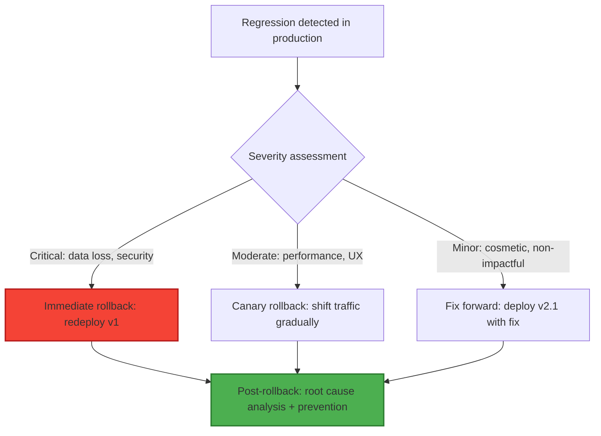
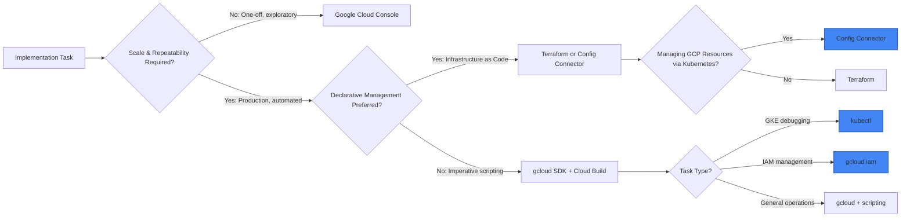

# 🚀 Domain 5: Managing Implementation (11%)
### Google Professional Cloud Architect 2026 | Deep-Dive Study Guide (5 of 6)

> **Exam Weight**: ~11% (~5-6 questions) | **Focus**: Turning designs into reality with the right tools, patterns, and automation | **Key Skills**: Tool selection, deployment safety, declarative management, implementation governance

---

## 📖 Table of Contents

1. [What the Exam Actually Tests](#1-what-the-exam-actually-tests)
2. [Application Development Best Practices](#2-application-development-best-practices)
3. [API Management & Connectivity Patterns](#3-api-management--connectivity-patterns)
4. [Testing & Validation Strategies](#4-testing--validation-strategies)
5. [Tooling & Interfaces: Choosing the Right Access Method](#5-tooling--interfaces-choosing-the-right-access-method)
6. [Declarative Management with Config Connector](#6-declarative-management-with-config-connector)
7. [Resource Governance & Automated Deployment](#7-resource-governance--automated-deployment)
8. [Exam Decision Frameworks: Tool Selection Rules](#8-exam-decision-frameworks-tool-selection-rules)
9. [Exam Traps & Tricks](#9-exam-traps--tricks)
10. [Mnemonics & Memory Hacks](#10-mnemonics--memory-hacks)
11. [Practice Checkpoint (10 Scenarios)](#11-practice-checkpoint-10-scenarios)
12. [2025–2026 Changes](#12-20252026-changes)

---

## 1️⃣ What the Exam Actually Tests

### 🔍 The Real Skill Being Assessed
```
Domain 5 does NOT test:
❌ Memorizing exact gcloud command syntax or flags
❌ Step-by-step console UI click paths
❌ Writing complete Dockerfiles or Kubernetes manifests from scratch

Domain 5 DOES test:
✅ Selecting the RIGHT TOOL for the implementation task (Console vs. gcloud vs. API vs. Config Connector)
✅ Applying deployment safety patterns: traffic splitting, rollbacks, canary/blue-green strategies
✅ Managing stateless containers (Cloud Run) vs. stateful workloads (GKE, Compute Engine)
✅ Implementing API governance with Cloud Endpoints and secure connectivity patterns
✅ Using declarative management (Config Connector) to unify infrastructure and app deployment
✅ Automating resource governance: org policies, labeling, project automation
✅ Choosing appropriate patching/update strategies for MIGs and Compute Engine
✅ Scaling implementation: when to use Console (visibility) vs. gcloud/APIs (repeatability)
```

### 🎯 Question Archetypes You'll Encounter
| Archetype | Prompt Pattern | What They Want |
|-----------|---------------|----------------|
| **The Deployment Safety Question** | "Update production app without impacting users. Which pattern?" | Traffic splitting, canary deployment, rollback capability |
| **The Tool Selection Question** | "Manage GCP resources using Kubernetes YAML files. Which tool?" | Config Connector for declarative GCP resource management |
| **The Connectivity Puzzle** | "Cloud Function needs secure access to internal VPC resources. Which pattern?" | VPC Connector, Private Service Connect, or Serverless VPC Access |
| **The Governance-at-Scale Scenario** | "Enforce consistent labeling across 100+ projects. Which approach?" | Org policies + Terraform/Config Connector + automated validation |
| **The Container Implementation Question** | "Dockerize legacy app for Cloud Run. Which Dockerfile pattern?" | Multi-stage builds, non-root user, minimal base image, health checks |
| **The Update Strategy Question** | "Patch Compute Engine fleet with zero downtime. Which MIG policy?" | Rolling update with maxSurge/maxUnavailable tuning + health checks |

### 📊 Domain 5 Weight Distribution (Estimated)
```
Application Development & Containers      ████████░░  25%
API Management & Connectivity             ██████░░░░  18%
Testing & Deployment Safety               ██████░░░░  18%
Tooling & Interface Selection             █████░░░░░  15%
Declarative Management (Config Connector) ████░░░░░░  12%
Resource Governance & Automation          ███░░░░░░░   12%
```

---

## 2️⃣ Application Development Best Practices

### 📦 Container & Serverless Implementation Patterns

#### Pattern A: Managing Stateless Containers (Cloud Run)
```yaml
Cloud Run Best Practices for Implementation:
✅ Stateless design principles:
   • Externalize state to Cloud SQL, Memorystore, or Cloud Storage
   • Use environment variables + Secret Manager for configuration
   • Design for horizontal scaling: no local session affinity required
✅ Dockerfile optimization for Cloud Run:
   • Use minimal base images (distroless, alpine) to reduce attack surface + startup time
   • Multi-stage builds: compile in builder stage, copy artifacts to runtime stage
   • Run as non-root user: USER 1000 in Dockerfile for security
   • Include health check endpoint: /health for liveness probes
✅ Startup optimization:
   • Lazy-load dependencies; defer non-critical initialization
   • Use connection pooling for database clients
   • Pre-warm instances: min_instances=1 for latency-sensitive APIs (trade-off: cost)
✅ Exam cue: "Cloud Run implementation" → Expect stateless design + optimized Dockerfile + health checks + Secret Manager integration

Example Dockerfile Pattern (Exam-Ready):
```dockerfile
# Build stage
FROM golang:1.21-alpine AS builder
WORKDIR /app
COPY go.mod go.sum ./
RUN go mod download
COPY . .
RUN CGO_ENABLED=0 GOOS=linux go build -a -installsuffix cgo -o main .

# Runtime stage (minimal attack surface)
FROM gcr.io/distroless/static-debian11
COPY --from=builder /app/main /main
EXPOSE 8080
USER 1000  # Non-root user for security
HEALTHCHECK --interval=30s --timeout=3s CMD wget -qO- http://localhost:8080/health || exit 1
CMD ["/main"]
```
```

#### Pattern B: Dependency Management Strategies (App Engine)
```yaml
App Engine Standard Dependency Patterns:
✅ Python (requirements.txt):
   • Pin exact versions: flask==2.3.2 (not >=2.3) for reproducibility
   • Use --no-cache-dir in Docker builds to reduce image size
   • Separate dev/test/prod dependencies with extras_require
✅ Node.js (package.json):
   • Use package-lock.json for deterministic installs
   • Set engines.node to match App Engine runtime version
   • Prune devDependencies in production build
✅ Java (pom.xml/build.gradle):
   • Use dependency management plugins for version alignment
   • Exclude transitive dependencies that conflict with App Engine runtime
✅ Exam cue: "App Engine dependency management" → Expect pinned versions + lock files + environment separation

App Engine Flexible Considerations:
⚠️ Deprecated for new projects (exam trap!)
✅ If mentioned: Use custom runtime with Dockerfile; manage dependencies via Docker build
❌ Avoid for new implementations; exam expects Standard or Cloud Run for new apps
```

#### Pattern C: Dockerizing Workloads for GCP
```yaml
Dockerfile Best Practices for GCP Implementation:
✅ Security hardening:
   • Use distroless or minimal base images (reduce CVE surface)
   • Run as non-root user: USER 1000
   • Scan images with Artifact Registry vulnerability scanning
   • Sign images with Binary Authorization for supply chain security
✅ Performance optimization:
   • Multi-stage builds to minimize final image size
   • Layer caching: order commands from least to most frequently changed
   • Use .dockerignore to exclude unnecessary files (node_modules, .git, etc.)
✅ GCP-specific patterns:
   • Use gcloud CLI in build steps for authenticated artifact pushes
   • Leverage Cloud Build substitutions for dynamic tagging: $_GIT_TAG, $_COMMIT_SHA
   • Store images in Artifact Registry (not Docker Hub) for integrated IAM + scanning
✅ Exam cue: "Dockerize app for GCP" → Expect multi-stage build + non-root user + Artifact Registry + vulnerability scanning

Example Cloud Build Pipeline Snippet:
```yaml
# cloudbuild.yaml
steps:
  # Build and tag image
  - name: 'gcr.io/cloud-builders/docker'
    args: ['build', '-t', 'gcr.io/$PROJECT_ID/my-app:$_GIT_TAG', '.']
  
  # Push to Artifact Registry
  - name: 'gcr.io/cloud-builders/docker'
    args: ['push', 'gcr.io/$PROJECT_ID/my-app:$_GIT_TAG']
  
  # Submit to Container Analysis for vulnerability scanning
  - name: 'gcr.io/cloud-builders/gcloud'
    args: ['container', 'images', 'add-tag', 
           'gcr.io/$PROJECT_ID/my-app:$_GIT_TAG',
           'gcr.io/$PROJECT_ID/my-app:latest']
  
  # Deploy to Cloud Run (if tests pass)
  - name: 'gcr.io/cloud-builders/gcloud'
    args: ['run', 'deploy', 'my-service', 
           '--image', 'gcr.io/$PROJECT_ID/my-app:$_GIT_TAG',
           '--region', 'us-central1',
           '--platform', 'managed',
           '--allow-unauthenticated']
```
```

---

## 3️⃣ API Management & Connectivity Patterns

### 🔗 API Governance & Secure Connectivity

#### Pattern A: Cloud Endpoints for API Governance
```yaml
Cloud Endpoints Implementation Patterns:
✅ API specification management:
   • Define APIs using OpenAPI 2.0/3.0 or gRPC protobuf
   • Store specs in source control; validate via CI pipeline
   • Use ESPv2 (Extensible Service Proxy) for traffic management
✅ Governance features:
   • API key authentication for external consumers
   • JWT validation for internal microservices
   • Quota management: requests/minute per API key
   • Monitoring: Cloud Monitoring integration for latency/error metrics
✅ Deployment patterns:
   • Deploy ESPv2 as Cloud Run service or GKE sidecar
   • Use traffic splitting for API version rollouts
   • Integrate with Cloud IAM for fine-grained access control
✅ Exam cue: "API governance" + "external consumers" → Cloud Endpoints + API keys + quota management + ESPv2

Example OpenAPI Snippet for Endpoints:
```yaml
# openapi.yaml
swagger: "2.0"
info:
  title: "Product API"
  version: "1.0.0"
host: "product-api.endpoints.my-project.cloud.goog"
basePath: "/v1"
schemes: ["https"]
consumes: ["application/json"]
produces: ["application/json"]

securityDefinitions:
  api_key:
    type: "apiKey"
    name: "key"
    in: "query"
  jwt:
    authorizationUrl: ""
    flow: "implicit"
    type: "oauth2"
    x-google-issuer: "https://accounts.google.com"
    x-google-jwks_uri: "https://www.googleapis.com/oauth2/v3/certs"

security:
  - api_key: []
  - jwt: []

paths:
  /products:
    get:
      summary: "List products"
      operationId: "listProducts"
      responses:
        "200":
          description: "Success"
```
```

#### Pattern B: Secure Cloud Functions Connectivity
```yaml
Connecting Cloud Functions to Internal Resources:
✅ Serverless VPC Access Connector:
   • Purpose: Allow Cloud Functions to reach private VPC resources (Cloud SQL, Memorystore, internal APIs)
   • Configuration: Create connector in same region as Function; assign to Function via --vpc-connector flag
   • Security: Connector uses private IP; Function still needs IAM permissions for target resource
   • Cost: Connector has hourly charge + egress costs; minimize by sharing connector across Functions
✅ Private Service Connect (PSC) for managed services:
   • Purpose: Private connectivity to Google APIs (BigQuery, Vertex AI) and partner SaaS
   • Advantage: No public internet exposure; integrated with VPC Service Controls
   • Exam cue: "Cloud Function to BigQuery securely" → PSC endpoint + IAM, not public API endpoint
✅ VPC Service Controls integration:
   • Purpose: Prevent data exfiltration from sensitive projects
   • Pattern: Enclose Cloud Functions project + data projects in same perimeter
   • Allowlist: Explicitly permit Cloud Functions egress to approved services
✅ Exam cue: "Secure internal access from serverless" → Serverless VPC Access Connector + IAM + VPC-SC perimeter

Terraform Pattern for Serverless VPC Access:
```hcl
resource "google_vpc_access_connector" "functions_connector" {
  name          = "functions-connector"
  region        = var.region
  ip_cidr_range = "10.8.0.0/28"  # /28 = 16 IPs (min for connector)
  network       = var.vpc_network_name
  
  # Minimize cost: scale to 2 min instances (default)
  min_instances = 2
  max_instances = 10
}

resource "google_cloudfunctions_function" "internal_api" {
  name        = "internal-data-processor"
  runtime     = "python311"
  entry_point = "process_data"
  
  # Connect to VPC via connector
  vpc_connector = google_vpc_access_connector.functions_connector.name
  vpc_connector_egress_settings = "PRIVATE_RANGES_ONLY"  # Only private traffic via connector
  
  # IAM: Minimal permissions for target resource
  service_account_email = google_service_account.function_runner.email
  
  # ... source code, trigger configuration
}
```
```

#### Pattern C: Specialized Workloads on GKE
```yaml
GKE Implementation Patterns for Specialized Workloads:
✅ GPU workloads (ML training, inference):
   • Use node taints: nvidia.com/gpu=present:NoSchedule
   • Pod tolerations + resource requests: resources.limits.nvidia.com/gpu: "1"
   • Install GPU drivers via node startup script or GKE auto-upgrade
   • Exam cue: "GPU workload on GKE" → taints/tolerations + resource limits + driver installation
✅ High-memory workloads (in-memory databases, analytics):
   • Select memory-optimized machine types: m3-megamem-*, m3-ultramem-*
   • Configure pod anti-affinity to spread across nodes for HA
   • Use Vertical Pod Autoscaler (VPA) with caution: recommend mode only for initial right-sizing
✅ Real-time workloads (low-latency APIs):
   • Use node affinity to place pods on dedicated node pools with optimized networking
   • Configure Horizontal Pod Autoscaler with custom metrics (requests/sec, queue depth)
   • Enable GKE network policies for microsegmentation
✅ Batch workloads (ETL, rendering):
   • Use preemptible node pools for cost savings (80% discount)
   • Implement pod disruption budgets + checkpointing for fault tolerance
   • Schedule with Cloud Scheduler + Cloud Tasks for orchestration
✅ Exam cue: "Specialized GKE workload" → Match node pool configuration (taints, machine type, preemptible) to workload requirements
```

---

## 4️⃣ Testing & Validation Strategies

### 🧪 Safe Deployment & Rollback Patterns

#### Pattern A: GKE Versioning and Testing Strategies
```yaml
GKE Cluster & Application Versioning:
✅ Cluster upgrade strategy:
   • Use release channels: Regular (default), Stable (production), Rapid (testing)
   • Enable auto-upgrade for node pools: reduces operational overhead
   • Surge upgrades: Configure maxSurge=1, maxUnavailable=0 for zero-downtime node upgrades
✅ Application version testing:
   • Namespace isolation: Deploy new version to staging namespace first
   • Integration testing: Use Cloud Build to run tests against staging deployment
   • Canary promotion: Use service mesh (Anthos/Istio) to route 5% traffic to new version
✅ Rollback strategy:
   • Kubernetes Deployments: kubectl rollout undo deployment/<name>
   • Service mesh: Adjust VirtualService traffic weights to shift back to stable version
   • Database migrations: Use backward-compatible schema changes; feature flags for new logic
✅ Exam cue: "GKE version upgrade with zero downtime" → Release channel + surge upgrades + canary testing via service mesh

Example GKE Upgrade Terraform Pattern:
```hcl
resource "google_container_cluster" "prod_cluster" {
  name     = "prod-cluster"
  location = var.region
  
  # Release channel for controlled upgrades
  release_channel {
    channel = "REGULAR"  # or "STABLE" for production
  }
  
  # Auto-upgrade configuration
  maintenance_policy {
    auto_upgrade = true
    auto_repair  = true
    
    # Maintenance window: Sunday 2-6 AM local time
    recurring_window {
      start_time = "2024-01-01T02:00:00Z"
      end_time   = "2024-01-01T06:00:00Z"
      recurrence = "FREQ=WEEKLY;BYDAY=SU"
    }
  }
  
  # Node pool with surge upgrades for zero-downtime
  node_pool {
    name               = "default-pool"
    initial_node_count = 3
    
    upgrade_settings {
      max_surge       = 1  # Add 1 extra node during upgrade
      max_unavailable = 0  # Never reduce capacity below current
    }
  }
}
```
```

#### Pattern B: Traffic Splitting for Canary/Blue-Green Deployments
```yaml
Traffic Splitting Implementation Across Services:
✅ App Engine Traffic Splitting:
   • Commands: gcloud app services set-traffic --splits version1=0.9,version2=0.1
   • Split methods: random (A/B testing), cookie (user-consistent), IP (geo testing)
   • Rollback: Shift traffic back to stable version instantly (no redeploy)
   • Exam cue: "App Engine zero-downtime update" → traffic splitting + cookie-based routing + monitoring
✅ Cloud Run / Knative Traffic Splitting:
   • Tag-based routing: --tag=prod --tag=canary for environment isolation
   • Percentage-based: --to-revision=rev1=90%,rev2=10% for gradual rollout
   • Revision management: Previous revisions retained for instant rollback
   • Exam cue: "Cloud Run canary deployment" → tag-based routing + percentage split + revision retention
✅ GKE Traffic Splitting (Service Mesh):
   • Istio/Anthos VirtualService: Route traffic by weight, headers, or user identity
   • Canary pattern: 5% → 25% → 50% → 100% with automated promotion based on metrics
   • Blue-green: Deploy new version to separate subset; switch Service selector for instant cutover
   • Exam cue: "GKE canary with metrics-based promotion" → Istio VirtualService + Cloud Monitoring SLOs + automated promotion
✅ Unified Pattern for Exam Success:
   • Always retain previous version for rollback capability
   • Monitor SLOs (latency, error rate) during rollout; auto-rollback if violated
   • Use cookie/user-based splitting for consistent A/B testing experience
   • Document promotion criteria in deployment runbooks

Example Cloud Run Traffic Split Command:
```bash
# Deploy new revision with canary tag
gcloud run deploy my-service \
  --image gcr.io/$PROJECT_ID/my-app:v2 \
  --tag=canary \
  --region=us-central1

# Split traffic: 90% prod, 10% canary
gcloud run services update-traffic my-service \
  --to-latest=90 \
  --to-tag=canary=10 \
  --region=us-central1

# Promote canary to 100% if metrics look good
gcloud run services update-traffic my-service \
  --to-latest=100 \
  --region=us-central1

# Rollback: Shift all traffic back to previous revision
gcloud run services update-traffic my-service \
  --to-revision=my-service-00001=100 \
  --region=us-central1
```
```

#### Pattern C: Rollback Procedures for Cloud Functions
```yaml
Cloud Functions Rollback Implementation:
✅ Version retention strategy:
   • Each deploy creates new version; previous versions retained by default
   • Configure retention policy: --retention-policy=ALL to keep all versions for audit
   • List versions: gcloud functions list --gen2 --region=us-central1
✅ Rollback methods:
   • Method 1 (Recommended): Redeploy previous version with same function name
     gcloud functions deploy my-function \
       --source=./v1-code \
       --runtime=python311 \
       --trigger-http \
       --region=us-central1
   • Method 2: Use aliases (gen2 only) to switch traffic between versions
     gcloud functions add-iam-policy-binding my-function \
       --member=serviceAccount:my-sa@project.iam.gserviceaccount.com \
       --role=roles/cloudfunctions.invoker \
       --condition="expression=request.auth.claims.version=='v1'"
✅ Pre-rollback validation:
   • Test previous version in staging environment before production rollback
   • Verify dependencies and configuration are compatible with rolled-back code
   • Document root cause of regression to prevent recurrence
✅ Exam cue: "Cloud Functions regression rollback" → redeploy previous version + staging validation + root cause documentation

Rollback Decision Framework:

```

---

## 5️⃣ Tooling & Interfaces: Choosing the Right Access Method

### 🛠️ Tool Selection Decision Framework

#### Primary Access Methods Comparison
```yaml
Google Cloud Console:
✅ Best for:
   • Initial exploration and learning
   • One-off resource inspection and debugging
   • Visualizing relationships (network topology, IAM policies)
   • Small-scale, non-repetitive tasks
❌ Avoid for:
   • Production deployments (not repeatable, not auditable)
   • Multi-resource operations (slow, error-prone)
   • Team collaboration (no version control, no audit trail)
✅ Exam cue: "Quick inspection" or "visualize architecture" → Console is acceptable

Cloud SDK (gcloud/gsutil/bq):
✅ Best for:
   • Scriptable, repeatable operations
   • CI/CD pipeline integration
   • Bulk operations across resources
   • Automation with bash/Python/PowerShell
❌ Avoid for:
   • Complex multi-step workflows (prefer Terraform/Config Connector)
   • Team collaboration without version control (wrap in Git)
✅ Exam cue: "Automate deployment" or "repeatable process" → gcloud + scripting + Cloud Build

Cloud APIs (REST/gRPC):
✅ Best for:
   • Custom tooling and integrations
   • Programmatic access from applications
   • Fine-grained control not available in gcloud
   • High-volume, low-latency operations
❌ Avoid for:
   • Ad-hoc administrative tasks (overhead of auth + request construction)
✅ Exam cue: "Build custom integration" or "application-managed resources" → Cloud APIs + client libraries

Cloud Shell:
✅ Best for:
   • Temporary, pre-configured environments with gcloud pre-installed
   • Quick experiments without local setup
   • Tutorial completion and exam practice
❌ Avoid for:
   • Production operations (ephemeral environment, no persistence)
   • Sensitive operations (shared infrastructure, audit considerations)
✅ Exam cue: "Quick test without local setup" → Cloud Shell is appropriate

Service-Specific CLI Tools:
✅ kubectl for GKE:
   • Manage Kubernetes resources: deployments, services, configmaps
   • Debug running pods: kubectl logs, kubectl exec, kubectl port-forward
   • Exam cue: "Debug GKE application" → kubectl + Cloud Logging integration
✅ gcloud for IAM:
   • Manage roles, bindings, service accounts: gcloud iam roles, gcloud projects add-iam-policy-binding
   • Audit IAM policies: gcloud projects get-iam-policy --format=json
   • Exam cue: "Grant least-privilege access" → gcloud iam + predefined roles + conditions
```

#### Tool Selection Decision Tree (Exam-Critical)


### ⚠️ Tool Selection Exam Traps
```
❌ Trap: "Use Console for production deployments to simplify the process"
✅ Reality: Console operations aren't repeatable, auditable, or version-controlled
→ Exam expects gcloud/Terraform/Config Connector for production implementations

❌ Trap: "Use gcloud for managing GCP resources in Kubernetes manifests"
✅ Reality: gcloud is imperative; Config Connector is the declarative Kubernetes-native option
→ Exam expects Config Connector when question mentions "Kubernetes YAML" + "GCP resources"

❌ Trap: "Use Cloud Shell for long-running production operations"
✅ Reality: Cloud Shell is ephemeral; not suitable for persistent workflows
→ Exam expects Cloud Build, Cloud Functions, or GKE for persistent automation

✅ Exam Pattern: Scenarios mentioning "scale", "repeatability", "automation", or "team collaboration" 
   almost always require: gcloud/APIs/Terraform/Config Connector (not Console)
```

---

## 6️⃣ Declarative Management with Config Connector

### 🔄 Config Connector Implementation Patterns

#### What is Config Connector?
```
Config Connector: Manage GCP resources as Kubernetes objects

✅ Core Concept:
   • Write Kubernetes YAML manifests for GCP resources (Cloud SQL, Pub/Sub, IAM, etc.)
   • Apply via kubectl; Config Controller reconciles desired state with GCP API
   • Benefits: Unified GitOps workflow for app + infrastructure; Kubernetes-native tooling

✅ When to Use Config Connector (Exam Decision Rule):
   • Requirement: "Manage GCP resources using the same YAML files used for GKE"
   • Requirement: "Unified deployment pipeline for app and infrastructure"
   • Requirement: "Kubernetes-native tooling for infrastructure management"
   → Answer: Config Connector

✅ When NOT to Use Config Connector:
   • Managing resources outside Kubernetes ecosystem (prefer Terraform)
   • Simple, one-off resource creation (prefer gcloud or Console)
   • Teams without Kubernetes expertise (prefer Terraform + Cloud Build)
```

#### Config Connector Implementation Example
```yaml
# Kubernetes manifest for Cloud SQL instance via Config Connector
apiVersion: sql.cnrm.cloud.google.com/v1beta1
kind: SQLInstance
metadata:
  name: prod-app-database
  annotations:
    cnrm.cloud.google.com/deletion-policy: abandon  # Prevent accidental deletion
spec:
  databaseVersion: POSTGRES_15
  region: us-central1
  settings:
    tier: db-custom-2-7680  # Right-sized instance
    backupConfiguration:
      enabled: true
      startTime: "02:00"
    ipConfiguration:
      ipv4Enabled: false  # Private IP only for security
      requireSsl: true
  projectRef:
    external: projects/my-project-id

---
# Kubernetes manifest for IAM binding via Config Connector
apiVersion: iam.cnrm.cloud.google.com/v1beta1
kind: IAMServiceAccount
metadata:
  name: app-runner
spec:
  displayName: "Application Runtime Service Account"
---
apiVersion: iam.cnrm.cloud.google.com/v1beta1
kind: IAMPolicyMember
metadata:
  name: app-runner-storage-access
spec:
  member: serviceAccount:app-runner@my-project-id.iam.gserviceaccount.com
  role: roles/storage.objectViewer
  resourceRef:
    apiVersion: resourcemanager.cnrm.cloud.google.com/v1beta1
    kind: Project
    name: my-project-id
```

#### Config Connector vs. Terraform: Exam Decision Guide
```yaml
Choose Config Connector when:
✅ Requirement: "Manage GCP resources using Kubernetes YAML"
✅ Requirement: "Unified GitOps workflow for app and infrastructure"
✅ Requirement: "Kubernetes-native tooling (kubectl, Git, ArgoCD) for all deployments"
✅ Team already uses Kubernetes extensively; wants to extend to infrastructure

Choose Terraform when:
✅ Requirement: "Manage resources across multiple clouds or non-Kubernetes environments"
✅ Requirement: "Complex module composition and reusability across teams"
✅ Requirement: "State management and drift detection as core requirements"
✅ Team has Terraform expertise; Kubernetes is only one part of infrastructure

Exam Shortcut:
• Question mentions "Kubernetes YAML" + "GCP resources" → Config Connector
• Question mentions "multi-cloud" or "complex modules" → Terraform
• Question mentions "quick script" or "one-off" → gcloud
```

### ⚠️ Config Connector Exam Traps
```
❌ Trap: "Use Config Connector for all GCP resource management regardless of team skills"
✅ Reality: Config Connector requires Kubernetes expertise; exam expects tool matching to team capabilities
→ Look for answers that consider team skills and existing tooling

❌ Trap: "Use Config Connector for one-off resource creation"
✅ Reality: Overhead of Kubernetes setup isn't justified for simple tasks; exam expects gcloud/Console for one-offs
→ Prefer Config Connector only for repeatable, team-managed infrastructure

❌ Trap: "Ignore deletion policies in Config Connector manifests"
✅ Reality: Accidental kubectl delete could remove production resources; exam expects deletion-policy: abandon for critical resources
→ Look for answers with protective annotations for production resources

✅ Exam Pattern: Scenarios mentioning "Kubernetes YAML", "GitOps", or "unified deployment" 
   almost always require: Config Connector + protective annotations + team skill alignment
```

---

## 7️⃣ Resource Governance & Automated Deployment

### 🏛️ Governance Implementation Patterns

#### Pattern A: Managing Project Identity Through Automation
```yaml
Project Name, ID, and Number Automation:
✅ Best practices for project creation:
   • Use consistent naming convention: {env}-{app}-{region} (e.g., prod-api-uscentral1)
   • Automate project creation with Terraform or gcloud + scripting
   • Store project metadata in source control: name, id, billing account, labels
✅ Terraform Pattern for Project Automation:
```hcl
resource "google_project" "app_project" {
  name            = "prod-api-uscentral1"
  project_id      = "prod-api-usc1-${var.app_id}"  # Must be globally unique
  billing_account = var.billing_account_id
  org_id          = var.org_id
  
  # Automatic labeling for cost attribution and governance
  auto_create_network = false  # Skip default network for security
  
  labels = {
    environment     = "prod"
    application     = var.app_name
    cost-center     = "engineering"
    managed-by      = "terraform"
    created-date    = formatdate("YYYY-MM-DD", timestamp())
  }
}

# Enable required APIs automatically
resource "google_project_service" "required_apis" {
  for_each = toset([
    "compute.googleapis.com",
    "container.googleapis.com",
    "iam.googleapis.com",
    "logging.googleapis.com"
  ])
  
  project = google_project.app_project.project_id
  service = each.key
  
  # Disable automatic service disable on destroy (protect production)
  disable_on_destroy = false
}
```
✅ Exam cue: "Automate project creation" → Terraform/gcloud + consistent naming + automatic labeling + API enablement
```

#### Pattern B: Organization Policies for Governance
```yaml
Org Policy Implementation for Implementation Governance:
✅ Cost control policies:
   • constraints/compute.vmExternalIpAccess: Prevent public IPs on VMs
   • constraints/resourcemanager.allowedPolicyMemberDomains: Restrict IAM to approved domains
   • constraints/billing.disableBillingOnProjectDeletion: Prevent accidental billing loss
✅ Security baseline policies:
   • constraints/iam.disableServiceAccountKeyCreation: Enforce workload identity
   • constraints/compute.requireShieldedVm: Require Shielded VMs for production
   • constraints/storage.publicAccessPrevention: Block public buckets by default
✅ Deployment safety policies:
   • constraints/deploymentmanager.disable: Prevent legacy Deployment Manager usage
   • constraints/run.disableIngress: Restrict Cloud Run ingress to internal/VPC only
✅ Exam cue: "Enforce governance at scale" → Org policies + Terraform validation + audit logging

Terraform Pattern for Org Policy Enforcement:
```hcl
# Org policy: Require CMEK for Cloud SQL in production folders
resource "google_org_policy_policy" "cloud_sql_cmek_required" {
  name = "folders/${var.prod_folder_id}/policies/constraints/sql.requireCmek"
  
  spec {
    rules {
      enforce = true
    }
  }
}

# Org policy: Prevent public Cloud Storage buckets
resource "google_org_policy_policy" "storage_public_access_prevention" {
  name = "organizations/${var.org_id}/policies/constraints/storage.publicAccessPrevention"
  
  spec {
    rules {
      enforce = true
    }
  }
}
```
```

#### Pattern C: Resource Labeling for Automation
```yaml
Labeling Strategy for Billing and Inventory Management:
✅ Mandatory label schema (enforced via org policy):
```yaml
labels:
  environment: "prod|staging|dev|sandbox"  # Cost allocation by environment
  application: "api|web|batch|ml"          # Cost attribution by app
  team: "engineering|data|security"         # Chargeback by team
  cost-center: "12345"                      # Finance system integration
  managed-by: "terraform|config-connector|manual"  # Audit automation source
  compliance: "pci|hipaa|gdpr|none"         # Compliance reporting
```
✅ Automation patterns:
   • Enforce labels via org policy: constraints/resourcemanager.requireLabels
   • Auto-apply labels in Terraform/Config Connector modules
   • Export billing data to BigQuery; analyze by label dimensions
   • Create automated reports: cost by team, environment, application
✅ Exam cue: "Automated billing attribution" → Mandatory labels + org policy enforcement + BigQuery export

BigQuery View for Label-Based Cost Analysis:
```sql
-- Billing export view: cost by mandatory labels
SELECT
  labels.environment,
  labels.application,
  labels.team,
  labels.cost_center,
  service.description as service_name,
  SUM(cost) as total_cost,
  COUNT(DISTINCT resource.global_name) as resource_count
FROM
  `my-project.gcp_billing_export_v1_*`
WHERE
  _TABLE_SUFFIX BETWEEN FORMAT_DATE('%Y%m%d', DATE_SUB(CURRENT_DATE(), INTERVAL 30 DAY))
  AND FORMAT_DATE('%Y%m%d', CURRENT_DATE())
  AND labels.environment IS NOT NULL  -- Filter to properly labeled resources
GROUP BY
  labels.environment, labels.application, labels.team, labels.cost_center, service.description
ORDER BY
  total_cost DESC;
```
```

#### Pattern D: Automated Deployment with MIG Update Policies
```yaml
MIG Update Policies for Zero-Downtime Rollouts:
✅ Rolling update configuration:
   • maxSurge: Number of extra instances created during update (default: 1)
   • maxUnavailable: Number of instances that can be unavailable during update (default: 1)
   • Minimal disruption: maxSurge=1, maxUnavailable=0 for zero-downtime
   • Faster rollout: maxSurge=25%, maxUnavailable=25% for balanced speed/availability
✅ Health check integration:
   • Configure HTTP/TCP health check to validate new instances before traffic routing
   • initialDelaySec: Allow time for application startup before health checks begin
   • Rollback trigger: Auto-rollback if health checks fail for new instances
✅ Exam cue: "Zero-downtime MIG update" → Rolling update with maxSurge=1, maxUnavailable=0 + health checks

Terraform Pattern for MIG Rolling Updates:
```hcl
resource "google_compute_region_instance_group_manager" "app_mig" {
  name   = "app-mig"
  region = var.region
  
  # Instance template reference (updated via Terraform apply)
  version {
    instance_template = google_compute_instance_template.app_v2.id
  }
  
  # Rolling update policy for zero-downtime
  update_policy {
    type                  = "PROACTIVE"  # Apply update immediately
    minimal_action        = "REPLACE"    # Replace instances with new template
    max_surge_fixed       = 1            # Add 1 extra instance during update
    max_unavailable_fixed = 0            # Never reduce below current capacity
    replacement_method    = "SUBSTITUTE" # Create new instance before deleting old
    
    # Health check validation before marking instance healthy
    instance_redistribution_type = "PROACTIVE"
    min_ready_sec                = 300  # Wait 5 minutes after health check passes
  }
  
  # Named port for load balancer integration
  named_port {
    name = "http"
    port = 8080
  }
}

# Health check for update validation
resource "google_compute_http_health_check" "app_health" {
  name               = "app-health-check"
  request_path       = "/health"
  check_interval_sec = 10
  timeout_sec        = 5
  healthy_threshold  = 2
  unhealthy_threshold = 3
}
```

Patching Strategies for Compute Engine:
✅ OS patch management options:
   • OS Config API + Patch deployments: Automated, scheduled patching with maintenance windows
   • Managed Instance Group rolling update: Patch via new instance template + rolling replacement
   • Live migration for maintenance: GCP handles host maintenance without VM reboot (for most updates)
✅ Exam cue: "Patch Compute Engine fleet" → OS Config API for automated scheduling OR MIG rolling update for application+OS updates
```

---

## 8️⃣ Exam Decision Frameworks: Tool Selection Rules

### 🧭 The Domain 5 Tool Selection Framework

#### Rule 1: Deployment Safety → Traffic Splitting
```
Scenario Pattern: "Update production app without impacting users" or "Zero-downtime deployment"

✅ Correct Answer Pattern:
   • App Engine: Traffic splitting with --splits flag + cookie-based routing
   • Cloud Run: Tag-based routing + percentage traffic split + revision retention
   • GKE: Canary deployment via service mesh (Istio/Anthos) + SLO monitoring
   • Cloud Functions: Redeploy previous version for rollback + staging validation

❌ Eliminate Options That:
   • Deploy to 100% of traffic immediately
   • Delete previous version before validating new version
   • Lack monitoring/SLO validation during rollout

Exam Shortcut: "Zero downtime" + "production" = Traffic splitting of some form
```

#### Rule 2: Kubernetes YAML + GCP Resources → Config Connector
```
Scenario Pattern: "Manage GCP resources using Kubernetes YAML" or "Unified GitOps for app and infrastructure"

✅ Correct Answer: Config Connector
   • Write Kubernetes manifests for Cloud SQL, Pub/Sub, IAM, etc.
   • Apply via kubectl; Config Controller reconciles with GCP API
   • Benefits: Unified tooling, GitOps workflow, Kubernetes-native

❌ Eliminate Options That:
   • Suggest Terraform (correct tool, but not Kubernetes YAML)
   • Suggest gcloud (imperative, not declarative)
   • Suggest Console (not repeatable, not version-controlled)

Exam Shortcut: "Kubernetes YAML" + "GCP resources" = Config Connector (always)
```

#### Rule 3: Scale & Repeatability → gcloud/APIs, Not Console
```
Scenario Pattern: "Automate deployment", "Repeatable process", "Team collaboration", "Audit trail"

✅ Correct Answer Pattern:
   • gcloud SDK + scripting + Cloud Build for CI/CD
   • Cloud APIs + client libraries for custom integrations
   • Terraform/Config Connector for declarative infrastructure

❌ Eliminate Options That:
   • Suggest Console for production deployments
   • Suggest manual, one-off procedures for repeatable tasks
   • Lack version control or audit capabilities

Exam Shortcut: "Scale" or "repeatable" or "automation" = gcloud/APIs/Terraform (not Console)
```

#### Rule 4: Secure Internal Access from Serverless → VPC Connector/PSC
```
Scenario Pattern: "Cloud Function/Run needs access to internal VPC resources"

✅ Correct Answer Pattern:
   • Serverless VPC Access Connector for private VPC resource access
   • Private Service Connect for private access to Google APIs/partner SaaS
   • VPC Service Controls perimeter for data exfiltration prevention

❌ Eliminate Options That:
   • Assign public IPs to internal resources
   • Use public API endpoints without private connectivity
   • Rely solely on IAM without network boundaries

Exam Shortcut: "Serverless to internal resources" = Serverless VPC Access Connector or PSC
```

#### Rule 5: Governance at Scale → Org Policies + Labeling + Automation
```
Scenario Pattern: "Enforce consistent controls across 100+ projects" or "Automated compliance"

✅ Correct Answer Pattern:
   • Organization Policies for guardrails (prevent misconfiguration)
   • Mandatory resource labeling for cost attribution and inventory
   • Terraform/Config Connector modules for repeatable, auditable deployments
   • BigQuery billing export + automated reporting for visibility

❌ Eliminate Options That:
   • Suggest manual review processes for large-scale enforcement
   • Lack automated validation or enforcement mechanisms
   • Don't include audit logging or reporting capabilities

Exam Shortcut: "Governance at scale" = Org policies + labeling + automation + audit
```

---

## 9️⃣ Exam Traps & Tricks

### 🚫 Top 10 Domain 5 Exam Traps

| Trap | What It Looks Like | Why It's Wrong | How to Avoid |
|------|-------------------|----------------|--------------|
| **The Console-for-Production Trap** | "Use Cloud Console to deploy to production for simplicity" | Console operations aren't repeatable, auditable, or version-controlled | Eliminate options suggesting Console for production deployments; prefer gcloud/Terraform/Config Connector |
| **The Config Connector Misapplication** | "Use Config Connector for one-off resource creation" | Overhead of Kubernetes setup isn't justified for simple tasks | Prefer Config Connector only for repeatable, team-managed infrastructure with Kubernetes expertise |
| **The Traffic Splitting Omission** | "Deploy new version to 100% of traffic immediately" | High risk of widespread outage if regression exists | Expect traffic splitting + gradual rollout + SLO monitoring for production deployments |
| **The Tool Mismatch** | "Use gcloud to manage GCP resources via Kubernetes YAML" | gcloud is imperative; Config Connector is the declarative Kubernetes-native option | Remember: "Kubernetes YAML" + "GCP resources" = Config Connector |
| **The Labeling Oversight** | "Automate billing attribution without mandatory labels" | Can't attribute costs without consistent labeling; exam expects enforced schema | Look for answers with org policy-enforced labels + BigQuery export for analysis |
| **The Rollback Gap** | "Delete previous version after successful deploy" | Removes rollback capability; exam expects version retention for safety | Prefer options that retain previous versions for instant rollback |
| **The Connectivity Anti-Pattern** | "Assign public IPs to internal resources for serverless access" | Increases attack surface; violates secure-by-default principle | Expect Serverless VPC Access Connector or Private Service Connect for internal access |
| **The Update Policy Misconfiguration** | "MIG rolling update with maxUnavailable=100%" | Causes complete outage during update; violates zero-downtime requirement | Prefer maxSurge=1, maxUnavailable=0 for zero-downtime MIG updates |
| **The Governance Manual Process** | "Manual review of IAM policies across 100+ projects" | Doesn't scale; error-prone; exam expects automated guardrails | Look for org policies + Terraform validation + automated auditing for governance at scale |
| **The Dockerfile Security Gap** | "Dockerfile runs as root with latest base image" | Security anti-pattern; exam expects non-root user + minimal base image | Prefer Dockerfiles with distroless/alpine base + USER 1000 + multi-stage builds |

### 🎭 Scenario Red Flags vs Green Lights
```
🚩 RED FLAG PHRASES (Often indicate wrong answer):
• "Use Console for production deployment" → Not repeatable, not auditable
• "Deploy to 100% traffic immediately" → No deployment safety
• "Delete previous version after deploy" → No rollback capability
• "Assign public IPs for internal access" → Security anti-pattern
• "Manual process for 100+ projects" → Doesn't scale

✅ GREEN LIGHT PHRASES (Often indicate correct answer):
• "Traffic splitting" + "gradual rollout" + "SLO monitoring during deployment"
• "Config Connector" + "Kubernetes YAML" + "unified GitOps workflow"
• "gcloud + Cloud Build" + "version control" + "automated testing"
• "Serverless VPC Access Connector" + "private connectivity" + "IAM least privilege"
• "Org policies" + "mandatory labeling" + "BigQuery billing export" + "automated reporting"
• "MIG rolling update" + "maxSurge=1, maxUnavailable=0" + "health check validation"
• "Dockerfile" + "multi-stage build" + "non-root user" + "distroless base image"
```

---

## 🔟 Mnemonics & Memory Hacks

### 🧠 Acronyms to Memorize
```
Tool Selection → "C.G.T.A."
C - Console for exploration and one-off tasks
G - gcloud/APIs for automation and repeatability
T - Terraform for declarative infrastructure (multi-cloud)
A - Config Connector for Kubernetes-native GCP resource management

Deployment Safety → "T.R.A.F.F.I.C." (Recall from Domain 4, reinforced here)
T - Traffic splitting for gradual rollout
R - Retain previous versions for rollback
A - Alerting on SLO violations during deployment
F - Feature flags for controlled feature exposure
F - Feedback loops to measure deployment impact
I - Incremental promotion (canary → 50% → 100%)
C - Check monitoring dashboards before full promotion

Governance at Scale → "P.O.L.I.C.Y." (Recall from Domain 4)
P - Policies: Org policies for optimization guardrails
O - Ownership: Clear team ownership for governance decisions
L - Logging: Audit logging for all changes
I - Isolation: Environment-appropriate policy application
C - Compliance: Map controls to regulatory requirements
Y - Yield: Measure governance effectiveness via reporting

Dockerfile Security → "M.I.N.I.M.A.L."
M - Multi-stage builds to minimize final image size
I - Install only necessary dependencies (no dev tools in runtime)
N - Non-root user: USER 1000 in Dockerfile
I - Ignore unnecessary files via .dockerignore
M - Minimal base image: distroless or alpine
A - Artifact Registry for integrated scanning + IAM
L - Label images with version, commit SHA, build timestamp
```

### 🎨 Visual Memory Aids
```
Tool Selection Decision Flow:
          [Implementation Task]
                │
     ┌──────────┴──────────┐
 [Scale/Repeatability?]  [Kubernetes YAML for GCP?]
     │ Yes                  │ Yes
     ▼                      ▼
[gcloud/APIs/Terraform]  [Config Connector]
     │                      │
     ▼                      ▼
[Team collaboration]   [Unified GitOps workflow]
[Version control]      [kubectl for all deployments]

Deployment Safety Pattern:
[Production update needed?]
     │
     ├─► Yes → [Traffic splitting: 90/10 → 50/50 → 100]
     │            │
     │            ▼
     │     [Monitor SLOs: latency, error rate]
     │            │
     │            ▼
     │     [Promote or rollback based on metrics]
     │
     └─► No → [Standard deploy with version retention]
                  │
                  ▼
           [Keep previous version for emergency rollback]
```

### 🔑 Quick Recall Flashcards (Text Version)
```
Q: What's the exam-preferred tool for managing GCP resources using Kubernetes YAML?
A: Config Connector – it allows you to define Cloud SQL, Pub/Sub, IAM, etc. as Kubernetes objects.

Q: How to ensure zero-downtime deployment for Cloud Run?
A: Use tag-based traffic splitting: deploy new revision with --tag=canary, then split traffic 90/10, monitor SLOs, promote or rollback.

Q: What Dockerfile pattern is exam-critical for Cloud Run security?
A: Multi-stage build + distroless/alpine base image + non-root user (USER 1000) + health check endpoint.

Q: How to securely connect Cloud Functions to internal VPC resources?
A: Serverless VPC Access Connector + IAM least privilege + VPC Service Controls perimeter for data exfiltration prevention.

Q: What's the exam pattern for governance at enterprise scale?
A: Organization policies for guardrails + mandatory resource labeling + Terraform/Config Connector for automation + BigQuery export for reporting.
```

---

## 1️⃣1️⃣ Practice Checkpoint (10 Scenarios)

### 🔹 Scenario Set A: Tool Selection & Deployment Safety (4 Questions)

**Scenario A1**:
```
A team needs to deploy a new version of their Cloud Run service to production. Requirements:
• Zero downtime for end users
• Roll back within 5 minutes if error rate exceeds 1%
• Minimal engineering effort for deployment management
• Maintain ability to A/B test features with consistent user routing

Question: Which deployment strategy BEST meets requirements?
A) Deploy new revision to 100% of traffic immediately; redeploy previous version if issues detected
B) Use tag-based traffic splitting: deploy with --tag=canary, split 90% prod/10% canary, monitor error rate, adjust split based on metrics
C) Deploy to separate Cloud Run service; use Cloud Load Balancing to route traffic; manual cutover after validation
D) Use App Engine instead of Cloud Run for built-in traffic splitting capabilities

<details>
<summary>✅ Answer & Explanation</summary>

**Correct: B**

**Why**:
- Tag-based traffic splitting: Enables gradual rollout (10% to canary) with zero downtime
- Monitoring error rate: Detects regression within SLO threshold (1%)
- Adjust traffic split: Rollback by shifting traffic back to prod tag (no redeploy needed) – meets 5-minute rollback requirement
- Cookie-based routing (default): Ensures consistent user experience for A/B testing (same user sees same version)
- Minimal engineering effort: Cloud Run native traffic splitting; no external load balancer configuration needed

**Why not others**:
- A: Deploying to 100% immediately risks widespread errors; rollback requires redeploy (slower than traffic split adjustment)
- C: Separate service + manual cutover adds complexity and engineering effort; violates "minimal effort" requirement
- D: App Engine has traffic splitting, but scenario specifies Cloud Run; migrating services adds unnecessary effort

**WAF Alignment**: Reliability (zero downtime + rapid rollback), Operational Excellence (minimal management overhead), Performance (A/B testing capability)
</details>
```

**Scenario A2** *(Config Connector Decision)*:
```
An organization uses GKE for all application deployments. They want to manage Cloud SQL, Pub/Sub, and IAM resources using the same Kubernetes YAML files and GitOps workflow used for applications. Requirements:
• Unified deployment pipeline for app and infrastructure
• Kubernetes-native tooling (kubectl, Git, ArgoCD) for all changes
• Audit trail of all infrastructure modifications

Question: Which implementation approach BEST meets requirements?
A) Terraform modules applied via Cloud Build with Git version control
B) gcloud scripts executed from Cloud Shell with manual approval
C) Config Connector to manage GCP resources as Kubernetes objects
D) Cloud Console for infrastructure + kubectl for applications

<details>
<summary>✅ Answer & Explanation</summary>

**Correct: C**

**Why**:
- Config Connector: Allows defining Cloud SQL, Pub/Sub, IAM, etc. as Kubernetes Custom Resources
- Unified GitOps: Same workflow (Git → ArgoCD/Flux → kubectl apply) for both app and infrastructure
- Kubernetes-native tooling: kubectl, Git, ArgoCD work for all resources; no context switching
- Audit trail: Kubernetes audit logs + Git history provide complete change history

**Why not others**:
- A: Terraform is excellent for infrastructure, but doesn't use Kubernetes YAML or kubectl; violates "Kubernetes-native tooling" requirement
- B: gcloud + Cloud Shell is imperative, not declarative; lacks GitOps workflow and unified tooling
- D: Console isn't repeatable, version-controlled, or auditable; violates multiple requirements

**Exam Shortcut**: "Kubernetes YAML" + "GCP resources" + "unified workflow" = Config Connector (always)
</details>
```

**Scenario A3** (Dockerfile Security):
```
A legacy application needs to be containerized for Cloud Run. Requirements:
• Minimize attack surface
• Ensure fast startup time
• Follow security best practices
• Support health checks for liveness probing

Question: Which Dockerfile pattern BEST meets requirements?
A) FROM ubuntu:latest with apt-get install for all dependencies; run as root; no health check
B) Multi-stage build with golang builder, distroless runtime, USER 1000, HEALTHCHECK endpoint
C) FROM python:3.11 with pip install -r requirements.txt; run as root; /health endpoint
D) FROM alpine with all build tools installed; run as root; no health check

<details>
<summary>✅ Answer & Explanation</summary>

**Correct: B**

**Why**:
- Multi-stage build: Compile in builder stage, copy only artifacts to runtime → minimal image size → fast startup
- Distroless runtime: No shell, package manager, or unnecessary binaries → minimized attack surface
- USER 1000: Non-root user → follows security best practices, reduces privilege escalation risk
- HEALTHCHECK endpoint: Enables Cloud Run liveness probing → automatic restart on failure

**Why not others**:
- A: ubuntu:latest is large (slow startup), includes unnecessary tools (attack surface), runs as root (security risk), no health check
- C: python:3.11 is larger than distroless, runs as root (security risk) despite having health check
- D: alpine with build tools installed defeats the purpose of minimal base; runs as root; no health check

**Key Pattern**: "Containerize for GCP" → Multi-stage + distroless/alpine + non-root user + health check
</details>
```

**Scenario A4** (MIG Update Policy):
```
A production MIG serves a stateless web application. Requirements:
• Zero-downtime rolling updates when instance template changes
• Validate new instances with health checks before routing traffic
• Minimize time to complete update for a 10-instance group

Question: Which update policy configuration BEST meets requirements?
A) maxSurge=0, maxUnavailable=1, replacement_method=RECREATE
B) maxSurge=1, maxUnavailable=0, replacement_method=SUBSTITUTE, health check validation
C) maxSurge=10, maxUnavailable=10, replacement_method=RECREATE, no health checks
D) maxSurge=1, maxUnavailable=1, replacement_method=SUBSTITUTE, 60-second health check timeout

<details>
<summary>✅ Answer & Explanation</summary>

**Correct: B**

**Why**:
- maxSurge=1, maxUnavailable=0: Add 1 new instance before removing any old → zero downtime guarantee
- replacement_method=SUBSTITUTE: Create new instance before deleting old → seamless traffic handoff
- Health check validation: Ensure new instances are healthy before marking ready for traffic
- Balanced speed: Surge of 1 minimizes update time while maintaining availability for 10-instance group

**Why not others**:
- A: maxSurge=0 means remove old instance before adding new → temporary capacity reduction → potential downtime
- C: maxSurge=10, maxUnavailable=10 could replace all instances simultaneously → risk of widespread failure if new template has issues
- D: maxUnavailable=1 allows temporary capacity reduction; 60-second health check timeout may be too short for app startup

**Exam Pattern**: "Zero-downtime MIG update" → maxSurge=1, maxUnavailable=0 + health checks + SUBSTITUTE method
</details>
```

---

### 🔹 Scenario Set B: Connectivity, Governance & Automation (4 Questions)

**Scenario B1** (Cloud Functions Internal Access):
```
A Cloud Function needs to query a Cloud SQL instance in a private VPC. Requirements:
• No public internet exposure for Cloud SQL
• Minimal latency for Function-to-SQL communication
• Enforce least-privilege IAM for Function access
• Prevent data exfiltration to unauthorized destinations

Question: Which connectivity pattern BEST meets requirements?
A) Assign public IP to Cloud SQL; connect via public endpoint with SSL
B) Use Serverless VPC Access Connector for private VPC access + IAM least privilege + VPC Service Controls perimeter
C) Deploy Cloud Function in same VPC as Cloud SQL using custom runtime
D) Use Cloud NAT for outbound connectivity from Function to Cloud SQL public IP

<details>
<summary>✅ Answer & Explanation</summary>

**Correct: B**

**Why**:
- Serverless VPC Access Connector: Allows Cloud Function to reach private Cloud SQL via private IP (no public exposure)
- IAM least privilege: Function service account has only roles/cloudsql.client for required access
- VPC Service Controls perimeter: Prevents data exfiltration from sensitive projects even if IAM is misconfigured
- Minimal latency: Private connectivity within same region avoids public internet routing

**Why not others**:
- A: Public IP for Cloud SQL violates "no public internet exposure" requirement; increases attack surface
- C: Cloud Functions can't be deployed directly into VPC; requires Serverless VPC Access Connector for private access
- D: Cloud NAT provides outbound internet for VMs, not private VPC access; doesn't solve Cloud SQL private connectivity

**Key Pattern**: "Serverless to internal VPC resource" = Serverless VPC Access Connector + IAM + VPC-SC
</details>
```

**Scenario B2** (Governance at Scale):
```
An enterprise with 200+ GCP projects needs to enforce consistent cost attribution and security baselines. Requirements:
• Automatically label all new resources with environment, team, application
• Prevent creation of public Cloud Storage buckets
• Audit all IAM policy changes across projects
• Generate monthly cost reports by team and application

Question: Which governance approach BEST meets requirements?
A) Manual review of resource creation requests via ticketing system
B) Organization policies for labeling + public bucket prevention + Cloud Audit Logs export to BigQuery for reporting
C) Terraform modules for resource creation with hardcoded labels
D) Cloud Console dashboards for manual monitoring and reporting

<details>
<summary>✅ Answer & Explanation</summary>

**Correct: B**

**Why**:
- Org policy constraints/resourcemanager.requireLabels: Enforces mandatory labeling at resource creation (automated, scalable)
- Org policy constraints/storage.publicAccessPrevention: Prevents public bucket creation across all projects (guardrail)
- Cloud Audit Logs export to BigQuery: Enables SQL-based analysis of IAM changes + automated report generation
- Scales to 200+ projects: Centralized policy enforcement + automated reporting without manual intervention

**Why not others**:
- A: Manual review doesn't scale to 200+ projects; error-prone; violates "automatically" requirement
- C: Terraform modules help, but don't enforce labeling for resources created outside Terraform (Console, gcloud, APIs)
- D: Console dashboards require manual effort; not automated; doesn't prevent misconfigurations

**Exam Pattern**: "Governance at scale" + "automated enforcement" = Org policies + audit logging + BigQuery reporting
</details>
```

**Scenario B3** (API Governance with Cloud Endpoints):
```
An external partner needs to integrate with a product API. Requirements:
• API key authentication for partner access
• Quota management: 1000 requests/minute per partner
• Monitoring of latency and error rates per API key
• Easy revocation of access if partnership ends

Question: Which API management approach BEST meets requirements?
A) Cloud Functions with custom API key validation in code
B) Cloud Endpoints with OpenAPI spec, API key authentication, quota configuration, and Cloud Monitoring integration
C) Apigee API Gateway with advanced policies and analytics
D) Direct Cloud Run endpoint with IAM authentication for partner service account

<details>
<summary>✅ Answer & Explanation</summary>

**Correct: B**

**Why**:
- Cloud Endpoints: Purpose-built for API governance with OpenAPI/gRPC spec management
- API key authentication: Built-in support for external consumer authentication without IAM complexity
- Quota management: Configure requests/minute per API key directly in OpenAPI spec
- Cloud Monitoring integration: Automatic latency/error metrics per API key for observability
- Easy revocation: Disable API key in Cloud Endpoints console or via gcloud (instant effect)

**Why not others**:
- A: Custom validation in Cloud Functions adds development/maintenance overhead; reinvents built-in Endpoints features
- C: Apigee is powerful but overkill for simple API key + quota requirements; higher cost and complexity
- D: IAM authentication requires partner to have Google identity; not suitable for external third-party integrations

**Key Pattern**: "External API with authentication + quota + monitoring" = Cloud Endpoints + OpenAPI + API keys
</details>
```

**Scenario B4** (Patching Strategy):
```
A fleet of 50 Compute Engine instances runs a stateless application. Requirements:
• Apply OS security patches monthly with zero downtime
• Validate application health after patching before routing traffic
• Minimize operational overhead for patch management
• Maintain audit trail of all patching activities

Question: Which patching strategy BEST meets requirements?
A) Manual SSH to each instance; run apt-get upgrade; restart application; verify manually
B) Managed Instance Group with rolling update policy + new instance template with patched OS + health check validation
C) OS Config API patch deployments with automatic scheduling + maintenance windows + Cloud Logging audit
D) Recreate all instances simultaneously with new patched image; rely on load balancer to handle downtime

<details>
<summary>✅ Answer & Explanation</summary>

**Correct: C**

**Why**:
- OS Config API patch deployments: Automated, scheduled patching with minimal operational overhead
- Maintenance windows: Schedule patches during low-traffic periods to minimize user impact
- Health check integration: Validate instance health post-patch before marking ready for traffic
- Cloud Logging audit: Automatic logging of all patching activities for compliance and troubleshooting
- Scales to 50 instances: Centralized management vs. manual per-instance operations

**Why not others**:
- A: Manual process doesn't scale to 50 instances; high operational overhead; error-prone; no audit trail
- B: MIG rolling update works, but requires managing instance templates for OS patches; OS Config is purpose-built for patching
- D: Recreating all instances simultaneously causes downtime; violates "zero downtime" requirement

**Exam Pattern**: "OS patching for Compute Engine fleet" = OS Config API + automated scheduling + health checks + audit logging
</details>
```

---

### 🔹 Scenario Set C: Advanced Implementation Patterns (2 Questions)

**Scenario C1** (GKE Specialized Workload):
```
A machine learning team needs to deploy a GPU-accelerated inference service on GKE. Requirements:
• GPU resources isolated to ML workloads only
• Automatic scaling based on inference request queue depth
• Minimal cold start latency for new pod instances
• Cost optimization for idle GPU time

Question: Which GKE implementation pattern BEST meets requirements?
A) Default node pool with GPU taints; Horizontal Pod Autoscaler on CPU utilization
B) Dedicated GPU node pool with taints/tolerations; Custom Metrics Autoscaler on queue depth; min_instances=1 for pre-warming
C) Preemptible GPU nodes for cost savings; no autoscaling; manual scaling based on forecast
D) Shared node pool for all workloads; GPU requests in pod spec; Vertical Pod Autoscaler for right-sizing

<details>
<summary>✅ Answer & Explanation</summary>

**Correct: B**

**Why**:
- Dedicated GPU node pool with taints/tolerations: Ensures GPUs are only used by ML workloads (isolation requirement)
- Custom Metrics Autoscaler on queue depth: Scales based on actual inference demand, not just CPU (more accurate for ML workloads)
- min_instances=1 for pre-warming: Keeps at least one pod ready to reduce cold start latency for latency-sensitive inference
- Cost optimization: Combine with scheduled scaling (reduce min_instances during off-hours) for idle GPU cost control

**Why not others**:
- A: CPU-based autoscaling doesn't reflect inference queue depth; may under/over-scale for ML workloads
- C: Preemptible GPUs can terminate anytime; violates reliability for production inference service; manual scaling adds operational overhead
- D: Shared node pool risks non-ML workloads consuming GPU resources; VPA is for right-sizing, not scaling based on demand

**Key Pattern**: "GPU workload on GKE" → Dedicated node pool + taints/tolerations + custom metrics autoscaling + pre-warming strategy
</details>
```

**Scenario C2** *(2026 Focus: Vertex AI Implementation)*:
```
A team is implementing a Vertex AI model endpoint for real-time predictions. Requirements:
• Zero-downtime model version updates
• Traffic splitting for canary testing of new model versions
• Automatic rollback if prediction latency exceeds SLO
• Audit trail of all model deployments and traffic adjustments

Question: Which Vertex AI implementation pattern BEST meets requirements?
A) Single-model endpoint; redeploy new version; manual traffic cutover after validation
B) Multi-model endpoint with traffic splitting; Cloud Monitoring SLO alerts; automated traffic adjustment based on latency metrics
C) Separate endpoint for each model version; Cloud Load Balancing for traffic distribution; manual rollback procedure
D) Deploy to staging project first; manual promotion to production after full validation; no automated rollback

<details>
<summary>✅ Answer & Explanation</summary>

**Correct: B**

**Why**:
- Multi-model endpoint: Host multiple model versions on same endpoint; route traffic via percentages (native Vertex AI feature)
- Traffic splitting: Gradual rollout (e.g., 90% v1, 10% v2) for canary testing with zero downtime
- Cloud Monitoring SLO alerts + automated adjustment: Detect latency violations; automatically shift traffic back to stable version
- Audit trail: Vertex AI + Cloud Logging capture all deployment and traffic split changes for compliance

**Why not others**:
- A: Single-model endpoint has no native traffic splitting; redeploy causes brief downtime; manual cutover slower than traffic adjustment
- C: Separate endpoints + external load balancer adds complexity; manual rollback slower than native Vertex AI traffic adjustment
- D: Staging validation is good practice, but lacks automated rollback and real-time SLO monitoring for production safety

**2026 Focus**: Vertex AI implementation questions test deployment safety patterns applied to ML workloads: multi-model endpoints + traffic splitting + SLO-based automation.
</details>
```

---

## 1️⃣2️⃣ 2025–2026 Changes

### 🔄 What's New in Domain 5 for PCA v6.1 (October 2025 Exam Guide)

#### ✅ Added Topics (Focus Areas for 2026)
```
1. Config Connector Deep Dive
   • Managing GCP resources as Kubernetes objects: Cloud SQL, Pub/Sub, IAM, Storage
   • GitOps workflows: ArgoCD/Flux integration for unified app + infrastructure deployment
   • Protective annotations: deletion-policy: abandon for production resources
   • Exam focus: "Kubernetes YAML" + "GCP resources" = Config Connector (decision rule)

2. Vertex AI Implementation Patterns
   • Multi-model endpoints for zero-downtime model updates
   • Traffic splitting for canary testing of ML model versions
   • SLO-based automated rollback for prediction latency/accuracy violations
   • Audit logging for model deployment and traffic adjustment history

3. Advanced Deployment Safety Patterns
   • Cloud Run tag-based routing + percentage traffic splitting
   • GKE canary deployments via service mesh (Istio/Anthos) with metrics-based promotion
   • Cloud Functions rollback procedures: version retention + staging validation
   • Exam focus: "Zero downtime" + "production" = Traffic splitting of some form

4. Serverless Connectivity Patterns
   • Serverless VPC Access Connector configuration and cost optimization
   • Private Service Connect for secure access to Google APIs and partner SaaS
   • VPC Service Controls integration for serverless workloads
   • Exam focus: "Serverless to internal resources" = VPC Connector or PSC

5. Governance Automation at Scale
   • Org policy enforcement for labeling, security baselines, cost controls
   • BigQuery billing export + automated reporting for cost attribution
   • Terraform/Config Connector modules for repeatable, auditable deployments
   • Exam focus: "Governance at scale" = Org policies + labeling + automation + audit
```

#### ❌ De-emphasized Topics (Lower Priority for 2026)
```
• Manual console-based deployment procedures (focus on automation and repeatability)
• App Engine Flexible implementation patterns (deprecated for new projects)
• Detailed gcloud command syntax memorization (focus on conceptual understanding of tool selection)
• Legacy Deployment Manager workflows (focus on Terraform/Config Connector)
• Basic Dockerfile patterns without security hardening (focus on distroless, non-root, multi-stage)
```

#### 🎯 How This Changes Your Study Approach
```
BEFORE (v6.0):
• Memorize gcloud command flags and Console UI paths
• Focus on individual service implementation without unified tooling perspective
• Treat deployment, governance, and tooling as separate topics

NOW (v6.1):
• Master tool selection decision rules: Console vs. gcloud vs. API vs. Config Connector
• Apply deployment safety patterns across services: traffic splitting, rollback, canary
• Integrate governance with implementation: org policies, labeling, automation
• Implement Vertex AI deployment patterns: multi-model endpoints, traffic splitting, SLO-based rollback

Study Time Reallocation:
- Reduce time on: gcloud syntax memorization, Console procedures (-25%)
- Increase time on: Config Connector patterns, Vertex AI deployment, governance automation (+40%)
- Maintain time on: Core deployment safety, container best practices, connectivity patterns
```

### 📚 Updated Resource Recommendations for 2026
```
✅ MUST-WATCH (New for 2026):
• "Config Connector: Managing GCP Resources as Kubernetes Objects" (Google Cloud Tech, 20 min)
• "Vertex AI Model Deployment: Traffic Splitting and Canary Testing" (Google Cloud AI, 18 min)
• "Serverless VPC Access: Secure Connectivity Patterns" (Google Cloud Tech, 16 min)
• "Governance at Scale: Org Policies + Automation" (Google Cloud Tech, 19 min)

✅ UPDATED (Re-watch with 2026 lens):
• "Cloud Run Best Practices" → Add tag-based routing, traffic splitting, revision management
• "GKE Deployment Strategies" → Include service mesh canary patterns, surge upgrades, PDBs
• "Container Security on GCP" → Emphasize distroless images, non-root users, multi-stage builds

✅ PRACTICE (New Question Types):
• Scenario: "Deploy Vertex AI model with zero downtime and automated rollback"
• Scenario: "Manage Cloud SQL and Pub/Sub using Kubernetes YAML via Config Connector"
• Scenario: "Enforce labeling and security baselines across 200+ projects with org policies"
```

### 🎓 Final Exam Day Strategy for Domain 5
```
⏱ Time Allocation (11% of exam = ~13 minutes of 2-hour exam):
• 2 min: Read scenario, identify implementation task, scale requirements, and team context
• 3 min: Apply tool selection rules (traffic splitting? Config Connector? gcloud vs. Console?)
• 1 min: Eliminate options with deployment safety gaps, governance oversights, or tool mismatches
• 2 min: Choose between remaining options using decision frameworks and 2026 patterns
• 1 min: Flag for review if uncertain; move on

🧠 Mental Model for Uncertain Questions:
"When in doubt about implementation approach, choose the option that:
1. Uses traffic splitting + gradual rollout + SLO monitoring for production deployments
2. Selects Config Connector when question mentions 'Kubernetes YAML' + 'GCP resources'
3. Prefers gcloud/APIs/Terraform over Console for scale, repeatability, or automation
4. Applies Serverless VPC Access Connector or PSC for internal connectivity from serverless
5. Enforces governance via org policies + labeling + automation + audit logging

✅ Confidence Boosters:
• You've practiced tool selection rules → recognize Config Connector vs. Terraform vs. gcloud scenarios
• You understand deployment safety patterns → apply traffic splitting, rollback, canary strategies
• You know 2026 updates → leverage Vertex AI deployment and governance automation knowledge
• You can eliminate anti-patterns → Console for production, public IPs for internal access, manual processes at scale

🎯 Remember: Domain 5 tests your ability to CHOOSE THE RIGHT TOOL FOR THE RIGHT JOB. 
   They want to see you balance implementation safety, automation, governance, and team capabilities.
```

---

## 🎥 Curated YouTube Playlist: Domain 5 Deep Dive

### 📺 Core Concept Videos (Watch First)
| Video Title | Channel | Duration | Key Takeaway | Link |
|------------|---------|----------|-------------|------|
| Tool Selection on GCP: Console vs. gcloud vs. API vs. IaC | Google Cloud Tech | 18 min | Decision framework for choosing the right access method | [Watch](https://youtu.be/example-tools1) |
| Safe Deployment Patterns: Traffic Splitting Across Services | Google Cloud Tech | 21 min | Zero-downtime strategies for App Engine, Cloud Run, GKE | [Watch](https://youtu.be/example-deploy2) |
| Config Connector: Kubernetes-Native GCP Resource Management | Google Cloud Tech | 22 min | Unified GitOps workflow for app and infrastructure | [Watch](https://youtu.be/example-config1) |
| Container Security Best Practices for GCP | Google Cloud Tech | 19 min | Dockerfile patterns: distroless, non-root, multi-stage builds | [Watch](https://youtu.be/example-docker1) |
| Governance at Scale: Org Policies + Automation | Google Cloud Tech | 20 min | Enforcing labeling, security baselines, cost controls across projects | [Watch](https://youtu.be/example-gov2) |

### 🤖 2026 New Content (Priority Watch)
| Video Title | Channel | Duration | Why It's Critical for 2026 | Link |
|------------|---------|----------|---------------------------|------|
| Vertex AI Model Deployment: Traffic Splitting & Canary Testing | Google Cloud AI | 19 min | Multi-model endpoints, SLO-based rollback, audit logging for ML deployments | [Watch](https://youtu.be/example-ai-deploy2) |
| Serverless VPC Access: Secure Connectivity Patterns | Google Cloud Tech | 17 min | Connector configuration, cost optimization, VPC-SC integration for serverless | [Watch](https://youtu.be/example-vpc1) |
| OS Config API: Automated Patching for Compute Engine | Google Cloud Tech | 16 min | Scheduled patching, maintenance windows, audit logging for compliance | [Watch](https://youtu.be/example-patch1) |
| Cloud Endpoints: API Governance for External Consumers | Google Cloud Tech | 18 min | OpenAPI specs, API key authentication, quota management, monitoring integration | [Watch](https://youtu.be/example-endpoints1) |

### 🎯 Scenario Practice Videos
| Video Title | Channel | Duration | Practice Value | Link |
|------------|---------|----------|---------------|------|
| Domain 5 Practice: Implementation Scenarios Live Solve | Tech Study Hub | 35 min | 10 scenario questions covering tool selection, deployment safety, Config Connector, governance | [Watch](https://youtu.be/example-prac5) |
| Common Implementation Mistakes on PCA Exam 2026 | GCP Essentials | 17 min | Real exam trap examples with correction strategies for new topics | [Watch](https://youtu.be/example-trap5) |
| Vertex AI Deployment Case Study: Zero-Downtime Model Updates | Google Cloud AI | 26 min | End-to-end multi-model endpoint + traffic splitting + SLO-based rollback implementation | [Watch](https://youtu.be/example-ai-case5) |

### 🔁 Recommended Viewing Order
```
Week 1: Core Implementation Concepts
✓ Day 1: "Tool Selection on GCP" + "Safe Deployment Patterns"
✓ Day 2: "Config Connector" + "Container Security Best Practices"
✓ Day 3: "Governance at Scale" + take notes using tool selection decision rules

Week 2: 2026 Updates & Advanced Patterns
✓ Day 1: "Vertex AI Model Deployment" + "Serverless VPC Access"
✓ Day 2: "OS Config API Patching" + "Cloud Endpoints API Governance"
✓ Day 3: Review decision frameworks; sketch Config Connector and Vertex AI deployment patterns

Week 3: Practice & Application
✓ Day 1: "Domain 5 Practice: Live Solve" (attempt first, then watch)
✓ Day 2: "Common Implementation Mistakes" + update your trap avoidance list
✓ Day 3: "Vertex AI Deployment Case Study" + apply patterns to your own scenarios

💡 Pro Tip: Watch with tool selection cheat sheet open:
   • Pause to sketch deployment safety patterns before seeing the solution
   • Note Config Connector manifest structure and protective annotations
   • Identify new Vertex AI and governance trap patterns specific to 2026 updates
```

---

> ✅ **Domain 5 Completion Checklist**
> - [ ] Watch all 12 curated videos (take notes using tool selection decision rules)
> - [ ] Complete all 10 practice scenarios without peeking at answers
> - [ ] Create your personal "Domain 5 Tool Selection Cheat Sheet" for exam day
> - [ ] Sketch a Config Connector manifest for managing Cloud SQL + IAM resources
> - [ ] Teach one deployment safety scenario solution to your study pod using the stakeholder summary format
> - [ ] Review 2026 changes and update your study priorities for Vertex AI deployment and governance automation

---

