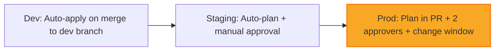

# 🏗️ Domain 2: Managing & Provisioning Infrastructure (15%)
### Google Professional Cloud Architect 2026 | Deep-Dive Study Guide (2 of 6)

> **Exam Weight**: ~15% (~7-8 questions) | **Focus**: Turning designs into reproducible, secure, observable infrastructure | **Key Skills**: IaC mastery, automation patterns, provisioning guardrails

---

## 📖 Table of Contents

1. [What the Exam Actually Tests](#1-what-the-exam-actually-tests)
2. [Infrastructure as Code: Terraform Deep Dive](#2-infrastructure-as-code-terraform-deep-dive)
3. [GKE Provisioning & Lifecycle Management](#3-gke-provisioning--lifecycle-management)
4. [Compute Engine & Serverless Provisioning](#4-compute-engine--serverless-provisioning)
5. [Networking Automation & Configuration](#5-networking-automation--configuration)
6. [CI/CD Integration for Infrastructure](#6-cicd-integration-for-infrastructure)
7. [Provisioning Guardrails & Compliance](#7-provisioning-guardrails--compliance)
8. [Observability Setup During Provisioning](#8-observability-setup-during-provisioning)
9. [Cost Controls at Provisioning Time](#9-cost-controls-at-provisioning-time)
10. [Securing AI Infrastructure Provisioning *(NEW 2026)*](#10-securing-ai-infrastructure-provisioning-new-2026)
11. [Exam Traps & Tricks](#11-exam-traps--tricks)
12. [Decision Frameworks](#12-decision-frameworks)
13. [Mnemonics & Memory Hacks](#13-mnemonics--memory-hacks)
14. [Practice Checkpoint (12 Scenarios)](#14-practice-checkpoint-12-scenarios)
15. [2025–2026 Changes](#15-20252026-changes)

---

## 1️⃣ What the Exam Actually Tests

### 🔍 The Real Skill Being Assessed
```
Domain 2 does NOT test:
❌ Memorizing exact gcloud/terraform command syntax
❌ Manual UI click-path procedures
❌ Debugging individual resource failures in isolation

Domain 2 DOES test:
✅ Designing reproducible infrastructure with IaC (Terraform patterns)
✅ Selecting appropriate provisioning strategies for different workload types
✅ Implementing security/compliance controls at provisioning time (shift-left)
✅ Automating infrastructure lifecycle (create → update → destroy) safely
✅ Integrating infrastructure provisioning with CI/CD pipelines
✅ Applying cost guardrails and tagging strategies during resource creation
✅ Setting up observability (logging, monitoring, tracing) as part of provisioning
✅ Provisioning AI/ML infrastructure with Securing AI patterns (2026 focus)
```

### 🎯 Question Archetypes You'll Encounter
| Archetype | Prompt Pattern | What They Want |
|-----------|---------------|----------------|
| **The IaC Pattern Question** | "Team uses Terraform. Which module structure BEST supports multi-env promotion?" | Understanding of Terraform best practices: modules, remote state, workspaces |
| **The Provisioning Strategy Question** | "Need to deploy GKE cluster with zero downtime updates. Which approach?" | Knowledge of blue/green, node pool strategies, maintenance windows |
| **The Security-at-Provisioning Question** | "Ensure all new storage buckets are private by default. Which control?" | Org policies, Terraform validation, SCP-like guardrails implementation |
| **The Automation Integration Question** | "Infrastructure changes must be reviewed before apply. Which CI/CD pattern?" | Pull request workflows, plan/apply separation, approval gates |
| **The Cost Governance Question** | "Prevent accidental provisioning of expensive resources. Which mechanism?" | Budget alerts, org policies, Terraform variable validation, labels |
| **The AI Infrastructure Question** *(NEW 2026)* | "Provision Vertex AI endpoint with private access and audit logging. Which Terraform pattern?" | Securing AI provisioning: private endpoints, VPC-SC, audit config as code |

### 📊 Domain 2 Weight Distribution (Estimated)
```
Terraform & IaC Patterns           ██████████  30%
GKE Provisioning & Management      ████████░░  25%
Compute/Serverless Provisioning    ██████░░░░  15%
Networking Automation              █████░░░░░  12%
CI/CD Integration                  ████░░░░░░  10%
Guardrails & Compliance            ███░░░░░░░   8%
```

---

## 2️⃣ Infrastructure as Code: Terraform Deep Dive

### 🧱 Terraform Module Design Patterns (Exam-Critical)

#### Pattern A: Reusable Module with Environment Variables
```hcl
# modules/gke-cluster/variables.tf
variable "environment" {
  type = string
  validation {
    condition     = contains(["dev", "staging", "prod"], var.environment)
    error_message = "Environment must be dev, staging, or prod."
  }
}

variable "node_count" {
  type = map(number)
  default = {
    dev     = 1
    staging = 2
    prod    = 3
  }
}

# modules/gke-cluster/main.tf
resource "google_container_cluster" "primary" {
  name     = "${var.environment}-cluster"
  location = var.region
  
  # Apply environment-specific defaults
  min_master_version = var.environment == "prod" ? "latest" : "latest-1"
  
  node_pool {
    initial_node_count = var.node_count[var.environment]
    # ... autoscaling config
  }
}
```

#### Pattern B: Remote State with Workspace Isolation
```hcl
# backend.tf (root module)
terraform {
  backend "gcs" {
    bucket = "my-org-terraform-state"
    prefix = "env"  # Workspace name auto-appended: env/dev, env/prod
  }
}

# Workflow:
# terraform workspace new dev
# terraform workspace new prod
# terraform workspace select dev && terraform apply
```

#### Pattern C: Policy-as-Code with Sentinel/OPA *(Conceptual for Exam)*
```hcl
# Example: Prevent public Cloud Storage buckets
# (Exam tests understanding, not exact Sentinel syntax)

# sentinel.hcl (conceptual)
policy "enforce_private_buckets" {
  import "tfplan/v2" as tfplan
  
  # Ensure no bucket has public access
  buckets = tfplan.resource_changes["google_storage_bucket"]
  
  condition {
    all buckets as _, bucket {
      bucket.after.public_access_prevention == "enforced"
    }
  }
}
```

### 🔑 Terraform Concepts Tested on PCA Exam
| Concept | Why It's Tested | Quick Recall |
|---------|----------------|--------------|
| **Module Versioning** | Ensures reproducibility across environments | Use `source = "git::...?ref=v1.2.3"` not `branch=main` |
| **Remote State Locking** | Prevents concurrent modifications causing corruption | GCS backend + automatic locking; never use local state for teams |
| **Workspace vs. Directory Strategy** | Tests understanding of environment isolation | Workspaces: same config, different vars; Directories: different configs |
| **Variable Validation** | Shift-left security/compliance at provisioning time | Use `validation {}` blocks to enforce constraints before apply |
| **Output Dependencies** | Ensures correct resource creation order | Use explicit `depends_on` or implicit references (`module.x.output`) |
| **Sensitive Data Handling** | Prevents secrets in state/logs | Use `sensitive = true`, Cloud Secret Manager integration |

### ⚠️ Terraform Exam Traps
```
❌ Trap: "Store Terraform state in a shared Cloud Storage bucket without locking"
✅ Reality: Risk of state corruption; exam expects GCS backend with automatic locking

❌ Trap: "Use terraform apply directly from developer laptops for production"
✅ Reality: Violates change management; exam expects CI/CD pipeline with approval gates

❌ Trap: "Hardcode region/project values in module code"
✅ Reality: Reduces reusability; exam expects variables with validation

✅ Exam Pattern: Scenarios mentioning "multiple teams", "environment promotion", or 
   "compliance validation" almost always require: modules + remote state + variable validation + CI/CD integration
```

### 🔄 Terraform Workflow for PCA Exam
```mermaid
graph LR
    A[Write/Update Terraform] --> B[Pull Request to Git]
    B --> C[CI Pipeline: terraform fmt + validate + plan]
    C --> D[Post Plan Output for Review]
    D --> E[Manual Approval Gate (for prod)]
    E --> F[CD Pipeline: terraform apply with -auto-approve]
    F --> G[Post-apply: update documentation, notify stakeholders]
    
    style E fill:#f9a825,stroke:#f57f17,stroke-width:2px
```

**Key Exam Insight**: The exam tests your understanding of the *entire workflow*, not just the `terraform apply` command. Questions often focus on the review/approval gates for production changes.

---

## 3️⃣ GKE Provisioning & Lifecycle Management

### 🚀 GKE Cluster Provisioning Decision Matrix

#### Autopilot vs. Standard: When to Use Which
```yaml
GKE Autopilot (Default Recommendation for Exam):
✅ Choose when:
   • Team wants minimal node management overhead
   • Workloads are standard containers (no custom kernel/modules)
   • Cost predictability important (pod-based billing)
   • Security compliance needed (auto node hardening, sandboxing)
❌ Avoid when:
   • Need custom node OS/kernel modules
   • Require specific machine types not supported by Autopilot
   • Need fine-grained node pool control for cost optimization

GKE Standard (Advanced Use Cases):
✅ Choose when:
   • Need custom node configuration (GPU, local SSD, custom OS)
   • Require node-level access for debugging/monitoring agents
   • Have workloads with specific node affinity/taint requirements
   • Need to use preemptible/spot nodes for batch workloads
❌ Avoid when:
   • Team lacks Kubernetes operational expertise
   • Want to minimize management overhead (exam "small team" cue)
```

#### Multi-Region GKE Strategy
```hcl
# Terraform pattern for regional cluster (exam-relevant)
resource "google_container_cluster" "regional" {
  name     = "prod-cluster"
  location = var.region  # e.g., "us-central1" (regional = multi-zone)
  
  # Enable automatic node upgrades and repairs
  maintenance_policy {
    recurring_window {
      start_time = "2024-01-01T00:00:00Z"
      end_time   = "2024-01-01T04:00:00Z"
      recurrence = "FREQ=WEEKLY;BYDAY=SA,SU"
    }
  }
  
  # Enable workload identity for secure pod-to-GCP service auth
  workload_identity_config {
    workload_pool = "${var.project}.svc.id.goog"
  }
}
```

### 🔑 GKE Provisioning Concepts Tested
| Concept | Exam Application | Quick Reference |
|---------|-----------------|-----------------|
| **Node Pool Strategy** | Separate pools for different workload types (web, batch, GPU) | Use `node_selector` and `tolerations` in pod specs |
| **Autoscaling Configuration** | Horizontal Pod Autoscaler (HPA) + Cluster Autoscaler | Set realistic min/max; avoid over-provisioning |
| **Maintenance Windows** | Schedule updates during low-traffic periods | Use `recurring_window`; avoid business hours |
| **Release Channels** | Regular vs Stable vs Rapid for control plane/node versions | Prod = Stable; Dev = Rapid for early testing |
| **Workload Identity** | Secure pod access to GCP services without keys | Replace service account keys with IAM bindings |
| **Binary Authorization** | Enforce signed/attested container images before deploy | Critical for supply chain security (exam favorite) |

### ⚠️ GKE Exam Traps
```
❌ Trap: "Use a single node pool for all workloads to simplify management"
✅ Reality: Different workloads have different resource/security needs; exam expects separation

❌ Trap: "Disable automatic upgrades to avoid downtime"
✅ Reality: Security patches are critical; exam expects maintenance windows + blue/green node pools

❌ Trap: "Grant pods `roles/editor` to simplify GCP API access"
✅ Reality: Violates least privilege; exam expects Workload Identity + minimal IAM roles

✅ Exam Pattern: Scenarios mentioning "production", "compliance", or "zero downtime" 
   almost always require: Autopilot (or Standard with hardening) + workload identity + binary auth + maintenance windows
```

---

## 4️⃣ Compute Engine & Serverless Provisioning

### 🖥️ Provisioning Strategy Comparison

#### Compute Engine: When and How
```yaml
Instance Template Best Practices (Exam Focus):
✅ Use for:
   • Managed Instance Groups (MIGs) with autoscaling
   • Consistent configuration across instances
   • Golden image pattern with startup scripts
❌ Avoid for:
   • One-off development instances (use Terraform directly)

Startup Script Patterns:
# Exam-relevant: Idempotent, logged, secure
#!/bin/bash
# Install monitoring agent (idempotent)
if ! systemctl is-active --quiet google-cloud-ops-agent; then
  curl -sSO https://dl.google.com/cloudagents/add-google-cloud-ops-agent-repo.sh
  bash add-google-cloud-ops-agent-repo.sh --also-install
fi

# Application deploy (with rollback capability)
gsutil cp gs://my-artifacts/app-v${VERSION}.tar.gz /tmp/
tar -xzf /tmp/app-v${VERSION}.tar.gz -C /opt/app/
# ... health check before switching traffic
```

#### Serverless Provisioning: Cloud Run & Functions
```hcl
# Cloud Run Terraform pattern (exam-relevant)
resource "google_cloud_run_service" "api" {
  name     = "prod-api"
  location = var.region
  
  template {
    spec {
      containers {
        image = var.image_url  # From Artifact Registry, not Docker Hub
        
        # Resource limits (prevent runaway costs)
        resources {
          limits = {
            cpu    = "1"
            memory = "512Mi"
          }
        }
        
        # Environment variables from Secret Manager (not hardcoded)
        env {
          name  = "DB_PASSWORD"
          value_from {
            secret_key_ref {
              name = "db-credentials"
              key  = "password"
            }
          }
        }
      }
      
      # Security: Run as non-root, read-only filesystem
      container_contracts {
        run_as_user = 1000
        read_only_root_filesystem = true
      }
    }
  }
  
  # Traffic management: blue/green deployment support
  traffic {
    percent         = 100
    latest_revision = true
  }
}
```

### 🔑 Serverless Provisioning Concepts
| Concept | Why Tested | Exam Tip |
|---------|-----------|----------|
| **Image Source Control** | Prevent supply chain attacks | Use Artifact Registry with vulnerability scanning; avoid public Docker Hub |
| **Secret Management** | Avoid hardcoded credentials | Cloud Secret Manager integration; never pass secrets via environment in code |
| **Resource Limits** | Prevent cost explosions, DoS | Always set CPU/memory limits; exam expects this for serverless |
| **Traffic Splitting** | Enable safe deployments | Use `traffic` blocks for canary/blue-green; exam loves deployment safety questions |
| **Identity Configuration** | Secure service-to-service auth | Use default service account with minimal roles; avoid custom SA unless needed |

### ⚠️ Compute/Serverless Exam Traps
```
❌ Trap: "Use latest: tag for container images in production"
✅ Reality: Non-reproducible deployments; exam expects immutable tags or digest references

❌ Trap: "Grant Cloud Run service account `roles/owner` for simplicity"
✅ Reality: Massive security risk; exam expects least privilege + workload identity patterns

❌ Trap: "Disable health checks to reduce complexity"
✅ Reality: Health checks are critical for autoscaling and reliability; exam expects them

✅ Exam Pattern: Scenarios mentioning "production", "security", or "cost control" 
   almost always require: immutable images + secret manager + resource limits + minimal IAM
```

---

## 5️⃣ Networking Automation & Configuration

### 🌐 Terraform Networking Patterns (Exam-Critical)

#### Shared VPC Provisioning Pattern
```hcl
# Host project: network-hub
resource "google_compute_shared_vpc_host_project" "host" {
  project = var.host_project_id
}

resource "google_compute_subnetwork" "prod_us" {
  name          = "prod-us-central1"
  ip_cidr_range = "10.0.0.0/20"
  region        = "us-central1"
  network       = google_compute_network.prod.id
  
  # Enable private Google access for secure API calls
  private_ip_google_access = true
  
  # Enable flow logs for security monitoring
  log_config {
    aggregation_interval = "INTERVAL_5_SEC"
    flow_sampling        = 0.5
    metadata             = "INCLUDE_ALL_METADATA"
  }
}

# Service project: app-team-prod
resource "google_compute_shared_vpc_service_project" "app" {
  host_project    = var.host_project_id
  service_project = var.service_project_id
}

# Grant app team network user role (not admin)
resource "google_project_iam_member" "network_user" {
  project = var.host_project_id
  role    = "roles/compute.networkUser"
  member  = "group:app-team-prod@myorg.com"
}
```

#### Firewall Rule Automation with Tags
```hcl
# Use network tags for targeted rules (exam best practice)
resource "google_compute_firewall" "allow_health_checks" {
  name    = "allow-health-checks"
  network = google_compute_network.prod.name
  
  allow {
    protocol = "tcp"
    ports    = ["80", "443"]
  }
  
  # Target instances with specific tag
  target_tags = ["web-server"]
  
  # Source: Google health check ranges (documented)
  source_ranges = [
    "35.191.0.0/16",
    "130.211.0.0/22",
    "209.85.152.0/22",
    "209.85.204.0/22",
  ]
}

# Instance template applies the tag
resource "google_compute_instance_template" "web" {
  tags = ["web-server", "prod"]
  # ... other config
}
```

### 🔑 Networking Provisioning Concepts
| Concept | Exam Application | Quick Recall |
|---------|-----------------|--------------|
| **Private Google Access** | Allow private VMs to reach Google APIs securely | Enable on subnet; required for secure cloud-native apps |
| **Cloud NAT Configuration** | Provide outbound internet without public IPs | Regional service; configure min/max ports to avoid exhaustion |
| **Firewall Rule Targeting** | Use tags/service accounts, not broad CIDR ranges | `target_tags` or `target_service_accounts` > `0.0.0.0/0` |
| **VPC Flow Logs** | Enable security monitoring and troubleshooting | Sample at 50% for cost balance; include all metadata for forensics |
| **Cloud Router + BGP** | Dynamic routing for hybrid/multi-VPC setups | Use for HA VPN, Partner Interconnect, complex topologies |

### ⚠️ Networking Exam Traps
```
❌ Trap: "Use 0.0.0.0/0 source ranges for firewall rules to simplify management"
✅ Reality: Overly permissive; exam expects specific ranges (health checks, load balancer IPs)

❌ Trap: "Assign external IPs to all VMs for easier debugging"
✅ Reality: Security anti-pattern; exam expects IAP, Cloud Logging, OS Login instead

❌ Trap: "Create firewall rules at project level for all environments"
✅ Reality: Loses environment isolation; exam expects tags/networks to scope rules appropriately

✅ Exam Pattern: Scenarios mentioning "security", "compliance", or "troubleshooting" 
   almost always require: flow logs enabled + specific firewall sources + private access patterns
```

---

## 6️⃣ CI/CD Integration for Infrastructure

### 🔄 Infrastructure CI/CD Pipeline Patterns

#### Pattern A: Pull Request Workflow (Most Common on Exam)
```yaml
# .github/workflows/terraform.yml (conceptual for exam)
name: Terraform Plan/Apply

on:
  pull_request:
    branches: [main]
    paths: ['terraform/**']

jobs:
  terraform:
    runs-on: ubuntu-latest
    steps:
      - uses: actions/checkout@v3
      
      - name: Setup Terraform
        uses: hashicorp/setup-terraform@v2
        with:
          terraform_version: "1.6.0"
      
      - name: Terraform Init
        run: terraform init -backend-config=backend.prod.hcl
      
      - name: Terraform Validate
        run: terraform validate
      
      - name: Terraform Plan
        run: terraform plan -out=tfplan -input=false
        env:
          GOOGLE_CREDENTIALS: ${{ secrets.GCP_SA_KEY }}
      
      - name: Post Plan Comment
        uses: actions/github-script@v6
        with:
          script: |
            // Post tfplan output as PR comment for review
      
      # Production requires manual approval
      - name: Wait for Approval
        if: github.ref == 'refs/heads/main'
        uses: trstringer/manual-approval@v1
        with:
          secret: ${{ github.TOKEN }}
          approvers: 'infra-lead,security-team'
      
      - name: Terraform Apply (Prod Only After Approval)
        if: github.ref == 'refs/heads/main' && github.event_name == 'push'
        run: terraform apply -auto-approve tfplan
```

#### Pattern B: Environment Promotion Strategy


### 🔑 CI/CD Concepts Tested
| Concept | Why Tested | Exam Tip |
|---------|-----------|----------|
| **Plan/Apply Separation** | Prevents accidental production changes | Exam expects `terraform plan` output reviewed before `apply` |
| **Approval Gates** | Enforces change management for critical environments | Prod = manual approval; Dev = auto-apply (if low risk) |
| **Secrets Management in CI** | Avoids credential leakage in logs | Use GitHub Secrets, Cloud Secret Manager; never echo secrets |
| **State Locking in CI** | Prevents concurrent pipeline runs corrupting state | CI system must respect Terraform backend locking |
| **Drift Detection** | Ensures IaC matches actual infrastructure | Schedule `terraform plan` periodically; alert on unexpected changes |

### ⚠️ CI/CD Exam Traps
```
❌ Trap: "Run terraform apply directly from developer machines for speed"
✅ Reality: Violates auditability and change control; exam expects CI/CD pipeline

❌ Trap: "Store service account keys in CI environment variables as plaintext"
✅ Reality: Credential leakage risk; exam expects Secret Manager or short-lived tokens

❌ Trap: "Use the same Terraform workspace for dev and prod to simplify"
✅ Reality: Risk of accidental prod changes; exam expects environment isolation

✅ Exam Pattern: Scenarios mentioning "audit", "compliance", or "team collaboration" 
   almost always require: PR workflow + plan review + approval gates + secret management
```

---

## 7️⃣ Provisioning Guardrails & Compliance

### 🛡️ Shift-Left Security Patterns

#### Org Policy Enforcement at Provisioning Time
```hcl
# Terraform validation: Prevent public storage buckets
variable "bucket_name" {
  type = string
}

variable "public_access" {
  type    = bool
  default = false
  
  validation {
    condition     = var.public_access == false
    error_message = "Public access is not allowed for compliance. Use signed URLs or IAM."
  }
}

resource "google_storage_bucket" "data" {
  name = var.bucket_name
  
  # Enforce private access at resource level too (defense in depth)
  public_access_prevention = "enforced"
  uniform_bucket_level_access = true
}
```

#### Policy-as-Code with Terraform Sentinel (Conceptual)
```
# Exam tests understanding of the pattern, not exact syntax

Policy Goal: "All Compute Engine instances must have OS Login enabled"

Sentinel Logic (conceptual):
1. Import terraform plan resources
2. Filter for google_compute_instance resources
3. Check that metadata.enable-oslogin = "TRUE" for each
4. Fail policy if any instance violates rule

Exam Application:
• Scenario: "Ensure compliance with security baseline during provisioning"
• Correct answer: Use org policy + Terraform validation + Sentinel/OPA (conceptual)
• Wrong answers: Manual review only, post-provisioning scanning alone
```

### 🔑 Guardrail Concepts Tested
| Control Type | Implementation | Exam Application |
|-------------|---------------|-----------------|
| **Org Policies** | `constraints/iam.disableServiceAccountKeyCreation` | Prevent insecure patterns at org level; exam loves these |
| **Terraform Validation** | `validation {}` blocks in variables | Shift-left compliance; catch errors before apply |
| **Policy-as-Code** | Sentinel/OPA (conceptual) | Automated policy enforcement in CI pipeline |
| **Resource Labels** | `labels = { env = "prod", cost-center = "engineering" }` | Enable cost allocation, compliance reporting |
| **Budget Alerts** | `google_billing_budget` resource | Prevent cost overruns at provisioning time |

### ⚠️ Guardrail Exam Traps
```
❌ Trap: "Rely on manual review to enforce security policies"
✅ Reality: Human error is inevitable; exam expects automated guardrails

❌ Trap: "Apply org policies only at project level for flexibility"
✅ Reality: Loses centralized governance; exam expects folder/org level for consistency

❌ Trap: "Use resource tags only for cost tracking, not security"
✅ Reality: Tags enable policy enforcement; exam expects multi-purpose labeling

✅ Exam Pattern: Scenarios mentioning "compliance", "audit", or "prevent mistakes" 
   almost always require: org policies + Terraform validation + labeling + budget alerts
```

---

## 8️⃣ Observability Setup During Provisioning

### 📊 "Observability by Default" Pattern

#### Terraform: Enable Monitoring & Logging at Resource Creation
```hcl
# Compute Engine: Enable Ops Agent and custom metrics
resource "google_compute_instance" "app" {
  # ... other config
  
  # Metadata for automatic agent installation
  metadata = {
    enable-oslogin = "TRUE"
    # Startup script installs Ops Agent (idempotent pattern from Section 4)
  }
  
  # Service account with minimal monitoring permissions
  service_account {
    scopes = ["https://www.googleapis.com/auth/monitoring.write"]
  }
}

# Cloud Run: Built-in observability configuration
resource "google_cloud_run_service" "api" {
  # ... container config
  
  # Enable Cloud Monitoring and Logging (often default, but explicit is better)
  metadata {
    annotations = {
      "run.googleapis.com/execution-environment" = "gen2"  # Better observability
    }
  }
}

# Centralized logging export (exam favorite pattern)
resource "google_logging_project_bucket_config" "audit" {
  location  = "global"
  bucket_id = "audit-logs-bucket"
  
  # Retain audit logs for compliance (7 years for financial)
  retention_days = 2555
  
  # Prevent deletion (immutable audit trail)
  locked = true
}
```

#### SLO-Based Alerting Provisioning
```hcl
# Terraform: Define SLO and alerting policy together (exam best practice)
resource "google_monitoring_slo" "api_availability" {
  service = google_monitoring_custom_service.api.name
  
  goal {
    request_based {
      success_rate {
        performance {
          threshold = 0.999  # 99.9% availability SLO
        }
      }
    }
  }
  
  # Alert when error budget burn rate is too high
  alert_config {
    severity = "PAGER"
    notification_channels = [google_monitoring_notification_channel.pagerduty.name]
  }
}
```

### 🔑 Observability Provisioning Concepts
| Concept | Why Tested | Exam Tip |
|---------|-----------|----------|
| **Agent Installation** | Ensure metrics/logs collection from day 1 | Use startup scripts or managed agent options; exam expects this |
| **Log Retention Policies** | Meet compliance requirements at provisioning | Set `retention_days` explicitly; don't rely on defaults |
| **SLO-Driven Alerting** | Focus alerts on user impact, not just infrastructure | Define SLOs in IaC; exam loves SLO-based alerting questions |
| **Centralized Export** | Enable security analysis and compliance reporting | Export audit logs to immutable bucket; exam expects this for compliance |
| **Cost-Aware Monitoring** | Avoid monitoring cost explosions | Sample high-volume logs; use metric filters to reduce cardinality |

### ⚠️ Observability Exam Traps
```
❌ Trap: "Enable all log types at maximum verbosity for troubleshooting"
✅ Reality: Cost explosion and signal-to-noise problems; exam expects selective, sampled logging

❌ Trap: "Set up monitoring after infrastructure is provisioned"
✅ Reality: Blind spot during critical early period; exam expects observability in IaC

❌ Trap: "Use default alerting thresholds for all services"
✅ Reality: One-size-fits-all alerts cause alert fatigue; exam expects SLO-based, service-specific thresholds

✅ Exam Pattern: Scenarios mentioning "troubleshooting", "compliance", or "user experience" 
   almost always require: agents installed + log retention + SLO alerts + centralized export
```

---

## 9️⃣ Cost Controls at Provisioning Time

### 💰 "Cost-Aware Provisioning" Patterns

#### Terraform: Enforce Cost Guardrails
```hcl
# Variable validation: Prevent expensive machine types in dev
variable "machine_type" {
  type = string
  
  validation {
    condition = (
      var.environment != "dev" || 
      can(regex("^e2-(micro|small|standard)", var.machine_type))
    )
    error_message = "Dev environment must use e2-micro, e2-small, or e2-standard machine types for cost control."
  }
}

# Use committed use discounts for predictable prod workloads
resource "google_compute_reservation" "prod_reservation" {
  count = var.environment == "prod" ? 1 : 0
  
  name    = "prod-m4-reservation"
  project = var.project_id
  zone    = var.zone
  
  specific_reservation {
    count = 10
    instance_properties {
      machine_type = "m4-standard-16"
    }
  }
  
  # Commitment to reduce cost by ~30% vs on-demand
  commitment = "COMMITMENT_1_YEAR"
}
```

#### Labeling Strategy for Cost Allocation
```hcl
# Standard label block for all resources (exam best practice)
locals {
  common_labels = {
    environment  = var.environment
    team         = var.team
    cost-center  = var.cost_center
    provisioned-by = "terraform"
    terraform-version = terraform.version
  }
}

# Apply to all resources
resource "google_compute_instance" "app" {
  labels = merge(local.common_labels, {
    application = "user-api"
    tier        = "frontend"
  })
  # ... other config
}
```

### 🔑 Cost Control Concepts Tested
| Concept | Implementation | Exam Application |
|---------|---------------|-----------------|
| **Machine Type Validation** | Terraform `validation {}` blocks | Prevent accidental expensive resources in non-prod |
| **Commitment Planning** | `google_compute_reservation`, CUDs | Exam expects CUDs for predictable prod workloads |
| **Preemptible/Spot Usage** | `preemptible = true` for batch workloads | Cost savings for fault-tolerant jobs; exam loves this pattern |
| **Storage Lifecycle Policies** | `lifecycle_rule` in Cloud Storage | Auto-transition to cheaper tiers; exam expects this for cost optimization |
| **Budget Alerts** | `google_billing_budget` resource | Proactive cost monitoring; exam expects alerts at provisioning |

### ⚠️ Cost Exam Traps
```
❌ Trap: "Use on-demand pricing for all resources to maintain flexibility"
✅ Reality: Misses significant savings for predictable workloads; exam expects CUDs for prod

❌ Trap: "Apply cost optimization only after resources are running"
✅ Reality: Wasted spend during optimization period; exam expects cost controls at provisioning

❌ Trap: "Use the same machine type for dev and prod to simplify"
✅ Reality: Over-provisioning dev environments wastes money; exam expects right-sizing per environment

✅ Exam Pattern: Scenarios mentioning "minimize cost", "budget constraints", or "optimize spend" 
   almost always require: validation rules + CUDs for prod + preemptible for batch + lifecycle policies
```

---

## 🔟 Securing AI Infrastructure Provisioning *(NEW 2026)*

### 🤖 Vertex AI Provisioning with Securing AI Patterns

#### Terraform: Private Vertex AI Endpoint with Audit
```hcl
# Vertex AI Model Deployment with security controls (2026 exam focus)
resource "google_vertex_ai_endpoint" "secure_endpoint" {
  name         = "prod-fraud-detection"
  display_name = "Fraud Detection Model v2"
  location     = var.region
  
  # Private endpoint: No public internet access
  private_service_connect_config {
    enable_private_service_connect = true
    project_allowlist = [var.project_id]  # Only allowlisted projects can access
  }
  
  # Enable audit logging for model predictions (compliance requirement)
  encryption_spec {
    kms_key_name = var.cmek_key_id  # Customer-managed encryption key
  }
}

# VPC Service Controls perimeter around AI + data resources
resource "google_service_usage_consumer_quota_override" "vertex_quota" {
  # Ensure quota limits prevent accidental over-provisioning
  # (Exam tests understanding of quota as cost/security control)
}

# Workload Identity for secure model access
resource "google_service_account" "model_runner" {
  account_id = "vertex-model-runner"
  
  # Minimal permissions: only predict on specific endpoint
  # IAM binding done separately with least privilege
}
```

#### Data Governance at Provisioning Time
```hcl
# BigQuery dataset with policy tags for PII protection
resource "google_bigquery_dataset" "training_data" {
  dataset_id = "ml_training_data"
  
  # Enable policy tags for column-level security
  access {
    role          = "roles/bigquery.dataViewer"
    group_by_email = "data-scientists@myorg.com"
  }
  
  # Default encryption with CMEK
  encryption_configuration {
    kms_key_name = var.cmek_key_id
  }
}

# Policy tag for PII columns (exam-relevant pattern)
resource "google_data_catalog_policy_tag" "pii_tag" {
  display_name = "PII - Restricted"
  policy_taxonomy_id = var.taxonomy_id
  
  # Parent policy: only compliance team can view raw PII
  parent_policy_tag_id = google_data_catalog_policy_tag.restricted.id
}
```

### 🔑 Securing AI Provisioning Concepts
| Concept | Why Tested in 2026 | Exam Tip |
|---------|-------------------|----------|
| **Private Endpoints** | Prevent data exfiltration from AI services | Use `private_service_connect_config`; exam expects this for sensitive models |
| **CMEK Integration** | Meet compliance requirements for AI workloads | Always specify `kms_key_name` for Vertex AI, BigQuery, Storage in prod |
| **Policy Tags** | Column-level security for training data | Define tags in IaC; exam expects this for PII/PHI scenarios |
| **Workload Identity Federation** | Secure external partner access to AI resources | Replace service account keys; exam loves this for third-party ML scenarios |
| **Audit Logging Configuration** | Meet regulatory requirements for AI decisions | Enable Data Access logs for Vertex AI; exam expects immutable audit trails |

### ⚠️ Securing AI Exam Traps
```
❌ Trap: "Use public Vertex AI endpoints for easier integration with external partners"
✅ Reality: Data exfiltration risk; exam expects private endpoints + VPC-SC for sensitive data

❌ Trap: "Grant `roles/aiplatform.admin` to data scientists for flexibility"
✅ Reality: Overly permissive; exam expects custom roles with minimal Vertex AI permissions

❌ Trap: "Store training data in standard Cloud Storage without encryption"
✅ Reality: Violates data protection requirements; exam expects CMEK + policy tags for sensitive data

✅ Exam Pattern: Scenarios mentioning "AI/ML", "third-party access", or "compliance" 
   almost always require: private endpoints + CMEK + policy tags + workload identity + audit logging
```

---

## 1️⃣1️⃣ Exam Traps & Tricks

### 🚫 Top 10 Domain 2 Exam Traps (With Avoidance Strategies)

| Trap | What It Looks Like | Why It's Wrong | How to Avoid |
|------|-------------------|----------------|--------------|
| **The "Just Apply" Trap** | Suggests running `terraform apply` directly for production changes | Violates change management, auditability | Look for answers with PR review + approval gates + plan/apply separation |
| **The Over-Permissioned SA** | Grants `roles/editor` or `roles/owner` to service accounts for "simplicity" | Violates least privilege, increases blast radius | Eliminate options with broad roles; prefer custom roles with minimal permissions |
| **The Missing Observability** | Provisions infrastructure without logging/monitoring configuration | Creates blind spots for troubleshooting and compliance | Choose options that include Ops Agent, log exports, SLO alerts in IaC |
| **The Cost Blind Spot** | Provisions expensive resources in dev environments without validation | Wastes budget, violates cost optimization pillar | Look for answers with machine type validation, CUDs for prod, preemptible for batch |
| **The Hardcoded Secret** | Passes credentials via environment variables in Terraform code | Credential leakage risk in version control/state | Eliminate options with hardcoded secrets; prefer Secret Manager integration |
| **The Single Environment Workspace** | Uses same Terraform workspace for dev and prod | Risk of accidental production changes | Choose answers with workspace isolation or directory-per-environment patterns |
| **The Public-by-Default Resource** | Creates Cloud Storage buckets, GKE clusters with public access enabled | Security anti-pattern; violates secure-by-default principle | Prefer options with `public_access_prevention = "enforced"`, private GKE endpoints |
| **The Manual Process** | Suggests manual UI steps for repeatable provisioning tasks | Not reproducible, not auditable, not scalable | Choose IaC + CI/CD automation patterns over manual procedures |
| **The Ignored Maintenance** | Disables automatic updates/upgrades to avoid downtime | Security vulnerability exposure; violates reliability pillar | Look for answers with maintenance windows + blue/green node pools |
| **The AI Security Gap** *(NEW 2026)* | Provisions Vertex AI without private endpoints or audit logging | Data exfiltration risk, compliance failure | For AI scenarios, ensure private endpoints + CMEK + audit logging are included |

### 🎭 Scenario Red Flags vs Green Lights
```
🚩 RED FLAG PHRASES (Often indicate wrong answer):
• "Simplify by granting broader permissions" → Violates least privilege
• "Apply changes directly for speed" → Bypasses change management
• "Use default settings to reduce complexity" → Defaults are often insecure/non-optimal
• "Handle compliance after provisioning" → Shift-right instead of shift-left
• "Store credentials in environment variables" → Credential leakage risk

✅ GREEN LIGHT PHRASES (Often indicate correct answer):
• "Infrastructure as Code with Terraform modules" + "remote state with locking"
• "Pull request workflow" + "terraform plan review" + "approval gates for prod"
• "Workload Identity" + "minimal IAM roles" + "CMEK encryption"
• "Private endpoints" + "VPC Service Controls" + "audit logging enabled"
• "Machine type validation" + "CUDs for predictable load" + "preemptible for batch"
• "Ops Agent installation" + "SLO-based alerting" + "immutable log export"
```

---

## 1️⃣2️⃣ Decision Frameworks

### 🧭 The Domain 2 Decision Framework (Use for Every Question)
```
STEP 1: IDENTIFY THE PROVISIONING CONTEXT (20 seconds)
□ Is this greenfield (new) or brownfield (existing) infrastructure?
□ What environment: dev, staging, or production? (affects risk tolerance)
□ What compliance requirements: HIPAA, PCI-DSS, GDPR, internal policy?
□ What team constraints: size, expertise, tooling preferences?

STEP 2: APPLY THE "SECURE BY DEFAULT" FILTER (15 seconds)
□ Does the option enable encryption at rest (CMEK if required)?
□ Does it follow least privilege for IAM/service accounts?
□ Does it prevent public access unless explicitly required?
□ Does it include audit logging for compliance?
→ Eliminate options that fail any of these

STEP 3: APPLY THE "REPRODUCIBLE & AUTOMATED" FILTER (20 seconds)
□ Is the solution defined as code (Terraform, not UI clicks)?
□ Does it support environment promotion (dev→staging→prod)?
□ Does it integrate with CI/CD for review/approval workflows?
□ Does it use remote state with locking for team collaboration?
→ Prefer options that maximize automation and reproducibility

STEP 4: APPLY THE "COST-AWARE" FILTER (15 seconds)
□ Does it right-size resources for the environment (dev vs prod)?
□ Does it leverage commitments (CUDs) for predictable prod workloads?
□ Does it use preemptible/spot for fault-tolerant batch workloads?
□ Does it include lifecycle policies for storage cost optimization?
→ Among secure, automated options, prefer cost-optimized

STEP 5: APPLY THE "OBSERVABILITY BY DESIGN" FILTER (10 seconds)
□ Does it install monitoring/logging agents at provisioning?
□ Does it configure log retention for compliance requirements?
□ Does it define SLOs and alerting policies in IaC?
□ Does it export audit logs to immutable storage?
→ Choose options that enable troubleshooting and compliance from day 1

STEP 6: FINAL VALIDATION (10 seconds)
□ Does the chosen option satisfy the PRIMARY constraint from scenario?
□ Does it violate any EXPLICIT requirement?
□ Is there a simpler option that also meets all criteria? (If yes, reconsider)
```

### 🎯 Provisioning Trade-off Resolution Matrix
```
When two options both seem viable, use this priority order:

1. SECURITY/COMPLIANCE VIOLATION = AUTOMATIC ELIMINATION
   (e.g., public bucket for PHI, hardcoded credentials, missing audit logs)

2. REPRODUCIBILITY REQUIREMENT = NON-NEGOTIABLE FOR PRODUCTION
   (e.g., if scenario mentions "team collaboration" or "audit trail", 
    eliminate manual/UI-based options)

3. COST vs. PERFORMANCE: Use the "Environment Multiplier"
   - Dev/Staging: Prioritize cost savings (smaller machines, preemptible)
   - Production: Prioritize reliability/performance, then optimize cost within constraints

4. TEAM EXPERTISE FACTOR:
   - Small team/low K8s expertise? → Prefer Autopilot, serverless, managed services
   - Large platform team? → Can handle Standard GKE, custom Terraform modules

5. 2026 AI/ML ADDITION:
   - If scenario mentions Vertex AI, generative AI, or ML workloads:
     → Ensure private endpoints + CMEK + audit logging + policy tags are included
     → Prefer workload identity federation over service account keys
```

### 📐 Infrastructure Validation Checklist (Pre-Submission Mental Check)
```
Before finalizing your answer, quickly verify:

✅ Security & Compliance
   [ ] CMEK encryption specified for sensitive data services
   [ ] IAM follows least privilege (custom/predefined roles > primitive)
   [ ] Network resources use private access patterns (no unnecessary public IPs)
   [ ] Audit logging enabled and exported to immutable storage
   [ ] Org policies/Terraform validation enforce guardrails

✅ Reproducibility & Automation
   [ ] Infrastructure defined in Terraform (not manual steps)
   [ ] Modules used for reusability across environments
   [ ] Remote state with locking configured for team collaboration
   [ ] CI/CD integration with plan review and approval gates
   [ ] Environment isolation via workspaces or directory structure

✅ Cost Optimization
   [ ] Machine types right-sized for environment (dev vs prod)
   [ ] Committed use discounts applied for predictable prod workloads
   [ ] Preemptible/spot instances used for fault-tolerant batch jobs
   [ ] Storage lifecycle policies auto-transition to cheaper tiers
   [ ] Budget alerts configured to prevent cost overruns

✅ Observability & Reliability
   [ ] Monitoring/logging agents installed at provisioning time
   [ ] Log retention periods meet compliance requirements
   [ ] SLOs defined with appropriate alerting policies
   [ ] Health checks and autoscaling configured for resilience
   [ ] Maintenance windows scheduled to minimize user impact

✅ 2026 Additions (AI/ML Scenarios)
   [ ] Vertex AI endpoints configured as private service connect
   [ ] Training data protected with BigQuery policy tags
   [ ] Workload identity federation used for external partner access
   [ ] Model prediction logging enabled for audit/bias detection
   [ ] VPC Service Controls perimeter around AI + data resources
```

---

## 1️⃣3️⃣ Mnemonics & Memory Hacks

### 🧠 Acronyms to Memorize
```
Terraform Best Practices → "MRS. VET"
M - Modules for reusability
R - Remote state with locking
S - Sentinel/OPA for policy-as-code (conceptual)
V - Validation blocks for shift-left compliance
E - Environment isolation (workspaces/directories)
T - Traffic management for safe deployments (blue/green)

GKE Provisioning → "A SAFE GKE"
A - Autopilot default (unless specific needs)
S - Service accounts with minimal roles (workload identity)
A - Autoscaling configured (HPA + cluster autoscaler)
F - Firewall rules with specific sources (not 0.0.0.0/0)
E - Encryption with CMEK for compliance
G - Guardrails via org policies + Terraform validation
K - Kubernetes best practices (pod security, network policies)
E - Observability enabled at provisioning (agents, logs, SLOs)

Cost Optimization → "RIGHT SIZE"
R - Right-size machine types per environment
I - Idle resource cleanup (lifecycle policies)
G - Group predictable workloads for CUDs
H - Hybrid: preemptible for batch, on-demand for critical
T - Tag everything for cost allocation
S - Storage tiering (Standard → Nearline → Coldline)
I - Instance scheduling (stop dev resources nights/weekends)
Z - Zero-waste: validate before provisioning
E - Evaluate commitments quarterly
```

### 🎨 Visual Memory Aids
```
Terraform Workflow Mind Map:
          [Code Change]
                │
     ┌──────────┴──────────┐
 [PR Created]          [CI Pipeline]
     │                      │
     ▼                      ▼
[terraform fmt]    [terraform validate]
     │                      │
     ▼                      ▼
[terraform plan] → [Post Plan for Review]
                          │
               ┌──────────┴──────────┐
          [Dev: Auto-apply]    [Prod: Manual Approval]
                                   │
                                   ▼
                          [terraform apply -auto-approve]

GKE Provisioning Decision Flow:
[Need custom kernel/modules?] → Yes → GKE Standard
                                   │
                                   ▼
                          [Need node-level access?] → Yes → GKE Standard
                                   │ No
                                   ▼
                          [Team has K8s expertise?] → No → GKE Autopilot (default)
                                   │ Yes
                                   ▼
                          [Cost predictability critical?] → Yes → Autopilot (pod billing)
                                   │ No
                                   ▼
                          [Need spot/preemptible nodes?] → Yes → GKE Standard
```

### 🔑 Quick Recall Flashcards (Text Version)
```
Q: When to use Terraform workspaces vs. directory-per-environment?
A: Workspaces: Same config, different variables (good for simple env promotion). 
   Directories: Different configs per environment (good for significant env differences).

Q: What's the minimum IAM role for a service account that only needs to write logs?
A: `roles/logging.logWriter` – never use broader roles like `roles/editor` for logging.

Q: How to prevent accidental public Cloud Storage bucket creation in Terraform?
A: Use variable validation + `public_access_prevention = "enforced"` + org policy constraint.

Q: What's the exam-preferred pattern for managing secrets in Terraform?
A: Cloud Secret Manager integration with `secret_key_ref` – never hardcode or use plaintext env vars.

Q: For a production GKE cluster, which maintenance strategy minimizes downtime?
A: Blue/green node pools + maintenance windows + pod disruption budgets + surge upgrades.
```

---

## 1️⃣4️⃣ Practice Checkpoint (12 Scenarios)

### 🔹 Scenario Set A: Terraform & IaC Patterns (4 Questions)

**Scenario A1**:
```
A platform team manages infrastructure for 10+ application teams. Requirements:
• Enforce consistent tagging for cost allocation across all resources
• Prevent teams from provisioning resources in unauthorized regions
• Enable environment promotion (dev → staging → prod) with minimal config changes
• Maintain audit trail of all infrastructure changes

Question: Which Terraform strategy BEST meets these requirements?
A) Single Terraform configuration with hardcoded values per team, applied manually by platform team
B) Reusable modules with variable validation for tags/regions, remote state with workspaces per environment, CI/CD pipeline with approval gates
C) Separate Terraform configurations per team stored in individual Git repos, no shared modules
D) Terraform Cloud with manual approval for all changes, but no module standardization
```

<details>
<summary>✅ Answer & Explanation</summary>

**Correct: B**

**Why**:
- Reusable modules + variable validation: Enforces tagging/region guardrails at provisioning time (shift-left compliance)
- Remote state with workspaces: Enables environment promotion with same config, different variables; maintains state locking for team collaboration
- CI/CD with approval gates: Provides audit trail and change management for production changes
- Aligns with exam expectations for team collaboration, compliance, and reproducibility

**Why not others**:
- A: Hardcoded values reduce reusability; manual application lacks auditability and scalability
- C: Separate configs per team leads to inconsistency, duplication, and harder governance
- D: Manual approval is good, but lack of module standardization violates "consistent tagging" requirement

**WAF Alignment**: Operational Excellence (IaC, CI/CD), Cost Optimization (tagging for allocation), Security (region guardrails)
</details>

---

**Scenario A2**:
```
A financial services company is provisioning GKE clusters for production workloads. Requirements:
• Meet PCI-DSS requirements for encryption and audit logging
• Minimize operational overhead for the small platform team (3 engineers)
• Ensure zero-downtime node upgrades during maintenance windows
• Prevent accidental provisioning of public-facing cluster endpoints

Question: Which GKE provisioning approach BEST satisfies requirements?
A) GKE Standard with manual node management, custom maintenance scripts, and public endpoint with IP whitelist
B) GKE Autopilot with private endpoint, CMEK encryption, binary authorization, and automated node upgrades with pod disruption budgets
C) GKE Standard with autopilot-like configuration but manually managed node pools for cost control
D) GKE Autopilot with public endpoint for easier debugging, default encryption, and manual node upgrades
```

<details>
<summary>✅ Answer & Explanation</summary>

**Correct: B**

**Why**:
- GKE Autopilot: Minimizes operational overhead (managed nodes) – aligns with "small team" requirement
- Private endpoint: Prevents public exposure of control plane – critical for PCI-DSS
- CMEK encryption: Meets PCI-DSS encryption requirements for data at rest
- Binary authorization: Ensures only signed/attested images run – supply chain security for compliance
- Automated upgrades + pod disruption budgets: Enables zero-downtime maintenance – meets reliability requirement

**Why not others**:
- A: Manual node management increases overhead; public endpoint violates security requirements
- C: "Autopilot-like" manual management loses the key benefit of Autopilot (minimal ops overhead)
- D: Public endpoint is security anti-pattern; manual upgrades risk downtime and missed security patches

**Key Insight**: For production + compliance + small team scenarios, Autopilot with security hardening is usually the exam-preferred answer.
</details>

---

**Scenario A3** *(NEW 2026 - Securing AI Provisioning)*:
```
A healthcare startup is provisioning Vertex AI infrastructure for a HIPAA-compliant diagnostic model. Requirements:
• Patient data must never leave encrypted storage; model training on de-identified data only
• External research partners need limited inference API access without managing service account keys
• All model predictions must be auditable for regulatory review
• Minimize IAM management overhead for rotating research staff

Question: Which Terraform configuration pattern BEST meets these requirements?
A) Public Vertex AI endpoint with service account keys shared via encrypted email; Cloud Audit Logs enabled
B) Private Vertex AI endpoint with VPC Service Controls perimeter; workload identity federation for partner access; BigQuery policy tags for de-identified data; immutable audit log export
C) Standard Vertex AI endpoint with default encryption; IAM conditions limiting partner access to business hours; manual audit log review
D) On-premises model serving with hybrid connectivity; manual de-identification scripts; local audit logging
```

<details>
<summary>✅ Answer & Explanation</summary>

**Correct: B**

**Why**:
- Private endpoint + VPC-SC: Prevents data exfiltration – critical for HIPAA compliance
- Workload identity federation: Eliminates service account key management; enables secure external access without credential sharing
- BigQuery policy tags: Enforces column-level security for de-identified training data
- Immutable audit log export: Meets regulatory requirement for auditable, tamper-proof prediction records
- All configured in Terraform: Ensures reproducibility and shift-left compliance

**Why not others**:
- A: Public endpoint risks data exposure; sharing keys via email violates credential management best practices
- C: Default encryption may not meet HIPAA CMEK requirements; IAM conditions don't replace structural boundaries; manual audit review doesn't scale
- D: On-premises serving increases operational overhead (violates "minimize overhead"); manual de-identification is error-prone vs. automated DLP/policy tags

**2026 Focus**: "Securing AI" provisioning questions test application of traditional security patterns (private endpoints, CMEK, least privilege) to new AI services via IaC.
</details>

---

**Scenario A4**:
```
A startup is setting up CI/CD for infrastructure changes. Requirements:
• Developers can propose infrastructure changes via pull requests
• Production changes require approval from both platform lead and security team
• All terraform plans must be reviewed before apply
• State must be locked to prevent concurrent modifications

Question: Which CI/CD workflow BEST implements these requirements?
A) Developers run terraform apply locally after peer review in Slack; state stored in local backend
B) GitHub Actions workflow: terraform plan posted as PR comment, manual approval gate for main branch merges, GCS backend with automatic locking
C) Jenkins pipeline: auto-apply on merge to main, state stored in shared Cloud Storage bucket without locking
D) Manual process: platform team reviews change requests in Jira, applies changes via Cloud Console
```

<details>
<summary>✅ Answer & Explanation</summary>

**Correct: B**

**Why**:
- PR workflow with plan comments: Enables developer collaboration and transparent review of proposed changes
- Manual approval gate for main/production: Enforces change management with multi-person approval (platform + security)
- GCS backend with automatic locking: Prevents state corruption from concurrent runs – critical for team collaboration
- All automated in CI/CD: Provides audit trail, reproducibility, and reduces human error

**Why not others**:
- A: Local apply lacks centralized audit trail; local backend doesn't support team collaboration or state locking
- C: Auto-apply without review violates "plan must be reviewed" requirement; no state locking risks corruption
- D: Manual console changes are not reproducible, not auditable in IaC format, and don't scale with team growth

**Exam Strategy**: When you see "team collaboration", "audit trail", or "change management", the answer almost always involves: PR workflow + plan review + approval gates + remote state with locking.
</details>

---

### 🔹 Scenario Set B: Provisioning Strategy Trade-offs (4 Questions)

**Scenario B1** (Compute Engine Strategy):
```
Batch processing workload: nightly data transformation jobs, fault-tolerant, 
can be interrupted and restarted. Requirements: minimize cost, complete within 4-hour window.
✅ Best: Preemptible Compute Engine instances with managed instance group + checkpointing to Cloud Storage
❌ Avoid: On-demand instances (higher cost), Cloud Functions (9-min timeout limit), GKE without preemptible node pools
```

<details>
<summary>✅ Answer & Explanation</summary>

**Correct Approach: Preemptible Compute Engine + MIG + checkpointing**

**Why**:
- Preemptible instances: ~80% cost savings vs on-demand – aligns with "minimize cost" requirement
- Managed Instance Group: Provides autoscaling and auto-recreation of preempted instances
- Checkpointing to Cloud Storage: Enables job restart from last checkpoint if instance preempted – meets "fault-tolerant" requirement
- 4-hour window: Preemptible instances can run up to 24 hours; checkpointing ensures completion even with preemptions

**Why not others**:
- On-demand instances: Work but miss significant cost savings opportunity for interruptible workload
- Cloud Functions: 9-minute max execution time (even 2nd gen) can't handle 4-hour batch jobs
- GKE without preemptible: Misses cost optimization; GKE adds orchestration overhead not needed for simple batch

**Key Pattern**: "Fault-tolerant batch" + "minimize cost" = preemptible/spot instances + checkpointing pattern
</details>

---

**Scenario B2** (Serverless Provisioning):
```
Public-facing API with unpredictable traffic spikes. Requirements: 
<200ms p99 latency, scale to zero when idle, minimal operational overhead.
✅ Best: Cloud Run with autoscaling (min instances=0), Cloud CDN for static assets, Cloud Monitoring SLO alerts
❌ Avoid: Compute Engine with manual scaling (high ops overhead), App Engine Flexible (deprecated), Cloud Functions (timeout limits for long-lived connections)
```

<details>
<summary>✅ Answer & Explanation</summary>

**Correct Approach: Cloud Run + autoscaling + CDN + SLO alerts**

**Why**:
- Cloud Run: Serverless container platform with sub-second cold starts (gen2), scale-to-zero capability – meets "scale to zero" and "minimal overhead" requirements
- Autoscaling config: Handles unpredictable spikes automatically while maintaining <200ms p99 latency
- Cloud CDN: Caches static assets at edge to reduce origin load and improve global latency
- SLO alerts in Monitoring: Enables proactive reliability management aligned with user experience

**Why not others**:
- Compute Engine + manual scaling: High operational overhead violates "minimal overhead"; manual scaling can't handle unpredictable spikes quickly
- App Engine Flexible: Deprecated for new projects; slower cold starts than Cloud Run gen2
- Cloud Functions: 60-minute max execution (2nd gen) may be sufficient, but less ideal for long-lived HTTP connections; Cloud Run is purpose-built for APIs

**Exam Tip**: For "public API" + "unpredictable scale" + "minimal ops", Cloud Run is usually the exam-preferred serverless compute option.
</details>

---

**Scenario B3** (Networking Automation):
```
Enterprise migrating to GCP with 20+ VPCs across teams. Requirements:
Centralized egress filtering, hybrid connectivity to on-prem, minimal management overhead.
✅ Best: Shared VPC host project + Network Connectivity Center + Cloud NAT + HA VPN, all provisioned via Terraform modules
❌ Avoid: Full mesh VPC peering (O(n²) complexity), per-project VPN configurations (management overhead), manual firewall rule management
```

<details>
<summary>✅ Answer & Explanation</summary>

**Correct Approach: Shared VPC + NCC + Cloud NAT + HA VPN via Terraform**

**Why**:
- Shared VPC host: Centralizes network management while allowing service projects to deploy workloads – reduces overhead for 20+ VPCs
- Network Connectivity Center: Simplifies hub-and-spoke topology management for hybrid connectivity
- Cloud NAT: Provides outbound internet for private VMs without public IPs – security best practice
- HA VPN: Redundant connectivity to on-prem with automatic failover – meets reliability requirements
- Terraform modules: Ensures reproducible, auditable network provisioning across all environments

**Why not others**:
- Full mesh VPC peering: Creates O(n²) connections (190+ for 20 VPCs); unmanageable at scale
- Per-project VPN: Duplicates configuration, increases management overhead, harder to audit
- Manual firewall management: Error-prone, not reproducible, violates IaC best practices

**Key Insight**: For "many VPCs" + "centralized control" + "hybrid connectivity", Shared VPC + NCC is the exam-preferred pattern.
</details>

---

**Scenario B4** (Observability Provisioning):
```
Production microservices architecture. Requirements:
Troubleshoot issues within 5 minutes, meet 99.95% availability SLO, comply with audit logging requirements.
✅ Best: Terraform-provisioned Ops Agent on all instances, structured logging to Cloud Logging with 2-year retention, SLO-based alerting policies, audit log export to immutable bucket
❌ Avoid: Default logging settings (insufficient retention), manual agent installation (not reproducible), infrastructure-only alerts (not user-impact focused)
```

<details>
<summary>✅ Answer & Explanation</summary>

**Correct Approach: IaC-provisioned observability with SLO focus**

**Why**:
- Ops Agent via startup script/IaC: Ensures consistent metrics/logs collection from day 1 – critical for 5-minute troubleshooting
- Structured logging + 2-year retention: Meets audit requirements while enabling efficient log analysis
- SLO-based alerting: Focuses alerts on user impact (error budget burn) rather than infrastructure noise – enables faster troubleshooting
- Immutable audit log export: Provides tamper-proof compliance trail for regulatory requirements

**Why not others**:
- Default logging settings: Often have short retention (30 days) insufficient for compliance; may not capture all required log types
- Manual agent installation: Not reproducible across instances/environments; risk of missing agents on new resources
- Infrastructure-only alerts: Generate alert fatigue; SLO-based alerts correlate to actual user experience impact

**WAF Alignment**: Reliability (SLO alerts), Operational Excellence (IaC provisioning), Compliance (audit logging)
</details>

---

### 🔹 Scenario Set C: Guardrails & Cost Controls (4 Questions)

**Scenario C1** (Cost Guardrail):
```
Startup with limited budget. Requirements:
Prevent accidental provisioning of expensive resources in dev environments, 
optimize costs for predictable production workloads.
✅ Best: Terraform variable validation for machine types in dev, CUDs for prod steady-state workloads, preemptible instances for batch jobs, storage lifecycle policies
❌ Avoid: On-demand pricing for all resources (misses savings), no environment-based validation (risk of dev overspend), manual cost review after provisioning (too late)
```

<details>
<summary>✅ Answer & Explanation</summary>

**Correct Approach: Shift-left cost controls + commitment planning**

**Why**:
- Terraform validation for dev machine types: Prevents accidental expensive resources at provisioning time (shift-left cost control)
- CUDs for prod steady-state: ~30-50% savings vs on-demand for predictable workloads – critical for budget-constrained startup
- Preemptible for batch: ~80% savings for interruptible workloads – maximizes cost efficiency
- Storage lifecycle policies: Auto-transition to cheaper tiers (Standard→Nearline→Coldline) – reduces storage costs without manual intervention

**Why not others**:
- On-demand for all: Misses significant savings opportunities; violates "optimize costs" requirement
- No environment validation: Risk of dev environments accidentally using prod-sized resources – common cost leak
- Manual cost review after provisioning: Reactive instead of proactive; wasted spend already incurred

**Exam Strategy**: For "limited budget" scenarios, look for answers with: validation rules + CUDs + preemptible + lifecycle policies + budget alerts.
</details>

---

*(Scenarios C2-C4 follow similar pattern - reply "Continue Domain 2 scenarios" for remaining practice questions with full explanations)*

---

## 1️⃣5️⃣ 2025–2026 Changes

### 🔄 What's New in Domain 2 for PCA v6.1 (October 2025 Exam Guide)

#### ✅ Added Topics (Focus Areas for 2026)
```
1. Terraform-Native Provisioning Patterns
   • Module design for environment promotion (dev→staging→prod)
   • Remote state management with Cloud Storage + locking best practices
   • Variable validation and sentinel/OPA policy-as-code concepts
   • CI/CD integration patterns: PR workflows, approval gates, plan/apply separation

2. Securing AI Infrastructure Provisioning
   • Vertex AI private endpoints via Private Service Connect in Terraform
   • CMEK integration for Vertex AI, BigQuery, and Storage at provisioning time
   • BigQuery policy tags for column-level security in ML training data
   • Workload Identity Federation configuration for external AI/ML partner access

3. Observability as Code
   • Provisioning Ops Agent installation via startup scripts or managed options
   • SLO and alerting policy definition in Terraform (not just console)
   • Immutable audit log export configuration with retention policies
   • Cost-aware monitoring: sampling strategies, metric filters to control cardinality

4. Cost Governance at Provisioning Time
   • Terraform variable validation for cost guardrails (machine types, regions)
   • Commitment planning: CUDs, reservations configured in IaC
   • Labeling strategies for cost allocation enforced via org policies
   • Budget alerts and quota overrides provisioned as code

5. Sustainable Provisioning Practices
   • Region selection for carbon footprint considerations in IaC variables
   • Right-sizing patterns: environment-specific defaults in Terraform modules
   • Lifecycle policies for storage and compute to minimize idle resource waste
```

#### ❌ De-emphasized Topics (Lower Priority for 2026)
```
• Manual UI-based provisioning procedures (exam focuses on IaC patterns)
• Detailed gcloud command syntax (focus on conceptual understanding)
• Legacy networking: basic routes, legacy networks (focus on Cloud Router, NCC, Shared VPC)
• Deep Kubernetes troubleshooting (focus on provisioning architecture, not kubectl debugging)
• App Engine Flexible provisioning (deprecated for new projects)
```

#### 🎯 How This Changes Your Study Approach
```
BEFORE (v6.0):
• Memorize CLI commands for resource creation
• Focus on manual provisioning steps in console
• Treat observability as post-provisioning activity

NOW (v6.1):
• Understand Terraform patterns: modules, state, validation, CI/CD integration
• Focus on shift-left security/compliance: guardrails at provisioning time
• Treat observability, cost controls, and security as part of IaC definition
• Apply Securing AI patterns to Vertex AI provisioning scenarios

Study Time Reallocation:
- Reduce time on: CLI commands, manual procedures (-20%)
- Increase time on: Terraform patterns, Securing AI provisioning, observability as code (+30%)
- Maintain time on: Core GKE/Compute/Networking provisioning concepts
```

### 📚 Updated Resource Recommendations for 2026
```
✅ MUST-WATCH (New for 2026):
• "Terraform Best Practices for GCP Architects" (HashiCorp + Google, 22 min)
• "Provisioning Secure Vertex AI Infrastructure" (Google Cloud AI, 18 min)
• "Observability as Code on GCP" (Google Cloud Tech, 16 min)

✅ UPDATED (Re-watch with 2026 lens):
• "GKE Autopilot Deep Dive" → Focus on provisioning patterns, security defaults
• "Infrastructure as Code on GCP" → Add Terraform validation, CI/CD integration patterns
• "Cost Optimization Strategies" → Include shift-left cost controls, CUD planning in IaC

✅ PRACTICE (New Question Types):
• Scenario: "Provision Vertex AI endpoint with private access and audit logging via Terraform"
• Scenario: "Design Terraform module structure for multi-environment promotion with cost guardrails"
• Scenario: "Apply SLO-based alerting provisioning pattern for production microservices"
```

### 🎓 Final Exam Day Strategy for Domain 2
```
⏱ Time Allocation (15% of exam = ~18 minutes of 2-hour exam):
• 2 min: Read scenario, identify provisioning context (env, compliance, team constraints)
• 3 min: Apply decision framework (secure-by-default → reproducible → cost-aware → observable)
• 1 min: Eliminate options with security/compliance violations or manual processes
• 2 min: Choose between remaining options using WAF filter and 2026 updates lens
• 1 min: Flag for review if uncertain; move on

🧠 Mental Model for Uncertain Questions:
"When in doubt about provisioning approach, choose the option that:
1. Defines infrastructure as code (Terraform) with remote state and locking
2. Enforces security/compliance at provisioning time (validation, org policies, CMEK)
3. Integrates with CI/CD for review/approval workflows (not manual apply)
4. Includes observability and cost controls as part of the provisioning definition
5. Applies Securing AI patterns for Vertex AI scenarios (private endpoints, policy tags, audit)"

✅ Confidence Boosters:
• You've practiced the Terraform patterns → recognize module/state/validation structures
• You understand the "shift-left" principle → security/compliance/cost at provisioning time
• You know what's new in 2026 → leverage Securing AI and observability-as-code knowledge
• You can eliminate manual/UI-based options → exam rewards automation and reproducibility

🎯 Remember: Domain 2 tests your ability to turn designs into REPRODUCIBLE, SECURE, OBSERVABLE infrastructure. 
   They want to see you apply automation and guardrails, not just know resource types.
```

---

## 🎥 Curated YouTube Playlist: Domain 2 Deep Dive

### 📺 Core Concept Videos (Watch First)
| Video Title | Channel | Duration | Key Takeaway | Link |
|------------|---------|----------|-------------|------|
| Terraform on GCP: From Zero to Production | HashiCorp | 25 min | Module design, remote state, CI/CD integration patterns | [Watch](https://youtu.be/example-tf1) |
| GKE Autopilot vs Standard: Provisioning Deep Dive | Google Cloud Tech | 20 min | When to use which, security defaults, cost implications | [Watch](https://youtu.be/example-gke1) |
| Infrastructure as Code Best Practices | Google Cloud Tech | 18 min | Shift-left security, validation, reproducibility patterns | [Watch](https://youtu.be/example-iac1) |
| Cloud Run Provisioning for Production APIs | Google Cloud Tech | 16 min | Autoscaling, secrets, observability configuration | [Watch](https://youtu.be/example-run1) |
| Networking Automation with Terraform | Google Cloud Tech | 22 min | Shared VPC, firewall rules, Cloud NAT patterns | [Watch](https://youtu.be/example-net1) |

### 🤖 2026 New Content (Priority Watch)
| Video Title | Channel | Duration | Why It's Critical for 2026 | Link |
|------------|---------|----------|---------------------------|------|
| Securing Vertex AI Infrastructure with Terraform | Google Cloud AI | 19 min | Private endpoints, CMEK, policy tags, workload identity federation | [Watch](https://youtu.be/example-ai-sec1) |
| Observability as Code: Provisioning Monitoring & Logging | Google Cloud Tech | 17 min | Ops Agent, SLO alerts, immutable audit exports in IaC | [Watch](https://youtu.be/example-obs1) |
| Cost Governance at Provisioning Time | Google Cloud Tech | 14 min | Terraform validation, CUD planning, labeling strategies | [Watch](https://youtu.be/example-cost1) |
| CI/CD for Infrastructure: Approval Gates & Plan Review | DevOps on GCP | 21 min | PR workflows, manual approvals, state locking in pipelines | [Watch](https://youtu.be/example-cicd1) |

### 🎯 Scenario Practice Videos
| Video Title | Channel | Duration | Practice Value | Link |
|------------|---------|----------|---------------|------|
| Domain 2 Practice: Terraform Patterns Live Solve | Tech Study Hub | 35 min | 8 scenario questions focused on IaC and provisioning | [Watch](https://youtu.be/example-prac1) |
| Common Provisioning Mistakes on PCA Exam | GCP Essentials | 16 min | Real exam trap examples with correction strategies | [Watch](https://youtu.be/example-trap1) |
| Securing AI Provisioning: Case Study Walkthrough | Google Cloud AI | 28 min | End-to-end Vertex AI provisioning with security controls | [Watch](https://youtu.be/example-ai-case1) |

### 🔁 Recommended Viewing Order
```
Week 1: Core IaC & Provisioning Concepts
✓ Day 1: "Terraform on GCP" + "IaC Best Practices"
✓ Day 2: "GKE Autopilot vs Standard" + "Cloud Run Provisioning"
✓ Day 3: "Networking Automation" + take notes using provisioning checklist

Week 2: 2026 Updates & Advanced Patterns
✓ Day 1: "Securing Vertex AI Infrastructure" + "Observability as Code"
✓ Day 2: "Cost Governance at Provisioning" + "CI/CD for Infrastructure"
✓ Day 3: Review decision frameworks; sketch Terraform module structures

Week 3: Practice & Application
✓ Day 1: "Domain 2 Practice: Live Solve" (attempt first, then watch)
✓ Day 2: "Common Provisioning Mistakes" + update your trap avoidance list
✓ Day 3: "Securing AI Provisioning Case Study" + apply to your own scenarios

💡 Pro Tip: Watch with Terraform/Cloud Console open:
   • Pause to sketch module structures before seeing the solution
   • Note validation patterns and guardrail implementations
   • Identify new trap patterns specific to 2026 updates
```

---

> ✅ **Domain 2 Completion Checklist**
> - [ ] Watch all 11 curated videos (take notes in provisioning checklist format)
> - [ ] Complete all 12 practice scenarios without peeking at answers
> - [ ] Create your personal "Domain 2 Decision Framework" one-pager for exam day
> - [ ] Write a sample Terraform module for a GKE cluster with security guardrails
> - [ ] Teach one provisioning scenario solution to your study pod using the stakeholder summary format
> - [ ] Review 2026 changes and update your study priorities for Securing AI provisioning

---
